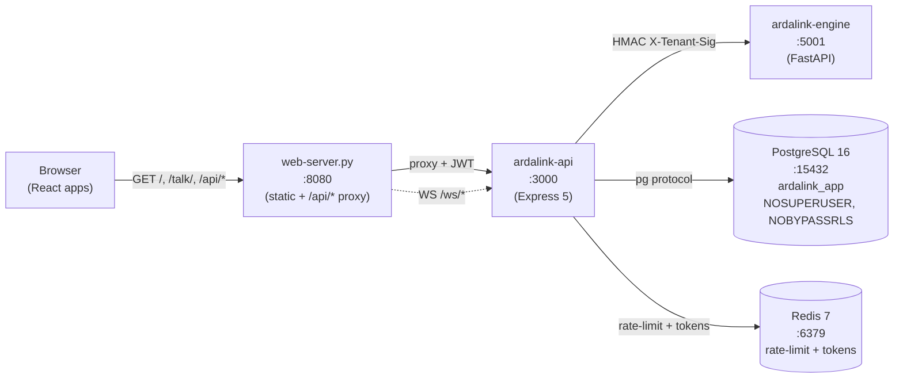
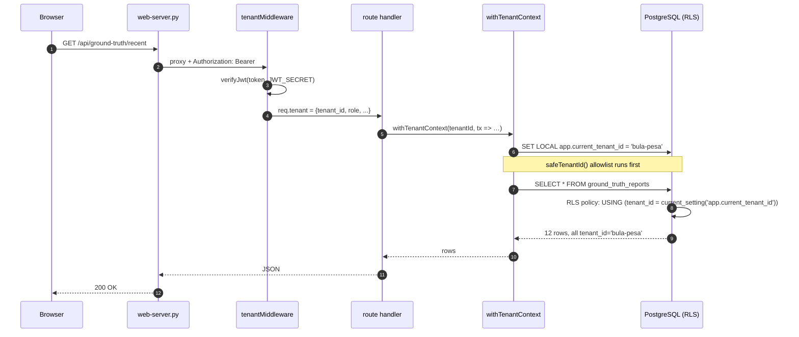
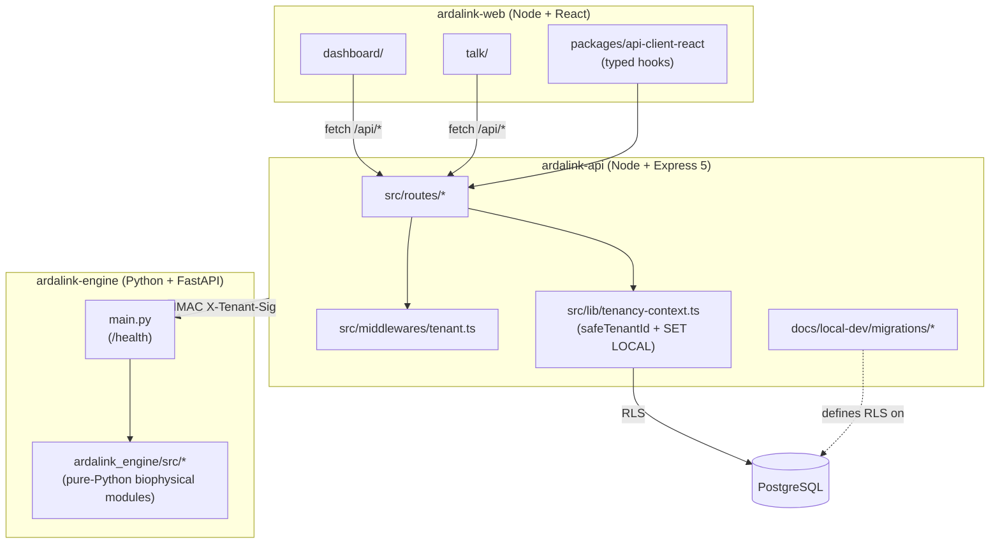
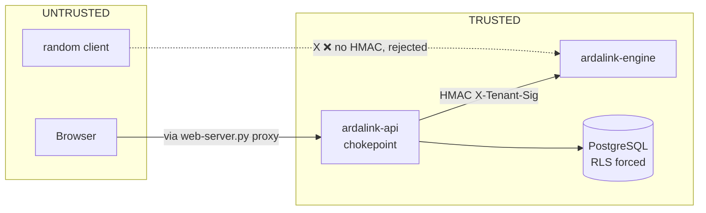

# ArdaLink — System Architecture

Five-minute tour of every service, the auth model, the data model,
and the request flows. For a step-by-step ops manual, see
`RUNBOOK.md`. For the 5-minute install, see `LOCAL_SETUP.md`.

---

## 1. System overview

```
                          ┌────────────────────────────────────────────┐
                          │            React 19 / Vite 7                │
                          │   ┌──────────────┐    ┌──────────────┐      │
                          │   │  Dashboard   │    │  Talk app    │      │
                          │   │  :8080/      │    │  :8080/talk/ │      │
                          │   └──────┬───────┘    └──────┬───────┘      │
                          │          │   static + /api/*  │              │
                          │          └────────┬───────────┘              │
                          └───────────────────┼──────────────────────────┘
                                              │ HTTP
                                              ▼
                          ┌────────────────────────────────────────────┐
                          │   web-server.py  (Python, in start-local.sh)│
                          │   static file server + /api/* + /ws/* proxy │
                          └────────────────────┬───────────────────────┘
                                               │ proxy
                                               ▼
┌─────────────────────┐  HMAC attested   ┌────────────────────────────────┐
│   ardalink-engine   │◄─────────────────►│          ardalink-api          │
│   Python 3.12       │  X-Tenant-ID     │   Node 22 / Express 5          │
│   FastAPI           │  X-Tenant-Sig    │   :3000                        │
│   :5001             │                  │                                │
│                     │                  │   ┌─────────────────────────┐  │
│   /health           │                  │   │ JWT auth (HS256)        │  │
│   (live biophysical │                  │   │ tenantMiddleware        │  │
│    work lives here) │                  │   └──────────┬──────────────┘  │
└─────────────────────┘                  │              │                 │
                                         │              ▼                 │
                                         │   ┌─────────────────────────┐  │
                                         │   │ withTenantContext(      │  │
                                         │   │   tenantId,             │  │
                                         │   │   tx => …)              │  │
                                         │   │  SET LOCAL app.current  │  │
                                         │   │        .tenant_id       │  │
                                         │   └──────────┬──────────────┘  │
                                         └──────────────┼─────────────────┘
                                                        │ Postgres protocol
                                                        ▼
                          ┌────────────────────────────────────────────┐
                          │  PostgreSQL 16   :15432                    │
                          │  user: ardalink_app (NOSUPERUSER,          │
                          │         NOBYPASSRLS)                        │
                          │  schemas: public, gis_engine               │
                          │  RLS: ENABLE + FORCE on every op table     │
                          └────────────────────────────────────────────┘
                                                        ▲
                                                        │
                          ┌────────────────────────────────────────────┐
                          │  Redis 7   :6379                            │
                          │  rate-limit + call-token store              │
                          └────────────────────────────────────────────┘
```

**Three services. One data path. One trust boundary.**

The web apps are pure static assets served by a Python reverse proxy
that also forwards `/api/*` and `/ws/*` to the API on `127.0.0.1:3000`.
There is no CORS, no separate origin, no auth dance for the browser.

---

## 2. The trust boundary

The API is the **only** service that talks to the database. The web
apps never connect. The engine is invoked over HTTP with HMAC
attestation.

```
                            Trust boundary
   ┌─────────────────────────│─────────────────────────┐
   │  UNTRUSTED              │              TRUSTED     │
   │                         │                         │
   │   Browser  ──► web:8080 │ ──► api:3000 ──► postgres│
   │                (proxy)  │                         │
   │                         │                         │
   │   Engine  ◄──HMAC──────►│ API  (server-to-server) │
   │                         │                         │
   └─────────────────────────│─────────────────────────┘
```

The `tenantMiddleware` on the API is the chokepoint. Every request
that isn't on the public list (`/api/healthz`, `/api/docs`,
`/api/redoc`) must present a valid Bearer JWT signed with `JWT_SECRET`.
The claim's `tenant_id` is the source of truth — any `X-Tenant-ID`
header from the caller is ignored.

---

## 3. Multi-tenant request flow

The full path of a single `GET /api/ground-truth/recent?limit=20`
request:

```
  Browser
    │
    │  Authorization: Bearer <JWT>
    │       payload: { tenant_id: "bula-pesa", role: "viewer", … }
    │
    ▼
  web-server.py
    │  proxy to api:3000/api/ground-truth/recent
    │  (Authorization header preserved)
    ▼
  ardalink-api
    │
    ├─► tenantMiddleware
    │     verifyJwt(token, JWT_SECRET)         ← reject if invalid
    │     req.tenant = { tenant_id: "bula-pesa", … }
    │
    ├─► groundTruthRouter
    │     const tenantId = req.tenant.tenant_id    // bula-pesa
    │     withTenantContext(tenantId, async (tx) => {
    │       await tx.execute(sql.raw(
    │         `SET LOCAL app.current_tenant_id = 'bula-pesa'`));
    │       //           ↑ inlined after safeTenantId() allowlist
    │       //             [a-z0-9-]{1,64} — no SQL injection possible
    │       return tx.select().from(groundTruthReportsTable).limit(20);
    │     })
    │
    ▼
  PostgreSQL
    │
    │  session: SET LOCAL app.current_tenant_id = 'bula-pesa'
    │
    │  SELECT * FROM ground_truth_reports LIMIT 20
    │     │
    │     └─► RLS policy:
    │           USING (tenant_id = current_setting(
    │                   'app.current_tenant_id', TRUE))
    │           WITH CHECK (tenant_id = current_setting(...))
    │
    │  Returns only rows where tenant_id = 'bula-pesa'.
    │
    ▼
  Response: 12 reports, all with tenant_id = "bula-pesa"
```

**The app never writes `WHERE tenant_id = ?`.** Every read and every
write goes through the RLS policy. If RLS were disabled, every
tenant would see every other tenant's data — there is no
application-level fallback.

---

## 4. Auth + multi-tenancy invariants

| Invariant | Where enforced | What breaks if violated |
|---|---|---|
| Every API request has a valid JWT | `tenantMiddleware` (`ardalink-api/src/middlewares/tenant.ts`) | 401 |
| `tenant_id` comes from the JWT claim, never the body | `requireTenant(req)` helper in route files | Cross-tenant write |
| `tenant_id` is an allowlist-safe string before `SET LOCAL` inlining | `safeTenantId()` regex in `ardalink-api/src/lib/tenancy-context.ts` | SQL injection via tenant claim |
| Every operational table has RLS on | `0001_multitenant_public.up.sql`, `0001_multitenant_gis_engine.up.sql` | Cross-tenant read |
| The API connects as `ardalink_app` (NOSUPERUSER, NOBYPASSRLS) | `start-local.sh` writes `DATABASE_URL=…ardalink_app:…` | RLS bypass via role |
| API ↔ engine calls carry HMAC headers | `X-Tenant-ID` + `X-Tenant-Sig` | Any caller could impersonate the engine |

---

## 5. HMAC attestation (api ↔ engine)

When the API needs biophysical work, it calls the engine with two
extra headers derived from a shared secret (`TENANT_ATTESTATION_SECRET`):

```
  api:3000  ──►  engine:5001
  X-Tenant-ID:    bula-pesa
  X-Tenant-Sig:   HMAC-SHA256(secret, "bula-pesa")
```

The engine verifies the signature before doing the work. This is what
stops a random caller from invoking the engine directly without going
through the API's auth check.

In the current local-dev build, the engine exposes only `/health` —
the biophysical work lives in `ardalink-engine/src/` as Python
modules, not as HTTP endpoints. The HMAC pathway is plumbed end-to-end
in the API and is ready for the engine routes when they're promoted
out of the library.

---

## 6. Repo relationship

```
  ardalink-web ──── fetch /api/* ────► ardalink-api
       │                                   │
       │                                   │  HMAC X-Tenant-Sig
       │                                   ▼
       │                              ardalink-engine
       │
       │  pnpm workspace (`packages/api-client-react`)
       │  only used at build time
       ▼
   static assets
   served by web-server.py
   (in ardalink-api/docs/local-dev/scripts/start-local.sh)
```

- **ardalink-web** has no runtime dependency on the other repos. It
  ships a JSON-typed API client (`packages/api-client-react`) and
  pre-built static assets.
- **ardalink-api** is the integration point. It owns the DB schema,
  the migrations, the auth, and the run scripts.
- **ardalink-engine** is a Python library with a thin HTTP wrapper
  for now. Real biophysical work runs as Python function calls,
  not HTTP.

---

## 7. Data model (Postgres)

Two schemas in one database:

```
  public                 gis_engine
  ──────                 ──────────
  tenants                energy_baselines
  tenant_feature_flags   water_sources
  pastoralists           herd_projections
  ground_truth_reports
  climate_snapshots
  satellite_snapshots
  call_tokens (ephemeral)
```

Every table has `tenant_id TEXT`. Every operational table has
`ENABLE + FORCE ROW LEVEL SECURITY` and a `tenant_isolation` policy.

Migrations live in `ardalink-api/docs/local-dev/migrations/`:

- `0000_base_schema.up.sql` — tables, indexes
- `0001_multitenant_public.up.sql` — RLS for public schema
- `0001_multitenant_gis_engine.up.sql` — RLS for gis_engine schema

The migrations are applied by `start-local.sh` automatically; you
should not need to run them by hand.

---

## 8. Why this shape

| Decision | Why |
|---|---|
| Three repos, not one | Independent deploys, independent lockfiles, no shared CI failure surface |
| RLS at the DB, not in the app | One place to audit, one place to fix, app code can't drift from policy |
| API as the only DB writer | The auth chokepoint and the data chokepoint are the same node |
| Static web + Python proxy | One process to operate locally; same shape as Caddy in prod (`ardalink-api/infra/docker/Caddyfile`) |
| JWT tenant claim as source of truth | Headers can be forged; signatures can't |
| `safeTenantId()` allowlist | `SET LOCAL` doesn't take parameters; the regex is the SQL-injection guard |
| HMAC between API and engine | Engine is reached over HTTP by an authenticated server, not the public |
| RLS forced, not just enabled | Even the table owner can't bypass — `ardalink_app` has `NO BYPASSRLS` |
| `nodeLinker: hoisted` for the web repo | Vite, Vitest, and the React build assume a flat `node_modules` |

---

## 9. Mermaid diagrams (render in GitHub, VS Code, Obsidian)

### 9.1 System overview



### 9.2 Multi-tenant request flow



### 9.3 Repo relationship



### 9.4 Trust boundary



---

*See `RUNBOOK.md` for the operator's view. See `LOCAL_SETUP.md` for
the 5-minute install.*
