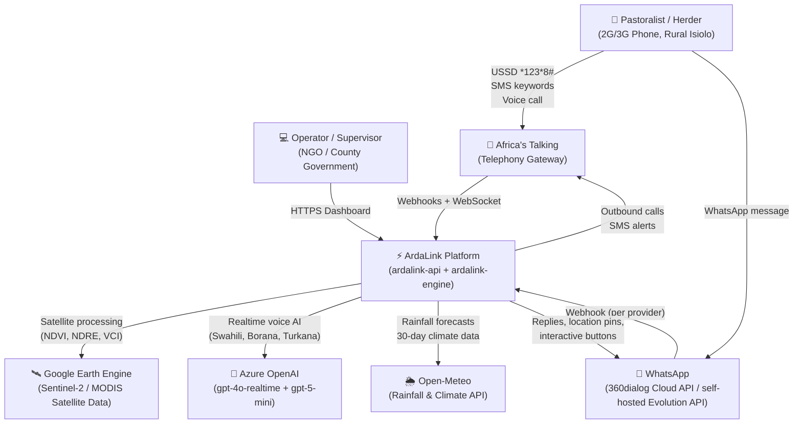
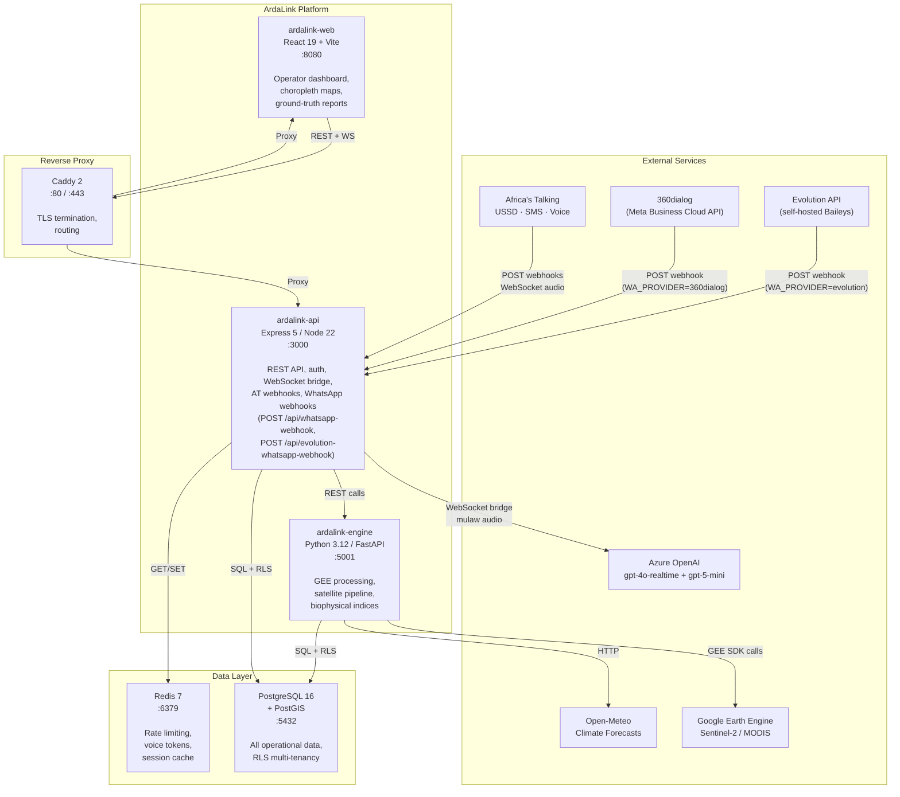

# ArdaLink AI — System Architecture

> **ArdaLink** is a drought monitoring and pastoralist support platform for Isiolo County, Kenya. It delivers satellite-based climate intelligence to herders via voice calls (2G/3G), USSD, and SMS in Swahili and local dialects (Borana, Turkana, Samburu, Somali).

**Repository:** [JHUB-AFRICA/arda-link-ai](https://github.com/JHUB-AFRICA/arda-link-ai)
**Version:** July 2026 (B-series + WhatsApp channel Phase 0/1 complete)

> **For the strategic view (gap analysis from current to production,
> vendor matrix, 5-phase implementation roadmap, privacy + ethics)
> see [`../STATUS.md`](../STATUS.md).** This document
> is the *technical* C4-style reference for engineers.

---

## Table of Contents

1. [C4 System Context](#c4-system-context)
2. [C4 Container Diagram](#c4-container-diagram)
3. [Component Descriptions](#component-descriptions)
4. [Technology Stack](#technology-stack)

---

## C4 System Context

The following diagram shows ArdaLink's position within the broader ecosystem — who uses it, and which external systems it depends on.

**Key relationships:**

- Pastoralists never interact with ArdaLink directly — Africa's Talking (AT) acts as the telephony intermediary for all USSD, SMS, and voice traffic; WhatsApp traffic goes through whichever provider is active (see [`whatsapp-first-architecture.md`](./whatsapp-first-architecture.md)).
- Operators access the React dashboard directly over HTTPS.
- ArdaLink pulls satellite indices from Google Earth Engine on a scheduled basis (weekly/monthly).
- Azure OpenAI provides the real-time AI voice layer that conducts Swahili conversations with herders, and the text LLM layer (GPT-5 Mini primary) that powers WhatsApp free-text conversations.
- **⚠️ Known limitation**: the 360dialog (Meta Business Cloud API) path is code-complete but pending Meta Business verification — see [`whatsapp-first-architecture.md`](./whatsapp-first-architecture.md#known-limitation-meta-business-api-verification) for the current blocker. Evolution API is the live-tested substitute in the meantime.

---

## C4 Container Diagram

This diagram shows the five internal containers that make up the ArdaLink platform and how data flows between them.

Exactly one of `WA_PROVIDER=360dialog` / `WA_PROVIDER=evolution` is active
at a time (`whatsappProviderRegistry.ts` reads the env fresh per call);
both webhook routes exist side by side but only the selected provider is
actually reachable for outbound sends.

**Port summary:**

| Container | Port | Protocol |
|-----------|------|----------|
| ardalink-web | 8080 | HTTP |
| ardalink-api | 3000 | HTTP + WebSocket |
| ardalink-engine | 5001 | HTTP |
| PostgreSQL | 5432 | TCP |
| Redis | 6379 | TCP |
| Caddy (prod) | 80 / 443 | HTTP / HTTPS |

---

## Component Descriptions

### ardalink-web

The operator-facing React dashboard. Operators (NGO staff, county government supervisors) use this to:

- View real-time drought intelligence briefs (NDVI anomaly, VCI stress maps)
- Monitor `ground_truth_calls` (Supabase) collected from herder voice calls
- Manage the pastoralist registry (name, phone, herd counts, location)
- Trigger manual outbound calls or test alerts
- View choropleth maps of Isiolo wards coloured by vegetation stress

Built with **React 19** and **Vite 7**. Communicates exclusively with `ardalink-api`.

---

### ardalink-api

The central API server and orchestrator. Responsibilities:

- **Authentication:** JWT-based login with role enforcement (`operator`, `supervisor`, `admin`)
- **Tenant isolation:** Middleware sets PostgreSQL `SET LOCAL app.current_tenant_id` on every request, enforcing Row-Level Security
- **AT webhook receiver:** Handles `POST /api/voice-callback`, `POST /api/ussd-callback`, `POST /api/sms-callback`
- **WhatsApp webhook receiver:** Handles `POST /api/whatsapp-webhook` (360dialog/Meta Cloud API) and `POST /api/evolution-whatsapp-webhook` (self-hosted Evolution API) — see the dedicated [WhatsApp channel](#whatsapp-channel) section below
- **Voice bridge:** Bidirectional WebSocket (`/api/voice-stream`) that relays mulaw audio frames between Africa's Talking and Azure OpenAI Realtime
- **Rate limiting:** Redis-backed per-IP and per-phone limits
- **Intelligence aggregation:** Proxies satellite and climate data from `ardalink-engine` to the dashboard

Built with **Express 5** on **Node.js 22**, using **Drizzle ORM** for type-safe queries.

---

### WhatsApp channel

WhatsApp is handled inside `ardalink-api` (no separate container) behind
a provider-agnostic interface, so the herder-facing conversation logic
never touches a provider-specific payload shape:

- **`WhatsappProvider` interface** (`lib/whatsappProvider.ts`) — five send
  methods (session text, template, interactive list/buttons, location)
  every provider adapter implements.
- **Two adapters**: `threeSixtyDialogProvider` (`lib/threeSixtyDialog.ts`,
  Meta's Cloud API via the 360dialog BSP) and `evolutionApiProvider`
  (`lib/evolutionApi.ts`, self-hosted Baileys/WhatsApp-Web protocol).
- **`whatsappProviderRegistry.ts`** selects the active adapter from
  `WA_PROVIDER` (`"360dialog"` default, or `"evolution"`), read fresh
  per call.
- **Shared turn handler** (`lib/whatsappTurn.ts`) — `processInboundWhatsappMessage()`
  is the single entry point both webhook routes call after normalizing
  their own wire envelope (`routes/whatsapp.ts`'s `fromMetaMessage()` or
  `routes/evolutionWhatsapp.ts`'s `fromEvolutionWebhook()`). Handles the
  welcome menu, Bula Pesa brief, Malisho water-point pins, and free-text
  conversation — the last of which pulls recent thread history
  (`recentWhatsappMessages()`) so the LLM has real memory instead of a
  stateless per-turn call, and uses a herder-led system prompt
  (`whatsappConversation.ts`) that weaves indicator questions in
  opportunistically rather than as a rigid mandatory script (deliberately
  divergent from the voice pipeline's `indicatorCollectionBlock()`).
- **Dual-write logging**: every turn writes to `whatsapp_messages`
  (thread/audit log) and `lead_interactions` (the same ops
  CallbackLog/trust-score feature source ussd/sms/voice already write).

**⚠️ Known limitation — Meta Business API verification**: the 360dialog
path is code-complete but 360dialog itself requires Meta to verify the
business account before it can send/receive live traffic on Meta's
Cloud API, and that verification hasn't happened yet. Evolution API
(self-hosted, no Meta approval needed) is the live-tested substitute
used to verify the full conversation pipeline end-to-end against a real
WhatsApp account in the meantime — see
[`whatsapp-first-architecture.md`](./whatsapp-first-architecture.md#known-limitation-meta-business-api-verification)
for the full picture and what's still Phase 2/3.

---

### ardalink-engine

The Python scientific processing engine. Responsibilities:

- **Google Earth Engine:** Authenticates via service account, queries MODIS MOD13Q1 imagery, computes NDVI, VCI and Prosopis invasion flags at ward level
- **Open-Meteo integration:** Fetches 30-day rainfall totals, soil moisture, and evaporation rates
- **Supabase writes:** `ingest_ward_satellite_indices.py` writes VCI snapshots directly to Supabase `satellite_indices` (VCI computed inline — no separate backfill step needed)
- **Local snapshot caching:** `satellite_snapshots` and `climate_snapshots` act as per-call caches; Supabase `satellite_indices` / `weather_data` are source of truth
- **Biophysical schema:** Maintains a separate `gis_engine` PostgreSQL schema for spatial indices (`baseline_aggregate`, `baseline_pixel`)

Built with **Python 3.12** and **FastAPI**.

---

### PostgreSQL + PostGIS

The operational database. Key design decisions:

- **Multi-tenancy via RLS:** Every table (except `admin_users`) has Row-Level Security enabled. Queries automatically scoped to the current tenant.
- **PostGIS:** Spatial extension for ward boundary polygons and future GPS-point queries.
- **Schemas:** `public` (operational), `gis_engine` (biophysical indices).

See [`data.md`](./data.md) for the full schema and ERD.

---

### Redis

Used for:

- **Rate limiting:** Voice call frequency per IP and per phone number
- **Token store:** Single-use tokens for browser voice sessions
- **Session cache:** Short-lived data that doesn't need durability

---

## Technology Stack

| Component | Technology | Version | Purpose |
|-----------|-----------|---------|---------|
| Web Dashboard | React, Vite | 19, 7 | Operator UI |
| API Server | Express, Node.js | 5, 22 | REST API + WebSocket bridge |
| ORM | Drizzle ORM | Latest | Type-safe PostgreSQL queries |
| Engine | Python, FastAPI | 3.12, Latest | Satellite + GEE processing |
| Database | PostgreSQL, PostGIS | 16 | Operational + spatial data |
| Cache | Redis | 7 | Rate limiting, tokens |
| AI Voice | Azure OpenAI | gpt-4o-realtime | Real-time voice conversations |
| Telephony | Africa's Talking | — | USSD, SMS, outbound voice |
| WhatsApp | 360dialog (Meta Cloud API) / Evolution API (self-hosted) | — | WhatsApp channel, swappable via `WA_PROVIDER` |
| Satellite | Google Earth Engine | — | NDVI, NDRE, VCI calculations |
| Weather | Open-Meteo | — | Rainfall, climate forecasts |
| Containers | Docker, Compose | — | Local + CI deployment |
| Reverse Proxy | Caddy 2 | 2-alpine | TLS termination, routing |

---

## Cross-References

- **Data layer details:** [`data.md`](./data.md)
- **API endpoints:** [`api.md`](./api.md)
- **Voice & USSD flows:** [`voice.md`](./voice.md)
- **WhatsApp channel (as-built + Meta API blocker):** [`whatsapp-first-architecture.md`](./whatsapp-first-architecture.md)
- **Satellite pipeline:** [`satellite.md`](./satellite.md)
- **Deployment:** [`deployment.md`](./deployment.md)
- **Security & multi-tenancy:** [`security.md`](./security.md)
- **Developer onboarding:** [`onboarding.md`](./onboarding.md)
