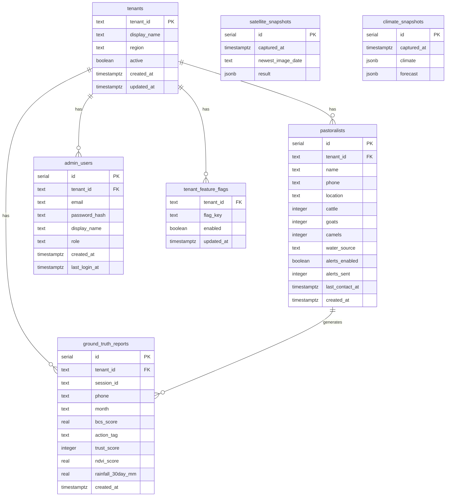
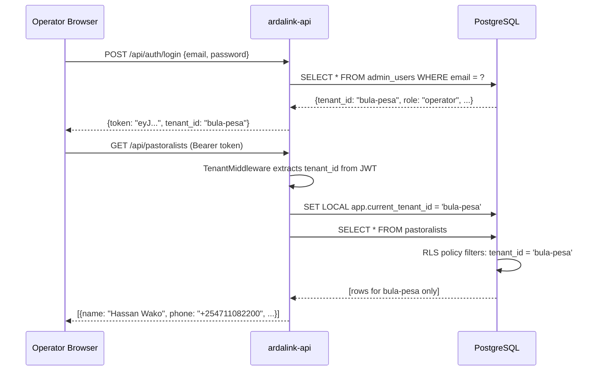

# ArdaLink AI — Data Architecture

> This document covers the PostgreSQL schema, entity relationships, multi-tenancy implementation, and Row-Level Security (RLS) policies for the ArdaLink platform.

---

## Table of Contents

1. [Entity Relationship Diagram](#entity-relationship-diagram)
2. [Table Schemas](#table-schemas)
3. [Multi-Tenancy Design](#multi-tenancy-design)
4. [Row-Level Security](#row-level-security)
5. [Snapshot Caching](#snapshot-caching)

---

## Entity Relationship Diagram



---

## Table Schemas

### `tenants` — Multi-tenancy root

Every piece of operational data is owned by a tenant. Tenants map to Isiolo County wards.

```sql
CREATE TABLE tenants (
    tenant_id    TEXT PRIMARY KEY,
    display_name TEXT        NOT NULL,
    region       TEXT        NOT NULL,
    active       BOOLEAN     DEFAULT TRUE,
    created_at   TIMESTAMPTZ,
    updated_at   TIMESTAMPTZ
);
```

**Current tenants:**

| tenant_id | display_name | Region |
|-----------|-------------|--------|
| `bula-pesa` | Bula Pesa Ward | Isiolo North |
| `garbatulla` | Garbatulla Ward | Isiolo South |
| `merti` | Merti Ward | Isiolo South |
| `legacy` | Legacy (pre-multi-tenant) | — |

---

### `pastoralists` — Herder registry

Registry of all enrolled pastoralists who can receive alerts and voice calls.

```sql
CREATE TABLE pastoralists (
    id               SERIAL PRIMARY KEY,
    created_at       TIMESTAMPTZ,
    tenant_id        TEXT        NOT NULL,
    name             TEXT        NOT NULL,
    phone            TEXT        NOT NULL,      -- E.164 format, e.g. +254711082200
    location         TEXT        DEFAULT '',    -- TODO: upgrade to PostGIS point
    cattle           INTEGER     DEFAULT 0,
    goats            INTEGER     DEFAULT 0,
    camels           INTEGER     DEFAULT 0,
    water_source     TEXT        DEFAULT 'Unknown',
    alerts_enabled   BOOLEAN     DEFAULT TRUE,
    alerts_sent      INTEGER     DEFAULT 0,
    last_contact_at  TIMESTAMPTZ,
    UNIQUE(tenant_id, phone)
);
```

**Notes:**
- `phone` is unique per tenant (same number may be enrolled in multiple tenants in edge cases).
- `location` is currently free-text (e.g. `"Bula Pesa NW"`). A PostGIS point column is planned.
- `herd_counts` (cattle + goats + camels) are used to weight drought impact assessments.

---

### `ground_truth_reports` — Voice call data store

The richest table. Every outbound AI voice call produces one row, containing the full set of pastoralist-reported livestock indicators alongside satellite correlations.

```sql
CREATE TABLE ground_truth_reports (
    id                         SERIAL PRIMARY KEY,
    created_at                 TIMESTAMPTZ,
    session_id                 TEXT,
    phone                      TEXT,
    month                      TEXT        NOT NULL,    -- e.g. "2026-06"
    timestamp                  TIMESTAMPTZ,
    tenant_id                  TEXT,

    -- AI conversation metadata
    satellite_metrics          JSONB,       -- NDVI/VCI snapshot at call time
    ai_question                TEXT,        -- Last AI prompt in transcript
    user_feedback              TEXT        NOT NULL,
    action_tag                 TEXT        NOT NULL,    -- e.g. "alert_triggered"
    recording_url              TEXT,
    duration_seconds           INTEGER,

    -- Body Condition Score (ILRI/FAO standard, 1.0–5.0)
    bcs_score                  REAL,
    bcs_raw_response           TEXT,        -- Verbatim herder response
    bcs_species                TEXT,        -- cattle | goat | camel
    bcs_confidence             TEXT,        -- high | medium | low
    bcs_flag_followup          BOOLEAN,

    -- Secondary herd indicators
    offtake_rate               TEXT,        -- early | normal | not_selling
    offtake_raw_response       TEXT,
    mortality_rate             TEXT,        -- none | 1-3 | 4-plus
    mortality_raw_response     TEXT,
    milk_production            TEXT,        -- normal | reduced | stopped
    milk_raw_response          TEXT,
    water_trekking_distance    TEXT,        -- under_5km | 5-10km | over_10km
    water_trekking_raw         TEXT,
    water_point_name           TEXT,
    water_point_status         TEXT,        -- operational | poor | dry
    water_point_raw_response   TEXT,
    supplementary_feeding      TEXT,        -- yes | no | planning
    supplementary_raw_response TEXT,

    -- Spatial data
    reported_quadrant          TEXT,        -- NW | NE | SW | SE | unknown
    reported_location          TEXT,

    -- Satellite correlations (captured at call time)
    ndvi_score                 REAL,
    ndvi_vs_baseline_percent   REAL,
    rainfall_30day_mm          REAL,
    soil_moisture_index        REAL,
    evaporation_rate           REAL,
    rainfall_evap_ratio        REAL,

    -- Data quality metadata
    data_methodology_version   TEXT        DEFAULT 'v1.0',
    standards_applied          TEXT        DEFAULT 'ILRI/FAO BCS, FEWS NET, LEGS, WFP CSI',
    call_duration_seconds      INTEGER,
    indicators_collected       INTEGER,
    data_completeness_percent  REAL,
    trust_score                INTEGER,    -- 0–100
    trust_flags                JSONB       -- array of penalty reasons
);
```

**Standards applied:**

| Standard | Full Name | Used For |
|----------|-----------|----------|
| ILRI/FAO BCS | Body Condition Scoring for Ruminants | BCS 1–5 scale |
| FEWS NET | Famine Early Warning Systems Network | Drought phase classification |
| LEGS | Livestock Emergency Guidelines and Standards | Response thresholds |
| WFP CSI | Coping Strategies Index | Household stress proxy |

---

### `satellite_snapshots` — GEE result cache

Caches the latest Google Earth Engine output to avoid repeated API calls.

```sql
CREATE TABLE satellite_snapshots (
    id                SERIAL PRIMARY KEY,
    captured_at       TIMESTAMPTZ,
    newest_image_date TEXT        NOT NULL,   -- e.g. "2026-06-20"
    result            JSONB       NOT NULL    -- full ward-level metrics object
);
```

---

### `climate_snapshots` — Weather cache

Caches Open-Meteo climate and forecast data.

```sql
CREATE TABLE climate_snapshots (
    id          SERIAL PRIMARY KEY,
    captured_at TIMESTAMPTZ,
    climate     JSONB NOT NULL,   -- historical + current climate metrics
    forecast    JSONB             -- 14-day forecast periods
);
```

---

### `admin_users` — Dashboard operators

Operators, supervisors, and admins who log into the web dashboard.

```sql
CREATE TABLE admin_users (
    id            SERIAL PRIMARY KEY,
    email         TEXT UNIQUE NOT NULL,
    password_hash TEXT        NOT NULL,
    tenant_id     TEXT        REFERENCES tenants(tenant_id),
    display_name  TEXT        NOT NULL,
    role          TEXT        CHECK (role IN ('operator', 'supervisor', 'admin')),
    created_at    TIMESTAMPTZ,
    last_login_at TIMESTAMPTZ
    -- NOTE: RLS is DISABLED on this table.
    -- Authentication happens before tenant context is established.
);
```

**Roles:**

| Role | Permissions |
|------|-------------|
| `operator` | View reports and maps for their tenant |
| `supervisor` | Operator + trigger calls, manage pastoralists |
| `admin` | Supervisor + manage users, cross-tenant access |

---

### `tenant_feature_flags`

Feature flag system for enabling experimental capabilities per tenant.

```sql
CREATE TABLE tenant_feature_flags (
    tenant_id  TEXT        REFERENCES tenants(tenant_id),
    flag_key   TEXT        NOT NULL,
    enabled    BOOLEAN     DEFAULT FALSE,
    updated_at TIMESTAMPTZ,
    PRIMARY KEY (tenant_id, flag_key)
);
```

---

## Multi-Tenancy Design

ArdaLink uses a **shared schema, shared database** multi-tenancy model. All tenants' data lives in the same PostgreSQL tables, separated by a `tenant_id` column and enforced at the database level via Row-Level Security (RLS).

### Why shared schema?

- Simpler deployment (one database, one migration set)
- Cross-tenant analytics possible for admin role
- PostGIS spatial queries work across wards without federation overhead

### Tenant context flow



---

## Row-Level Security

Every table except `admin_users` has RLS enabled with the following policy:

```sql
-- Enable RLS on a table
ALTER TABLE pastoralists ENABLE ROW LEVEL SECURITY;

-- Create the tenant isolation policy
CREATE POLICY tenant_isolation ON pastoralists
    USING (tenant_id = current_setting('app.current_tenant_id', TRUE));
```

The `TRUE` flag in `current_setting(...)` means the function returns `NULL` (rather than raising an error) if no tenant is set — rows are hidden rather than an exception thrown.

### Setting tenant context in the API

```typescript
// ardalink-api: withTenantContext helper
async function withTenantContext<T>(
    tenantId: string,
    fn: (db: DrizzleDB) => Promise<T>
): Promise<T> {
    return db.transaction(async (tx) => {
        await tx.execute(
            sql`SET LOCAL app.current_tenant_id = ${tenantId}`
        );
        return fn(tx);
    });
}
```

This is called inside every route handler that touches tenant-scoped data.

### Tables with RLS enabled

| Table | RLS | Notes |
|-------|-----|-------|
| `pastoralists` | ✅ | |
| `ground_truth_reports` | ✅ | |
| `tenant_feature_flags` | ✅ | |
| `satellite_snapshots` | ✅ | |
| `climate_snapshots` | ✅ | |
| `admin_users` | ❌ | Auth happens before context is set |
| `tenants` | ❌ | Root table, accessed by admin only |

---

## Snapshot Caching

The satellite and climate snapshot tables act as a write-through cache to reduce GEE API calls and Open-Meteo request volume.

```
GET /api/intelligence/brief
        │
        ▼
 Check satellite_snapshots
 (WHERE captured_at > NOW() - INTERVAL '7 days')
        │
   ┌────┴────┐
   │ Fresh?  │
   └────┬────┘
    Yes │              No
        │              │
        ▼              ▼
  Return cached   ardalink-engine
  JSONB result    GEE API call
                       │
                       ▼
                  Write new row to
                  satellite_snapshots
                       │
                       ▼
                  Return result
```

---

## Cross-References

- **How data flows from voice calls:** [`voice.md`](./voice.md)
- **Satellite indices stored in snapshots:** [`satellite.md`](./satellite.md)
- **RLS in the auth flow:** [`security.md`](./security.md)
- **API endpoints for data access:** [`api.md`](./api.md)
