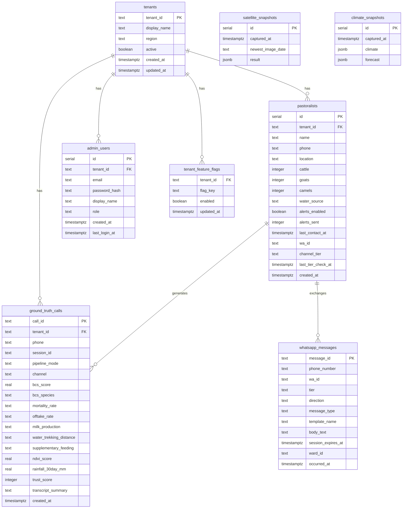
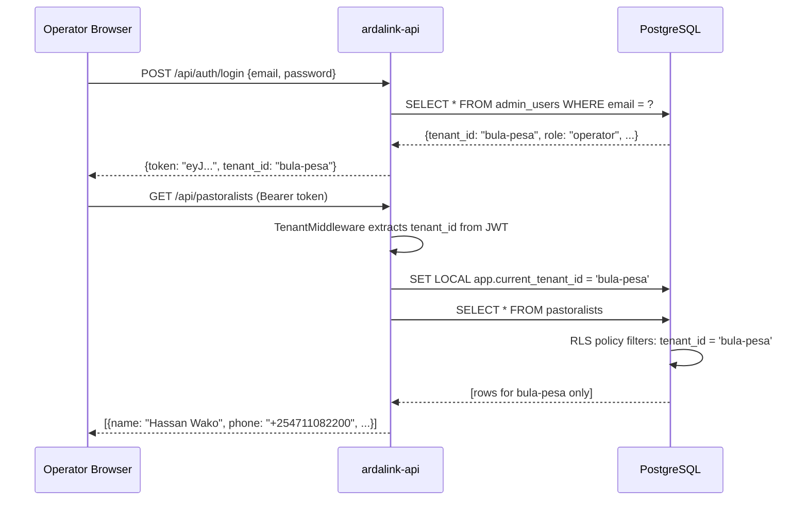

# ArdaLink AI — Data Architecture

> This document covers the PostgreSQL schema, entity relationships, multi-tenancy implementation, and Row-Level Security (RLS) policies for the ArdaLink platform.

---

## Table of Contents

1. [Entity Relationship Diagram](#entity-relationship-diagram)
2. [Table Schemas](#table-schemas)
3. [Multi-Tenancy Design](#multi-tenancy-design)
4. [Row-Level Security](#row-level-security)
5. [Snapshot Caching](#snapshot-caching)

---

## Entity Relationship Diagram



---

## Table Schemas

### `tenants` — Multi-tenancy root

Every piece of operational data is owned by a tenant. Tenants map to Isiolo County wards.

```sql
CREATE TABLE tenants (
    tenant_id    TEXT PRIMARY KEY,
    display_name TEXT        NOT NULL,
    region       TEXT        NOT NULL,
    active       BOOLEAN     DEFAULT TRUE,
    created_at   TIMESTAMPTZ,
    updated_at   TIMESTAMPTZ
);
```

**Canonical tenants (5 active Isiolo Sub-County wards):**

| tenant_id | display_name | Ward ID | Region |
|-----------|-------------|---------|--------|
| `wabera` | Wabera Ward | 241 | Isiolo North |
| `bula-pesa` | Bulla Pesa Ward | 242 | Isiolo North |
| `ngare-mara` | Ngare Mara Ward | 245 | Isiolo North |
| `burat` | Burat Ward | 246 | Isiolo South |
| `oldonyiro` | Oldonyiro Ward | 247 | Isiolo South |

Retired demo tenants `garbatulla`, `merti`, `kinna`, and `legacy` must not appear in any production code path. The ward-ID mapping is enforced in `ardalink-api/src/lib/wardMapping.ts`; use `knownWardIds()` rather than hard-coding slugs.

---

### `pastoralists` — Herder registry

Registry of all enrolled pastoralists who can receive alerts and voice calls.

```sql
CREATE TABLE pastoralists (
    id               SERIAL PRIMARY KEY,
    created_at       TIMESTAMPTZ,
    tenant_id        TEXT        NOT NULL,
    name             TEXT        NOT NULL,
    phone            TEXT        NOT NULL,      -- E.164 format, e.g. +254711082200
    location         TEXT        DEFAULT '',    -- TODO: upgrade to PostGIS point
    cattle           INTEGER     DEFAULT 0,
    goats            INTEGER     DEFAULT 0,
    camels           INTEGER     DEFAULT 0,
    water_source     TEXT        DEFAULT 'Unknown',
    alerts_enabled   BOOLEAN     DEFAULT TRUE,
    alerts_sent      INTEGER     DEFAULT 0,
    last_contact_at  TIMESTAMPTZ,
    wa_id            TEXT,                          -- WhatsApp's stable user identifier (added migration 0005)
    channel_tier     TEXT        DEFAULT 'sms',      -- 'whatsapp' | 'voice' | 'ussd' | 'sms'
    last_tier_check_at TIMESTAMPTZ,                  -- when channel_tier was last (re-)probed
    UNIQUE(tenant_id, phone)
);
```

**Notes:**
- `phone` is unique per tenant (same number may be enrolled in multiple tenants in edge cases).
- `location` is currently free-text (e.g. `"Bula Pesa NW"`). A PostGIS point column is planned.
- `herd_counts` (cattle + goats + camels) are used to weight drought impact assessments.
- `channel_tier` drives the WhatsApp-first channel resolver (`src/lib/channelTier.ts`) — re-evaluated every 30 days per `Arda-link-AI-Docs/whatsapp-first-architecture.md`.

---

### `ground_truth_calls` — Voice call data store (Supabase primary)

Every AI voice call produces one row in Supabase `ground_truth_calls`. The local `ground_truth_reports` table was dropped (migration `0004_drop_ground_truth_reports.up.sql`); all call data now lands directly in Supabase via `insertGroundTruthCall()` in `src/lib/supabase.ts`.

```sql
-- Supabase schema (abridged — see Supabase project for full DDL)
CREATE TABLE ground_truth_calls (
    call_id                TEXT        PRIMARY KEY,   -- UUID
    tenant_id              TEXT        NOT NULL,
    phone                  TEXT,                      -- E.164 herder phone
    session_id             TEXT,                      -- AT session ID
    pipeline_mode          TEXT,                      -- 'deterministic' | 'realtime'
    channel                TEXT        DEFAULT 'voice', -- 'voice' | 'sms' | 'ussd' | 'whatsapp' (added migration 0005)

    -- Body Condition Score (ILRI/FAO standard, 1.0–5.0)
    bcs_score              REAL,
    bcs_species            TEXT,        -- cattle | goat | camel
    bcs_confidence         TEXT,        -- high | medium | low

    -- Secondary herd indicators
    mortality_rate         TEXT,        -- none | 1-3 | 4-plus
    offtake_rate           TEXT,        -- early | normal | not_selling
    milk_production        TEXT,        -- normal | reduced | stopped
    water_trekking_distance TEXT,       -- under_5km | 5-10km | over_10km
    supplementary_feeding  TEXT,        -- yes | no | planning

    -- Satellite snapshot at call time
    ndvi_score             REAL,
    rainfall_30day_mm      REAL,

    -- Data quality
    trust_score            INTEGER,     -- 0–100
    transcript_summary     TEXT,
    action_tag             TEXT,

    created_at             TIMESTAMPTZ
);
```

**Fields not in `ground_truth_calls`** (returned as `null` by all API reads):
- `ndviVsBaselinePercent` — requires NDVI baseline lookup; compute via `vciBackfillJob` if needed
- `reportedQuadrant`, `reportedLocation` — spatial fields; planned for a future migration
- `waterPointName` / `waterPointStatus` — stored in WPDx snapshot (`src/lib/data/wpdxIsiolo.ts`), not per-call

**Standards applied:**

| Standard | Full Name | Used For |
|----------|-----------|----------|
| ILRI/FAO BCS | Body Condition Scoring for Ruminants | BCS 1–5 scale |
| FEWS NET | Famine Early Warning Systems Network | Drought phase classification |
| LEGS | Livestock Emergency Guidelines and Standards | Response thresholds |
| WFP CSI | Coping Strategies Index | Household stress proxy |

---

### `whatsapp_messages` — WhatsApp thread/audit log (added migration 0005)

Append-only thread log for the WhatsApp channel — the WhatsApp analogue of `lead_interactions`, but with two rows per conversational turn (one `in`, one `out`) since WhatsApp's `message_type`/`template_name`/`session_expires_at` fields are richer and direction-specific. Written via `logWhatsappMessage()` in `src/lib/supabase.ts` (dual-write: Supabase primary + local mirror, same pattern as `logLeadInteraction`).

```sql
CREATE TABLE whatsapp_messages (
    message_id          UUID        PRIMARY KEY DEFAULT gen_random_uuid(),
    phone_number        TEXT        NOT NULL,
    wa_id               TEXT,
    tier                TEXT,                     -- 'verified' | 'lead' | 'unknown', snapshot at send time
    direction           TEXT        NOT NULL,      -- 'in' | 'out' | 'status'
    message_type        TEXT        NOT NULL,      -- 'text' | 'template' | 'interactive_list' | 'interactive_buttons' | 'list_reply' | 'button_reply' | 'location' | 'audio' | 'status'
    template_name       TEXT,
    body_text           TEXT,
    session_expires_at  TIMESTAMPTZ,
    ward_id             TEXT,
    occurred_at         TIMESTAMPTZ NOT NULL DEFAULT now(),
    raw_payload         JSONB,
    tenant_id           TEXT
);
```

See `Arda-link-AI-Docs/whatsapp-first-architecture.md` for the channel's full strategic design.

---

### `satellite_snapshots` — GEE result cache

Caches the latest Google Earth Engine output to avoid repeated API calls.

```sql
CREATE TABLE satellite_snapshots (
    id                SERIAL PRIMARY KEY,
    captured_at       TIMESTAMPTZ,
    newest_image_date TEXT        NOT NULL,   -- e.g. "2026-06-20"
    result            JSONB       NOT NULL    -- full ward-level metrics object
);
```

---

### `climate_snapshots` — Weather cache

Caches Open-Meteo climate and forecast data.

```sql
CREATE TABLE climate_snapshots (
    id          SERIAL PRIMARY KEY,
    captured_at TIMESTAMPTZ,
    climate     JSONB NOT NULL,   -- historical + current climate metrics
    forecast    JSONB             -- 14-day forecast periods
);
```

---

### `admin_users` — Dashboard operators

Operators, supervisors, and admins who log into the web dashboard.

```sql
CREATE TABLE admin_users (
    id            SERIAL PRIMARY KEY,
    email         TEXT UNIQUE NOT NULL,
    password_hash TEXT        NOT NULL,
    tenant_id     TEXT        REFERENCES tenants(tenant_id),
    display_name  TEXT        NOT NULL,
    role          TEXT        CHECK (role IN ('operator', 'supervisor', 'admin')),
    created_at    TIMESTAMPTZ,
    last_login_at TIMESTAMPTZ
    -- NOTE: RLS is DISABLED on this table.
    -- Authentication happens before tenant context is established.
);
```

**Roles:**

| Role | Permissions |
|------|-------------|
| `operator` | View reports and maps for their tenant |
| `supervisor` | Operator + trigger calls, manage pastoralists |
| `admin` | Supervisor + manage users, cross-tenant access |

---

### `tenant_feature_flags`

Feature flag system for enabling experimental capabilities per tenant.

```sql
CREATE TABLE tenant_feature_flags (
    tenant_id  TEXT        REFERENCES tenants(tenant_id),
    flag_key   TEXT        NOT NULL,
    enabled    BOOLEAN     DEFAULT FALSE,
    updated_at TIMESTAMPTZ,
    PRIMARY KEY (tenant_id, flag_key)
);
```

---

## Multi-Tenancy Design

ArdaLink uses a **shared schema, shared database** multi-tenancy model. All tenants' data lives in the same PostgreSQL tables, separated by a `tenant_id` column and enforced at the database level via Row-Level Security (RLS).

### Why shared schema?

- Simpler deployment (one database, one migration set)
- Cross-tenant analytics possible for admin role
- PostGIS spatial queries work across wards without federation overhead

### Tenant context flow



---

## Row-Level Security

Every table except `admin_users` has RLS enabled with the following policy:

```sql
-- Enable RLS on a table
ALTER TABLE pastoralists ENABLE ROW LEVEL SECURITY;

-- Create the tenant isolation policy
CREATE POLICY tenant_isolation ON pastoralists
    USING (tenant_id = current_setting('app.current_tenant_id', TRUE));
```

The `TRUE` flag in `current_setting(...)` means the function returns `NULL` (rather than raising an error) if no tenant is set — rows are hidden rather than an exception thrown.

### Setting tenant context in the API

```typescript
// ardalink-api: withTenantContext helper
async function withTenantContext<T>(
    tenantId: string,
    fn: (db: DrizzleDB) => Promise<T>
): Promise<T> {
    return db.transaction(async (tx) => {
        await tx.execute(
            sql`SET LOCAL app.current_tenant_id = ${tenantId}`
        );
        return fn(tx);
    });
}
```

This is called inside every route handler that touches tenant-scoped data.

### Tables with RLS enabled

| Table | RLS | Notes |
|-------|-----|-------|
| `pastoralists` | ✅ | |
| `ground_truth_calls` | ✅ | Supabase primary; local `ground_truth_reports` dropped |
| `tenant_feature_flags` | ✅ | |
| `satellite_snapshots` | ✅ | Per-call cache; Supabase `satellite_indices` is source of truth |
| `climate_snapshots` | ✅ | Per-call cache; Supabase `weather_data` is source of truth |
| `admin_users` | ❌ | Auth happens before context is set |
| `tenants` | ❌ | Root table, accessed by admin only |

### Local mirror tables (Supabase → local, synced every 5 min by `syncJob.ts`)

| Mirror table | Supabase source | Notes |
|---|---|---|
| `pastoralist_leads` | `pastoralists` | Read fallback during Supabase outage |
| `lead_interactions` | `lead_interactions` | Read fallback |
| `satellite_indices` | `satellite_indices` | VCI + NDVI per ward per month |
| `weather_data` | `weather_data` | Temperature, rainfall, humidity per ward |
| `weather_forecast` | `weather_forecast` | 7-day Open-Meteo forecast |
| `ground_truth_calls` | `ground_truth_calls` | Thin mirror; synced for read fallback |
| `ward_cells` | `ward_cells` | 26,975 raster cell rows; not actively synced |
| `whatsapp_messages` | `whatsapp_messages` | Dual-write at write time (like `lead_interactions`), not `syncJob.ts`-polled — append-only, never hand-edited in Supabase |

---

## Snapshot Caching

The satellite and climate snapshot tables act as a write-through cache to reduce GEE API calls and Open-Meteo request volume.

```
GET /api/intelligence/brief
        │
        ▼
 Check satellite_snapshots
 (WHERE captured_at > NOW() - INTERVAL '7 days')
        │
   ┌────┴────┐
   │ Fresh?  │
   └────┬────┘
    Yes │              No
        │              │
        ▼              ▼
  Return cached   ardalink-engine
  JSONB result    GEE API call
                       │
                       ▼
                  Write new row to
                  satellite_snapshots
                       │
                       ▼
                  Return result
```

---

## Cross-References

- **How data flows from voice calls:** [`voice.md`](./voice.md)
- **Satellite indices stored in snapshots:** [`satellite.md`](./satellite.md)
- **RLS in the auth flow:** [`security.md`](./security.md)
- **API endpoints for data access:** [`api.md`](./api.md)
