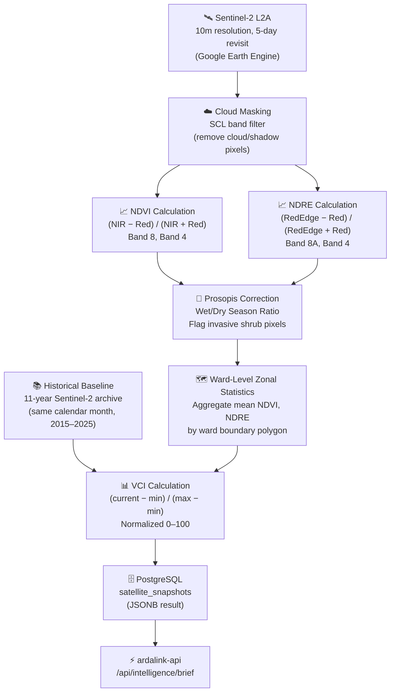
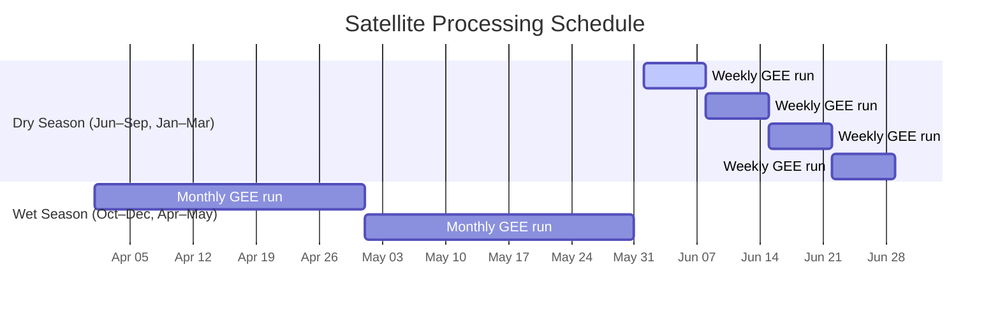

# ArdaLink AI — Satellite Intelligence Pipeline

> ArdaLink uses **Google Earth Engine (GEE)** and **Sentinel-2** satellite imagery to compute vegetation health indices across all 10 Isiolo County wards. These indices power the drought alerts, operator dashboard, and the briefings read to pastoralists during voice calls.

---

## Table of Contents

1. [Processing Pipeline](#processing-pipeline)
2. [Index Calculations](#index-calculations)
3. [Ward Boundary Integration](#ward-boundary-integration)
4. [Scheduling Strategy](#scheduling-strategy)
5. [Open-Meteo Climate Integration](#open-meteo-climate-integration)
6. [Output Schema](#output-schema)

---

## Processing Pipeline



### Processing steps in detail

**Step 1 — Sentinel-2 image acquisition**

The engine queries GEE for the most recent Sentinel-2 L2A (atmospherically corrected) image over Isiolo County with less than 20% cloud cover. Sentinel-2 provides 10m/pixel resolution with a 5-day revisit cycle, making it ideal for pasture monitoring.

**Step 2 — Cloud masking**

The Scene Classification Layer (SCL) band is used to mask out clouds, cloud shadows, water, and snow pixels before any index calculation. Only vegetation and bare-soil pixels are retained.

**Step 3 — NDVI and NDRE calculation**

Band arithmetic is performed at pixel level (see [Index Calculations](#index-calculations) below).

**Step 4 — Prosopis juliflora correction**

*Prosopis juliflora* (mathenge) is an invasive shrub widespread in Isiolo. It maintains a high NDVI even during drought, which can mask genuine pasture degradation. ArdaLink computes a wet-season vs. dry-season NDVI ratio to flag pixels where green signal is likely from Prosopis rather than edible pasture.

**Step 5 — Ward-level zonal statistics**

Ward boundary polygons (GeoJSON) are loaded and used to aggregate pixel-level indices to ward-level means, medians, and stressed-pixel percentages. "Stressed" is defined as NDVI below the ward's long-term 25th percentile.

**Step 6 — Historical baseline and VCI**

The Vegetation Condition Index requires a per-ward, per-month historical baseline computed from the 11-year Sentinel-2 archive (2015–2025). This one-time backfill enables normalised comparison.

**Step 7 — Write to PostgreSQL**

Results are written to `satellite_snapshots` as a JSONB blob keyed by `newest_image_date`. The API reads from this cache to serve the intelligence brief.

---

## Index Calculations

### NDVI — Normalized Difference Vegetation Index

**What it measures:** Overall vegetation density and photosynthetic activity. In pastoral rangelands, NDVI correlates strongly with available pasture biomass.

**Formula:**

```
NDVI = (NIR − Red) / (NIR + Red)
     = (Band 8 − Band 4) / (Band 8 + Band 4)
```

**Interpretation for Isiolo rangelands:**

| NDVI Range | Condition | Meaning |
|-----------|-----------|---------|
| 0.40 – 1.00 | Excellent | Dense, healthy pasture |
| 0.30 – 0.39 | Good | Normal rangeland |
| 0.20 – 0.29 | Fair | Some stress, monitor |
| 0.10 – 0.19 | Poor | Significant degradation |
| 0.00 – 0.09 | Extreme | Near-bare ground |
| < 0.00 | Severe | Water, bare rock, burned |

---

### NDRE — Normalized Difference Red Edge Index

**What it measures:** Chlorophyll content and early plant stress. NDRE responds to stress earlier than NDVI, making it useful for detecting the onset of drought before visible vegetation loss.

**Formula:**

```
NDRE = (RedEdge − Red) / (RedEdge + Red)
     = (Band 8A − Band 4) / (Band 8A + Band 4)
```

NDRE is primarily used as a secondary cross-check signal alongside NDVI.

---

### VCI — Vegetation Condition Index

**What it measures:** How current vegetation compares to the historical range for the same location and calendar month. VCI removes seasonal variation, making it a more reliable drought indicator than raw NDVI.

**Formula:**

```
VCI = (NDVI_current − NDVI_min) / (NDVI_max − NDVI_min) × 100
```

Where `NDVI_min` and `NDVI_max` are the multi-year minimum and maximum for that ward in that specific calendar month (e.g. all June values from 2015–2025).

**Drought classification (FEWS NET standard):**

| VCI | Drought Class |
|-----|--------------|
| 70 – 100 | No drought |
| 55 – 69 | Mild drought watch |
| 35 – 54 | Moderate drought |
| 20 – 34 | Severe drought |
| 0 – 19 | Extreme drought |

A VCI below 35 triggers the automatic alert threshold in ArdaLink.

---

### Wet/Dry Ratio — Prosopis Flag

**What it measures:** Whether green signal in the current dry-season image is attributable to edible pasture or invasive Prosopis shrub.

**Formula:**

```
WetDryRatio = NDVI_peak_wet_season / NDVI_current_dry_season
```

A ratio > 2.5 for a given pixel suggests Prosopis presence. These pixels are downweighted in the ward-level pasture stress estimate.

---

## Ward Boundary Integration

ArdaLink processes all 10 Isiolo County wards:

| Ward | Sub-County | Approximate Area |
|------|-----------|-----------------|
| Bula Pesa | Isiolo North | ~320 km² |
| Wabera | Isiolo North | ~110 km² |
| Olare | Isiolo North | ~580 km² |
| Chari | Isiolo North | ~490 km² |
| Kinna | Isiolo North | ~1,200 km² |
| Garbatulla | Isiolo South | ~2,800 km² |
| Merti | Isiolo South | ~3,100 km² |
| Cherab | Isiolo South | ~1,800 km² |
| Sericho | Isiolo South | ~2,400 km² |
| Oldonyiro | Isiolo South | ~2,900 km² |

Ward boundaries are stored as GeoJSON polygons in the `gis_engine` PostgreSQL schema and served via the `/api/open-data/choropleth` endpoint for dashboard map rendering.

---

## Scheduling Strategy



| Season | Run Frequency | Rationale |
|--------|-------------|-----------|
| Dry (Jun–Sep, Jan–Mar) | Weekly | Rapid vegetation decline; herders need timely alerts |
| Wet (Oct–Dec, Apr–May) | Monthly | Conditions change slowly; reduce GEE API usage |

**Backfill:** A one-time historical backfill processes all Sentinel-2 scenes from 2015–2025 to establish the 11-year baseline required for VCI calculation. This ran once at system initialisation and does not repeat.

**Scheduling implementation:** The engine exposes a `/trigger` endpoint. The API's cron scheduler (node-cron) calls this on the appropriate schedule and writes results to `satellite_snapshots`.

---

## Open-Meteo Climate Integration

In addition to satellite indices, ArdaLink fetches rainfall and climate data from [Open-Meteo](https://open-meteo.com) — a free, open-source weather API.

**Variables fetched:**

| Variable | Period | Use |
|----------|--------|-----|
| `precipitation_sum` | 30 days | Rainfall context for alerts |
| `soil_moisture_0_7cm` | Current | Ground-level moisture index |
| `et0_fao_evapotranspiration` | 30 days | Evaporation rate (pasture stress proxy) |
| `precipitation_sum` | 14-day forecast | Forward-looking alert severity |

**Rainfall-Evaporation Ratio:**

```
RainfallEvapRatio = rainfall_30day_mm / evaporation_30day_mm
```

A ratio below 0.5 indicates moisture deficit — the land is losing more water than it receives. This is combined with VCI in the composite drought score.

Results are cached in the `climate_snapshots` table with the same expiry logic as satellite data.

---

## Output Schema

A `satellite_snapshots.result` JSONB object has the following structure:

```json
{
  "wards": [
    {
      "ward_id": "bula-pesa",
      "ward_name": "Bula Pesa",
      "ndvi_mean": 0.17,
      "ndvi_median": 0.15,
      "ndre_mean": 0.09,
      "stressed_pixel_pct": 68.4,
      "prosopis_pixel_pct": 12.3,
      "vci": 22.1,
      "ndvi_vs_baseline_percent": -38.5,
      "drought_class": "severe",
      "anomaly": true
    }
  ],
  "county_summary": {
    "mean_vci": 31.2,
    "wards_in_severe_drought": 4,
    "wards_in_extreme_drought": 2
  },
  "image_metadata": {
    "newest_image_date": "2026-06-20",
    "cloud_cover_pct": 8.3,
    "sentinel2_scene_id": "S2A_MSIL2A_20260620T075621..."
  }
}
```

---

## Cross-References

- **How satellite data reaches pastoralists:** [`voice.md`](./voice.md)
- **API endpoint for intelligence brief:** [`api.md`](./api.md#intelligence--satellite)
- **Database tables for snapshot storage:** [`data.md`](./data.md#snapshot-caching)
- **Engine container in deployment:** [`deployment.md`](./deployment.md)
