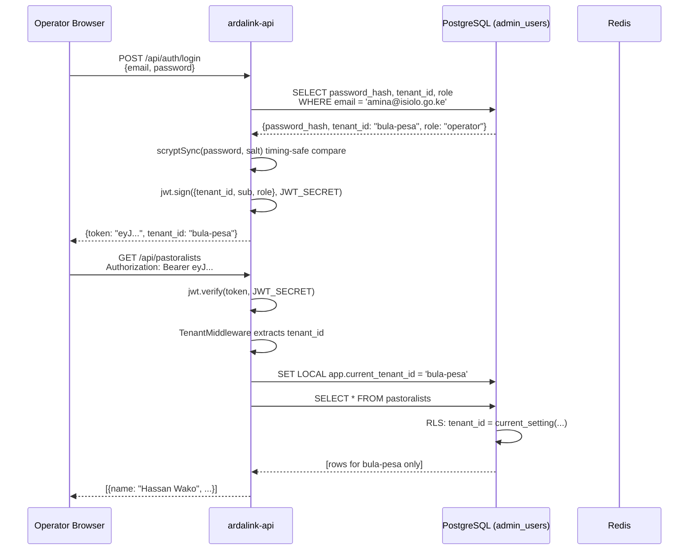
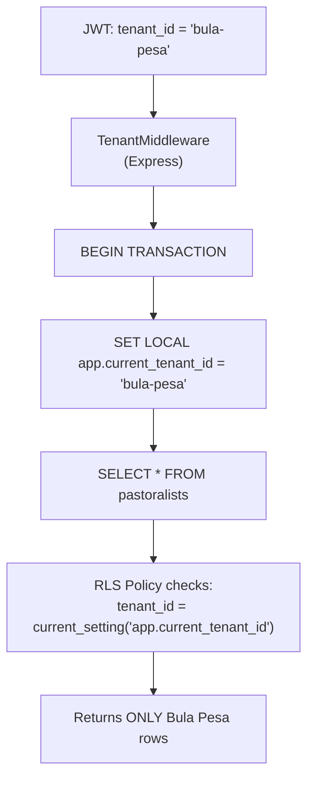
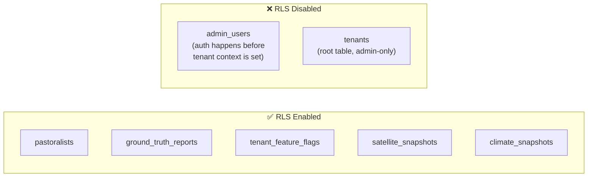
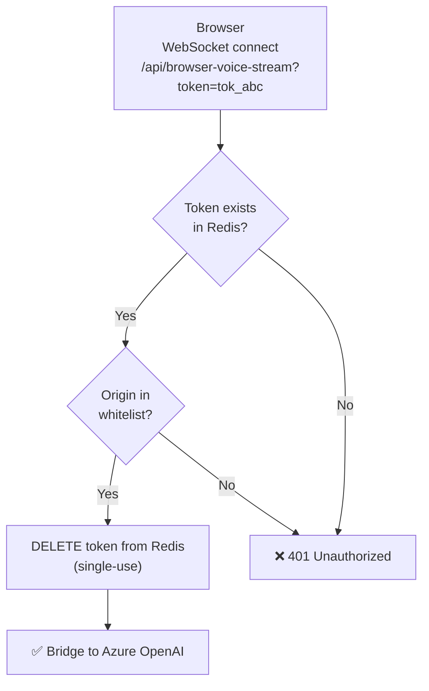

# ArdaLink AI — Security & Multi-Tenancy

> This document covers ArdaLink's authentication system, multi-tenant data isolation via PostgreSQL Row-Level Security (RLS), rate limiting, and WebSocket security.

---

## Table of Contents

1. [Authentication Flow](#authentication-flow)
2. [JWT Token Structure](#jwt-token-structure)
3. [Multi-Tenancy Flow](#multi-tenancy-flow)
4. [Row-Level Security Implementation](#row-level-security-implementation)
5. [Rate Limiting](#rate-limiting)
6. [WebSocket Security](#websocket-security)
7. [CORS & Frontend Token Storage](#cors--frontend-token-storage)
8. [Secrets Management](#secrets-management)
9. [Dependency Posture](#dependency-posture)

---

## Authentication Flow



### Key security properties

- Passwords are stored as **`scryptSync` hashes** (memory-hard, stronger
  than bcrypt against GPU/ASIC cracking) — never plaintext. Verified
  2026-08-04: `src/lib/auth.ts` (not bcrypt, correcting this doc's prior
  claim).
- Login also runs a **decoy scrypt computation** against a fixed salt
  when the email doesn't match any user, before returning "invalid
  credentials" — this keeps response timing indistinguishable between
  "wrong password" and "no such user," closing a user-enumeration
  side-channel. A good pattern worth preserving, previously undocumented.
- JWTs are signed with `JWT_SECRET` (HMAC-SHA256, hand-rolled — not the
  `jsonwebtoken` package). Tokens contain no sensitive data — only
  `tenant_id`, `sub` (user ID), and `role`. `JWT_SECRET` is validated
  to be ≥32 bytes at boot (warns loudly if shorter); the local dev value
  is 60 bytes.
- Token expiry is recommended at 8 hours for operators, 1 hour for automated systems.
- `admin_users` is the **only table without RLS** — authentication must succeed before tenant context can be set.
- **No login rate limiting or lockout exists** (verified 2026-08-04 —
  see [Rate Limiting](#rate-limiting) below). `/api/auth/login` accepts
  unlimited attempts; only the scrypt cost factor and the decoy-hash
  timing defense stand between an attacker and a slow online brute force.
  Worth adding before this is reachable from anywhere untrusted.

---

## JWT Token Structure

```json
{
  "header": {
    "alg": "HS256",
    "typ": "JWT"
  },
  "payload": {
    "tenant_id": "bula-pesa",
    "sub": "admin_user:42",
    "role": "operator",
    "iat": 1750000000,
    "exp": 1750028800
  }
}
```

**Claims:**

| Claim | Type | Description |
|-------|------|-------------|
| `tenant_id` | string | Ward/tenant identifier — sets DB context |
| `sub` | string | Subject: `admin_user:<id>` |
| `role` | string | `operator` \| `supervisor` \| `admin` |
| `iat` | number | Issued-at timestamp |
| `exp` | number | Expiry timestamp |

---

## Multi-Tenancy Flow

ArdaLink uses a **shared-schema, per-row isolation** model. All tenant data coexists in the same tables, separated by `tenant_id` and enforced by PostgreSQL Row-Level Security.



**Critical detail:** `SET LOCAL` scopes the setting to the current transaction. When the transaction commits or rolls back, the setting is cleared. This prevents tenant context leakage between requests in a connection pool.

### Tenant isolation matrix

| Tenant | Can Read Own Data | Can Read Other Tenant Data | Notes |
|--------|------------------|---------------------------|-------|
| Any authenticated `admin_user` | ✅ | ❌ (RLS blocks) | RLS scopes strictly to the JWT's own `tenant_id` |
| No JWT | ❌ | ❌ | Public endpoints only |

**Correction (2026-08-04):** `admin_users.role` is a free-form `text`
column (default `"operator"`) — it is stored and present on the JWT, but
**nothing in the codebase currently branches on it**. There is no
`admin`-tier cross-tenant override today; every authenticated
`admin_user` has identical power within their own tenant, full stop. The
previous version of this table described a 3-tier role model
(`operator`/`supervisor`/`admin`) with an admin cross-tenant bypass that
does not exist in the real implementation. This is a known, tracked gap
(see the Operator Data-Management Console plan) — worth building
role-gated middleware (e.g. `role='admin'` required for deletes) before
opening the console beyond a small trusted operator group, not urgent
while every current user of it is already fully trusted.

---

## Row-Level Security Implementation

### Enabling RLS on a table

```sql
-- Enable RLS
ALTER TABLE pastoralists ENABLE ROW LEVEL SECURITY;
ALTER TABLE pastoralists FORCE ROW LEVEL SECURITY;  -- applies to table owner too

-- Create isolation policy
CREATE POLICY tenant_isolation ON pastoralists
    AS PERMISSIVE
    FOR ALL
    TO ardalink_app_role
    USING (tenant_id = current_setting('app.current_tenant_id', TRUE));
```

The `TRUE` parameter in `current_setting(..., TRUE)` means: return `NULL` if the setting is not defined (rather than raising an error). When `NULL` is returned, the policy evaluates to `false` — rows are hidden silently.

### Tables with RLS enabled



### Application-side context wrapper

```typescript
// ardalink-api/src/db/tenant.ts
import { sql } from 'drizzle-orm';
import { db } from './client';

export async function withTenantContext<T>(
    tenantId: string,
    fn: (tx: typeof db) => Promise<T>
): Promise<T> {
    return db.transaction(async (tx) => {
        // Scoped to this transaction only
        await tx.execute(
            sql`SET LOCAL app.current_tenant_id = ${tenantId}`
        );
        return fn(tx);
    });
}

// Usage in a route handler:
app.get('/api/pastoralists', async (req, res) => {
    const { tenant_id } = req.jwt; // extracted by TenantMiddleware
    const rows = await withTenantContext(tenant_id, (tx) =>
        tx.select().from(pastoralists)
    );
    res.json(rows);
});
```

---

## Rate Limiting

**Correction (2026-08-04):** the Redis-backed design previously
documented here does not exist in the current codebase. Verified
directly: no `express-rate-limit`-style dependency, no `redis:` key
prefixes, no `.incr()`/counter calls anywhere in `ardalink-api/src`.
`ardalink-local-redis` runs in the local dev stack but nothing in the
application actually connects to it — it's provisioned, not used. This
means `/api/auth/login`, voice-call triggers, the WhatsApp/USSD/SMS
webhooks, and every other endpoint currently accept unlimited requests
with no application-level throttling.

Real limits that exist today are all upstream/provider-side, not
application code:
- Africa's Talking, Evolution, and Meta/360dialog each have their own
  account-level sending/rate caps, enforced by the provider, not by
  ArdaLink.
- The LLM registry (`src/lib/llm/cost.ts`) enforces a **daily budget**
  per provider (a spend cap, not a per-caller rate limit) — a runaway
  caller can still exhaust it and degrade service for everyone else
  before the cap kicks in.

**Recommended before any deployment reachable from an untrusted
network** (i.e. anything past local dev — see
[`deployment.md`](./deployment.md)): add `express-rate-limit` (or
equivalent) at minimum on `/api/auth/login` (attempt throttling) and on
the public-facing WhatsApp/USSD/SMS webhook routes (abuse/DoS
protection). The already-running Redis instance is a natural store for
this if request volume ever outgrows in-memory counters.

---

## WebSocket Security

### Voice stream (`/api/voice-stream`)

This endpoint is called by Africa's Talking — not browsers. It is protected by:

1. **Phone number validation:** The `?phone=` query parameter must match a registered pastoralist in the current tenant.
2. **Session token:** The session ID from `/api/voice-callback` must be present and unused.
3. **Origin:** AT connects from known IP ranges; unexpected origins are rejected.

### Browser voice stream (`/api/browser-voice-stream`)



**Allowed origins (configured via env):**
- `localhost` (development)
- `*.replit.app` (Replit preview)
- `your-domain.com` (production)

Any connection with a missing, empty, or unlisted `Origin` header is rejected with HTTP 401.

---

## CORS & Frontend Token Storage

**Added 2026-08-04 (security sweep).**

- **CORS is currently fully open**: `ardalink-api/src/app.ts` calls
  `app.use(cors())` with no options — this reflects any request origin.
  Low-risk while the API is only reachable from local dev, but the
  operator console now includes destructive actions (delete water node,
  decline a lead, correct ground truth) — restrict to the real dashboard
  origin(s) via `cors({ origin: [...] })` before any deployment reachable
  from the open internet (see [`deployment.md`](./deployment.md) for
  which scenarios that applies to).
- **The operator JWT is stored in `localStorage`** (`ardalink.jwt`,
  `dashboard/packages/api-client-react`'s `readToken()`/`writeToken()`).
  Standard practice, but readable by any JS running on the page — an
  XSS vulnerability anywhere in the dashboard would let an attacker steal
  it. This sweep checked every `dangerouslySetInnerHTML` in the dashboard
  and found exactly one, in shadcn's `ChartStyle` component — it only
  injects fixed CSS custom-property declarations from a hardcoded
  `THEMES` map, never operator/herder-sourced text, so no active XSS
  vector was found. Documented here as a defense-in-depth note: any
  future component that renders raw ground-truth text, pastoralist
  names, or other DB-sourced strings via `dangerouslySetInnerHTML` (or
  an unescaped template) would turn this into a real token-theft path.

---

## Secrets Management

### Local development (current actual practice)

Real secrets live in `ardalink-api/.env.local` and `ardalink-engine/.env.local`
(gitignored — confirmed via `git log --all` that neither has ever been
committed, in either repo). Loaded two ways depending on how the process
starts:
- **Direct/dev** (`pnpm run dev`, `uv run`): the app's own dotenv-style
  loader reads `.env.local` directly.
- **systemd** (the always-on local WhatsApp-tester instance — see
  [`deployment.md`](./deployment.md)): `EnvironmentFile=` feeds most of
  `.env.local` into the process environment before Node even starts.
  **Known caveat, fixed 2026-08-04**: systemd's env-file parser silently
  corrupts multi-line PEM values with escaped `\n` sequences (it drops
  the backslash) — `GOOGLE_SERVICE_ACCOUNT_JSON`'s private key was
  breaking Earth Engine auth this way for an unknown period until
  root-caused. That one var is now deliberately excluded from
  `EnvironmentFile=` and loaded via the app's own dotenv fallback
  instead (which parses it correctly) — see the F3 entry in `STATUS.md`
  for the full root-cause chain. Any future secret with embedded
  newlines/special characters should go through the same path, not
  `EnvironmentFile=` directly.
- **Structural risk, not fixable by `chmod`**: the entire project
  currently lives on an NTFS drive mounted via FUSE with
  `uid=0,gid=0,allow_other` — every file, `.env.local` included, reports
  as world-readable/writable and `chmod` is a silent no-op (there's no
  real ACL underneath for it to change). This is acceptable only because
  it's a single-developer local machine; it must not be replicated on
  any real deployment target below — those need an actual Linux
  filesystem where `chmod 600` on env files is real.

### Production

Recommended secret storage options (in order of preference):

1. **Docker secrets** — for self-hosted Docker Compose/Swarm deployments
2. **AWS Secrets Manager** — if hosting on AWS
3. **Azure Key Vault** — if hosting on Azure (co-located with Azure OpenAI)
4. **Environment variables via hosting platform UI** — DigitalOcean App Platform, Hetzner Cloud, etc.

### Secret rotation policy

| Secret | Rotation | Priority |
|--------|----------|----------|
| `JWT_SECRET` | Every 90 days | High — invalidates all sessions |
| `SESSION_SECRET` | Every 90 days | High |
| `TENANT_ATTESTATION_SECRET` | Every 180 days | Medium |
| `AFRICASTALKING_API_KEY` | On staff changes | High |
| `AZURE_OPENAI_API_KEY` | Every 90 days | High |
| `GEE_SERVICE_ACCOUNT` | Annual or on staff changes | Medium |
| `POSTGRES_PASSWORD` | Every 180 days | High |
| `SUPABASE_SECRET_KEY` | Every 90 days | High — full read/write on the real production data store |

---

## Dependency Posture

**Added 2026-08-04 (security sweep).** GitHub's Dependabot banner reports
~30 advisories repo-wide, which sounds alarming out of context — broken
down by actual exposure:

| Service | Prod-relevant | Detail |
|---|---|---|
| `ardalink-api` | 1 moderate | `uuid` <11.1.1, transitive via `@google/earthengine`→`googleapis`; only exploitable if a `buf` param is passed to uuid v3/v5/v6 generation, which googleapis's internal usage doesn't do |
| `ardalink-web` | 1 high, 1 moderate, 1 low | All `postcss`/`esbuild`, transitively inside Vite's *dev-server* toolchain — not present in the actual built `dist/` served by nginx in any deployment |
| `ardalink-engine` | 1 moderate | `cryptography` 49.0.0 → 50.0.0 fix available |

The remaining ~26 advisories are devDependency-only — test tooling
(`vitest`, `testcontainers`'s `archiver`), linting (`eslint`) — never
shipped, never network-reachable in production. `vitest`'s one critical
advisory (arbitrary file read/execute) specifically requires its UI
server to be listening, which no environment here ever runs. Worth
occasionally bumping (`postcss`/`esbuild` are trivial patch bumps;
`vitest` 2.x→3.x is a semver-major with likely config/API changes, not a
quick fix) but none of this blocks any deployment.

---

## Cross-References

- **Database schema and RLS tables:** [`data.md`](./data.md)
- **API authentication endpoints:** [`api.md`](./api.md#authentication)
- **Environment variables:** [`deployment.md`](./deployment.md#environment-variables)
- **Developer setup:** [`onboarding.md`](./onboarding.md)
