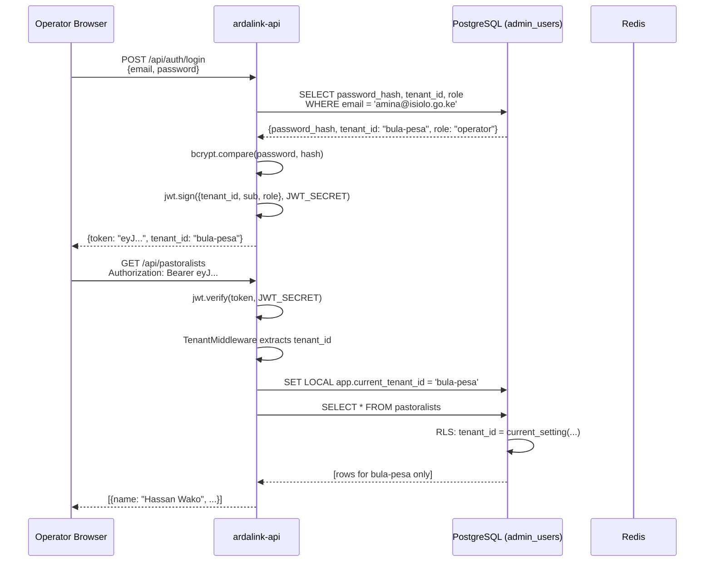
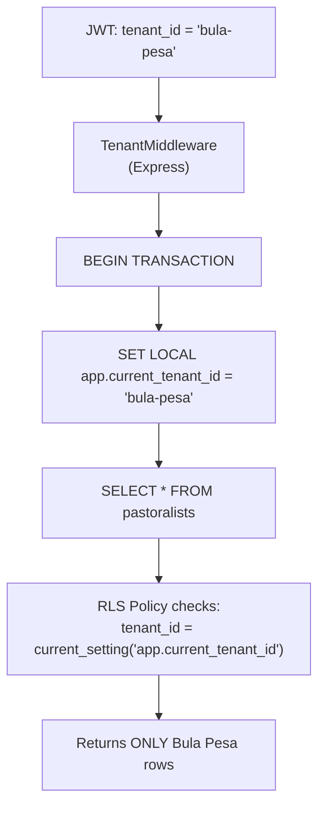
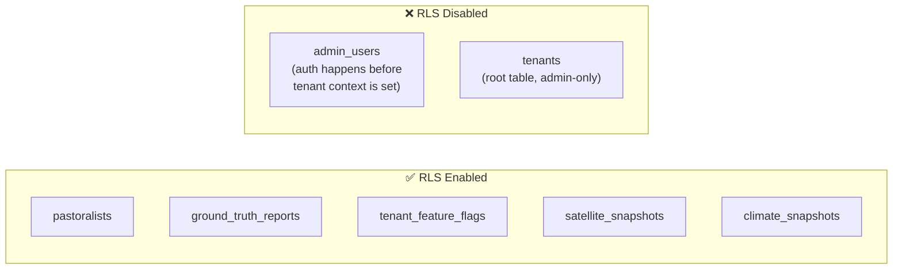
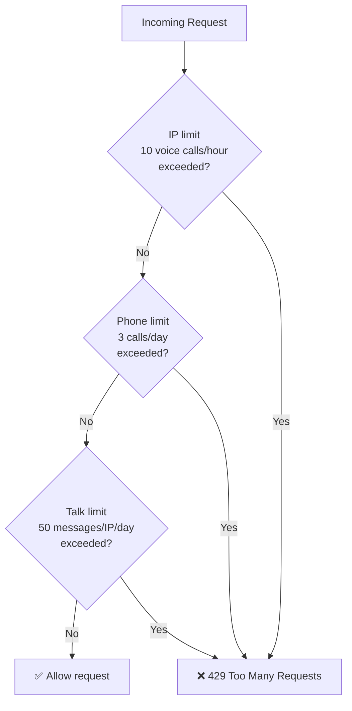
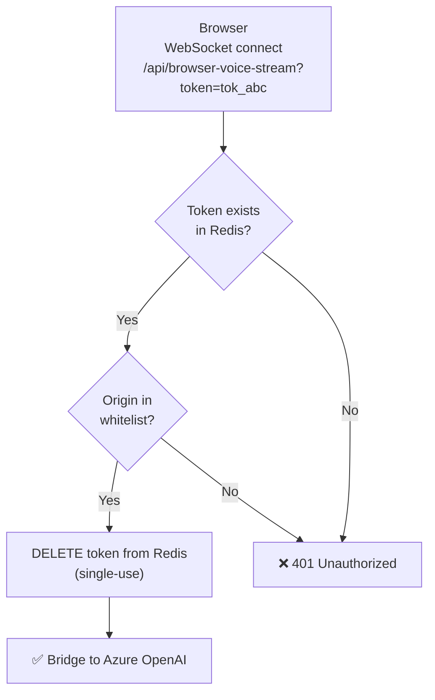

# ArdaLink AI — Security & Multi-Tenancy

> This document covers ArdaLink's authentication system, multi-tenant data isolation via PostgreSQL Row-Level Security (RLS), rate limiting, and WebSocket security.

---

## Table of Contents

1. [Authentication Flow](#authentication-flow)
2. [JWT Token Structure](#jwt-token-structure)
3. [Multi-Tenancy Flow](#multi-tenancy-flow)
4. [Row-Level Security Implementation](#row-level-security-implementation)
5. [Rate Limiting](#rate-limiting)
6. [WebSocket Security](#websocket-security)
7. [Secrets Management](#secrets-management)

---

## Authentication Flow



### Key security properties

- Passwords are stored as **bcrypt hashes** — never plaintext.
- JWTs are signed with `JWT_SECRET` (HS256). Tokens contain no sensitive data — only `tenant_id`, `sub` (user ID), and `role`.
- Token expiry is recommended at 8 hours for operators, 1 hour for automated systems.
- `admin_users` is the **only table without RLS** — authentication must succeed before tenant context can be set.

---

## JWT Token Structure

```json
{
  "header": {
    "alg": "HS256",
    "typ": "JWT"
  },
  "payload": {
    "tenant_id": "bula-pesa",
    "sub": "admin_user:42",
    "role": "operator",
    "iat": 1750000000,
    "exp": 1750028800
  }
}
```

**Claims:**

| Claim | Type | Description |
|-------|------|-------------|
| `tenant_id` | string | Ward/tenant identifier — sets DB context |
| `sub` | string | Subject: `admin_user:<id>` |
| `role` | string | `operator` \| `supervisor` \| `admin` |
| `iat` | number | Issued-at timestamp |
| `exp` | number | Expiry timestamp |

---

## Multi-Tenancy Flow

ArdaLink uses a **shared-schema, per-row isolation** model. All tenant data coexists in the same tables, separated by `tenant_id` and enforced by PostgreSQL Row-Level Security.



**Critical detail:** `SET LOCAL` scopes the setting to the current transaction. When the transaction commits or rolls back, the setting is cleared. This prevents tenant context leakage between requests in a connection pool.

### Tenant isolation matrix

| Tenant | Can Read Own Data | Can Read Other Tenant Data | Notes |
|--------|------------------|---------------------------|-------|
| `operator` role | ✅ | ❌ (RLS blocks) | Default |
| `supervisor` role | ✅ | ❌ (RLS blocks) | |
| `admin` role | ✅ | ✅ (can override tenant_id) | Cross-tenant analytics |
| No JWT | ❌ | ❌ | Public endpoints only |

---

## Row-Level Security Implementation

### Enabling RLS on a table

```sql
-- Enable RLS
ALTER TABLE pastoralists ENABLE ROW LEVEL SECURITY;
ALTER TABLE pastoralists FORCE ROW LEVEL SECURITY;  -- applies to table owner too

-- Create isolation policy
CREATE POLICY tenant_isolation ON pastoralists
    AS PERMISSIVE
    FOR ALL
    TO ardalink_app_role
    USING (tenant_id = current_setting('app.current_tenant_id', TRUE));
```

The `TRUE` parameter in `current_setting(..., TRUE)` means: return `NULL` if the setting is not defined (rather than raising an error). When `NULL` is returned, the policy evaluates to `false` — rows are hidden silently.

### Tables with RLS enabled



### Application-side context wrapper

```typescript
// ardalink-api/src/db/tenant.ts
import { sql } from 'drizzle-orm';
import { db } from './client';

export async function withTenantContext<T>(
    tenantId: string,
    fn: (tx: typeof db) => Promise<T>
): Promise<T> {
    return db.transaction(async (tx) => {
        // Scoped to this transaction only
        await tx.execute(
            sql`SET LOCAL app.current_tenant_id = ${tenantId}`
        );
        return fn(tx);
    });
}

// Usage in a route handler:
app.get('/api/pastoralists', async (req, res) => {
    const { tenant_id } = req.jwt; // extracted by TenantMiddleware
    const rows = await withTenantContext(tenant_id, (tx) =>
        tx.select().from(pastoralists)
    );
    res.json(rows);
});
```

---

## Rate Limiting

Rate limiting is enforced via Redis. Counters are keyed by phone number or IP address with a TTL matching the window.



### Rate limit policies

| Resource | Limit | Window | Key |
|----------|-------|--------|-----|
| Voice call trigger | 10 | 1 hour | IP address |
| Voice call trigger | 3 | 24 hours | Phone number |
| Browser voice messages | 50 | 24 hours | IP address |
| Browser voice tokens | 1 | Per token | Token value |

### Redis key patterns

```
rate:voice:ip:<ip_address>        → counter, TTL 3600s
rate:voice:phone:<e164_number>    → counter, TTL 86400s
rate:talk:ip:<ip_address>         → counter, TTL 86400s
token:voice:<token_value>         → "1" (exists = valid), TTL = ttl param
```

---

## WebSocket Security

### Voice stream (`/api/voice-stream`)

This endpoint is called by Africa's Talking — not browsers. It is protected by:

1. **Phone number validation:** The `?phone=` query parameter must match a registered pastoralist in the current tenant.
2. **Session token:** The session ID from `/api/voice-callback` must be present and unused.
3. **Origin:** AT connects from known IP ranges; unexpected origins are rejected.

### Browser voice stream (`/api/browser-voice-stream`)



**Allowed origins (configured via env):**
- `localhost` (development)
- `*.replit.app` (Replit preview)
- `your-domain.com` (production)

Any connection with a missing, empty, or unlisted `Origin` header is rejected with HTTP 401.

---

## Secrets Management

### Local development

Store secrets in a `.env` file at the repository root. **Never commit `.env` to git.**

```bash
# .gitignore
.env
.env.local
.env.production
```

### Production

Recommended secret storage options (in order of preference):

1. **Docker secrets** — for self-hosted Docker Compose/Swarm deployments
2. **AWS Secrets Manager** — if hosting on AWS
3. **Azure Key Vault** — if hosting on Azure (co-located with Azure OpenAI)
4. **Environment variables via hosting platform UI** — DigitalOcean App Platform, Hetzner Cloud, etc.

### Secret rotation policy

| Secret | Rotation | Priority |
|--------|----------|----------|
| `JWT_SECRET` | Every 90 days | High — invalidates all sessions |
| `SESSION_SECRET` | Every 90 days | High |
| `TENANT_ATTESTATION_SECRET` | Every 180 days | Medium |
| `AFRICASTALKING_API_KEY` | On staff changes | High |
| `AZURE_OPENAI_API_KEY` | Every 90 days | High |
| `GEE_SERVICE_ACCOUNT` | Annual or on staff changes | Medium |
| `POSTGRES_PASSWORD` | Every 180 days | High |

---

## Cross-References

- **Database schema and RLS tables:** [`data.md`](./data.md)
- **API authentication endpoints:** [`api.md`](./api.md#authentication)
- **Environment variables:** [`deployment.md`](./deployment.md#environment-variables)
- **Developer setup:** [`onboarding.md`](./onboarding.md)
