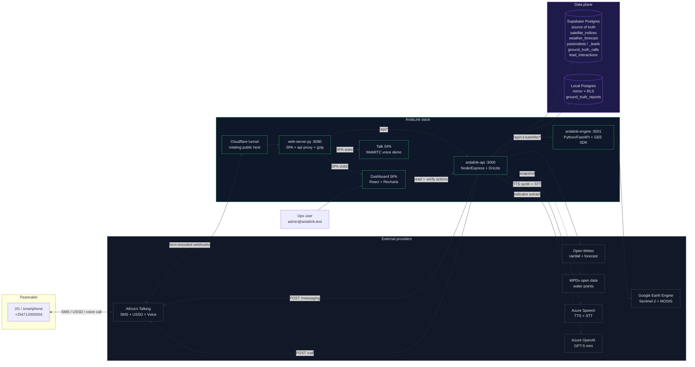
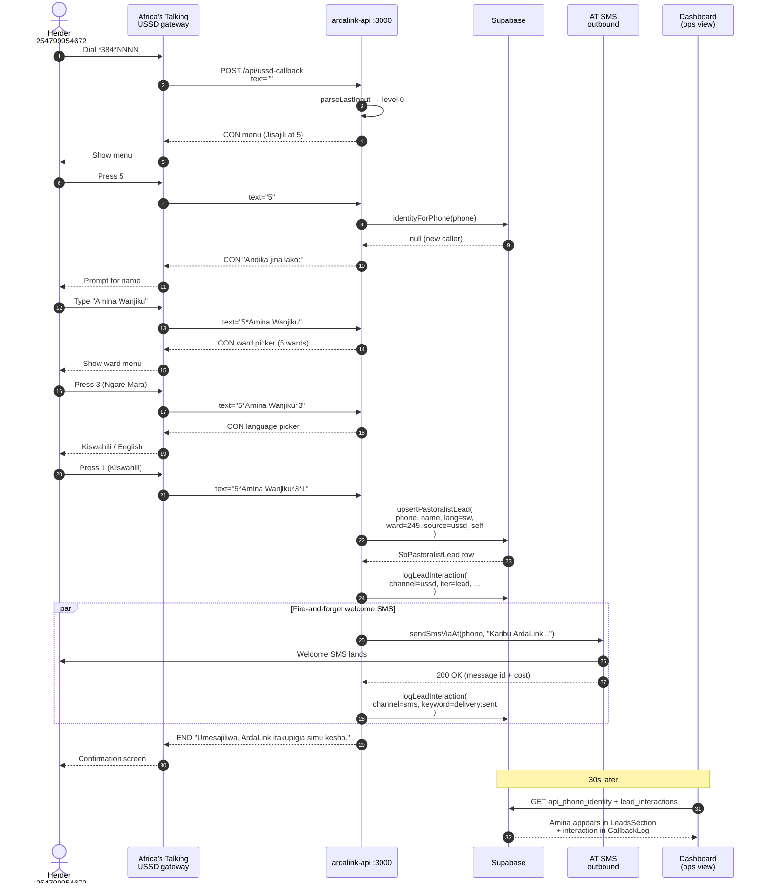
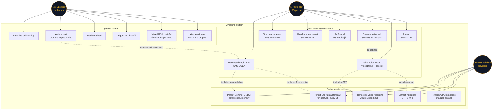

# ArdaLink — System UML Diagrams

Rendered natively by GitHub, VS Code preview, Notion (with the Mermaid
integration), and Obsidian. All three diagrams are kept in one file so
the audit reviewer can see topology, flow, and capability in one scroll.

Status: **pre-launch pilot**. All actor phones and data referenced in
these diagrams are test / synthetic. No real herders enrolled yet.

---

## 1. Component diagram — system topology + data flow

Shows every deployed piece of ArdaLink and how they connect. External
providers (Africa's Talking, Google Earth Engine, Open-Meteo, WPDx,
Azure Speech, Azure OpenAI) are the black-boxes the system depends on.
Supabase Postgres is the source-of-truth data plane; local Postgres is
a resilient mirror.



**Reading it:**
- Herder never talks to us directly — AT is the only edge. Every AT
  webhook lands on the tunnel, is proxied to the api, and the api
  replies (SMS body, USSD `CON`/`END` text, voice XML).
- Api is the coordinator. It reads Supabase for herder identity +
  satellite + weather, delegates raw GEE fetches to the Python engine,
  writes reports to both Supabase (source of truth) and local (mirror).
- Ops interacts only with the dashboard, never with production data
  directly.

---

## 2. Sequence diagram — USSD self-enrollment end-to-end (Jisajili flow)

The most complete existing loop-closure example: a herder dials USSD,
walks the 4-screen enrollment, lands in `pastoralist_leads`, gets a
welcome SMS, appears on the ops dashboard. Every arrow below is code
that runs today.



**Reading it:**
- 4 USSD round-trips, 1 outbound SMS, 2 Supabase writes (lead +
  interaction), all instrumented.
- The SMS is fire-and-forget (`par` block) — USSD `END` returns to
  AT immediately so the herder isn't waiting for the SMS to dispatch.
- The dashboard sees the new lead within 30 seconds via the
  auto-refreshing panel.
- Every interaction — USSD keystroke, welcome SMS, delivery status —
  is a row in `lead_interactions` so the ops CallbackLog shows the
  entire timeline.

---

## 3. Use case diagram — actors + capabilities

Who does what. Three actors interact with the system: **Pastoralist**
(via 2G phone, real herder), **Ops user** (via dashboard, project
staff), and **External data provider** (AT / GEE / Open-Meteo — the
system consumes these).



**Reading it:**
- Pastoralist has 7 primary use cases, all channel-neutral (SMS,
  USSD, or voice depending on their preference).
- Ops has 6 dashboard-driven capabilities, split between reactive
  (view logs, verify) and proactive (trigger backfill).
- External data ingest is 5 background jobs — 3 scheduled, 2 called
  during voice pipeline execution.
- Dotted lines are `<<include>>` / `<<extend>>` — showing e.g. that
  requesting a voice call (UC5) dispatches the voice report use case
  (UC6), which itself includes STT + LLM extract.

---

## Diagram maintenance rules

- **When to update:** whenever a new external provider is added, a
  new persistent table lands in Supabase, or a new user-facing use
  case ships.
- **What NOT to include:** transient in-process caches, individual
  DB rows, log lines. Kept at the "system + capability" level.
- **Preview locally:**
  ```bash
  npx @mermaid-js/mermaid-cli -i system-diagrams.md -o diagrams.png
  ```
