# ArdaLink — System diagrams

Every diagram here is Mermaid — renders natively in GitHub, VS Code
preview, Notion, and Obsidian. Everything is grouped by *who starts
the flow*:

| Section | Trigger | What it covers |
|---|---|---|
| §1 | — | System topology (one big picture) |
| §2 | Herder | SMS · USSD · voice pipelines |
| §3 | The clock | Scheduled jobs (forecast, satellite, VCI backfill) |
| §4 | Africa's Talking | Delivery, opt-out, subscription callbacks |
| §5 | Ops user | Login, verify-a-lead, decline, heatmap toggle |
| §6 | The flywheel | How every herder report reshapes the next herder's brief |
| §7 | All actors | Use-case map |

> Pre-launch pilot. Every phone number below is a test fixture.

---

## 1. System topology

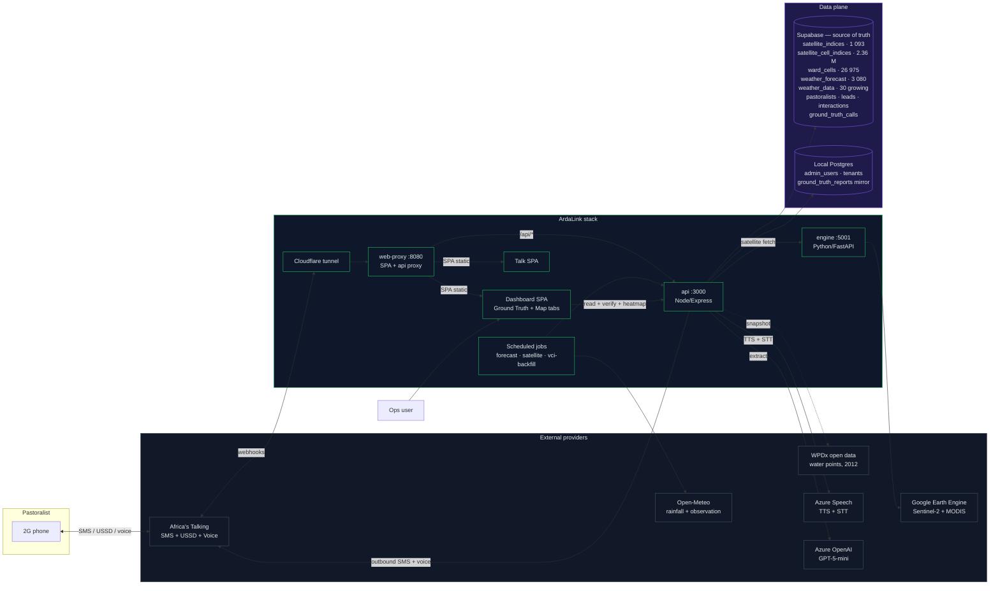

**Read it as:** the herder never touches us directly — Africa's
Talking is the only edge. The api coordinates every other piece.
Supabase is source of truth; the local database keeps a resilient
mirror plus what Supabase doesn't yet host (admin login, tenant
settings).

---

## 2. Herder flows

### 2.1 SMS keywords — one diagram, four keywords

Every keyword follows the same handler shape: **inbound webhook →
identify caller → compose reply → send outbound SMS → log both
sides**.

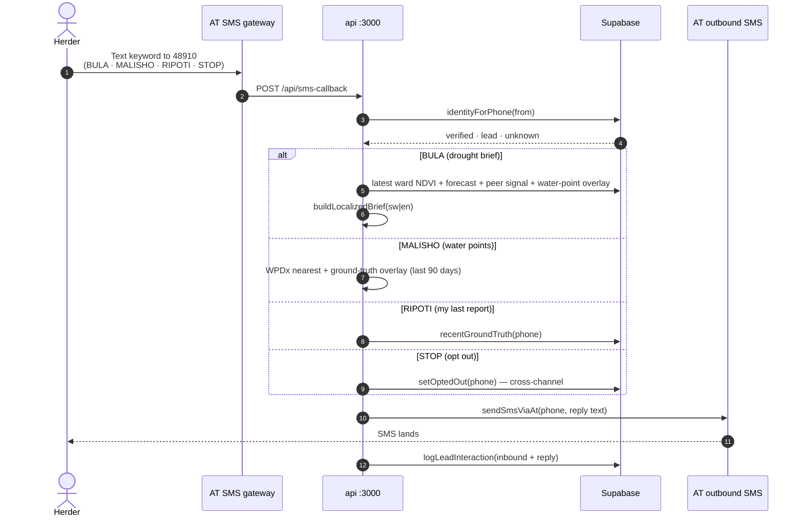

**Note:** `STOP` sends an empty outbound (Africa's Talking convention);
every future dispatch to that phone is blocked at the api boundary.

### 2.2 USSD menu — the 5 items

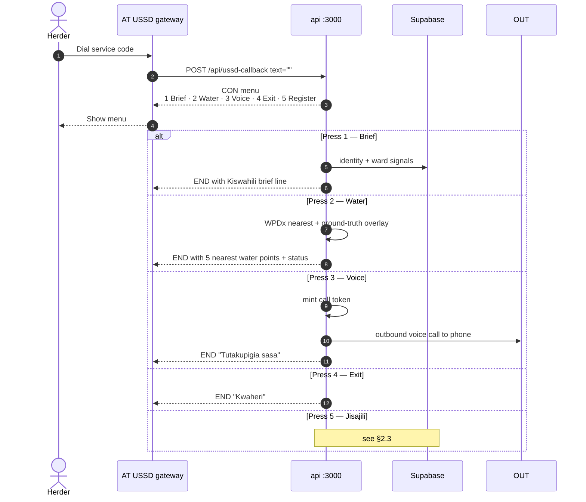

### 2.3 Jisajili — 4-screen self-enrolment

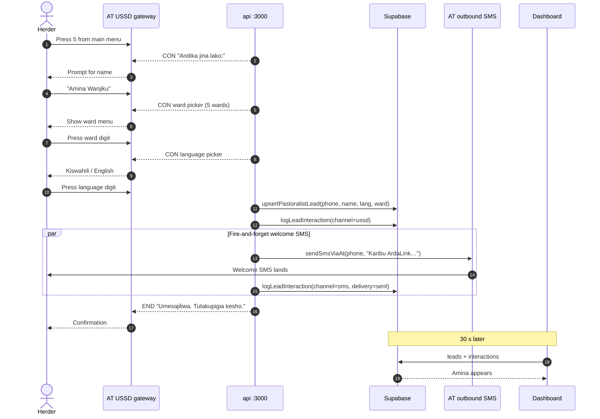

**Read it as:** four screens, one welcome SMS, two rows in Supabase.
The USSD `END` comes back to the herder before the SMS even
dispatches — never make them wait.

### 2.4 Voice pipeline

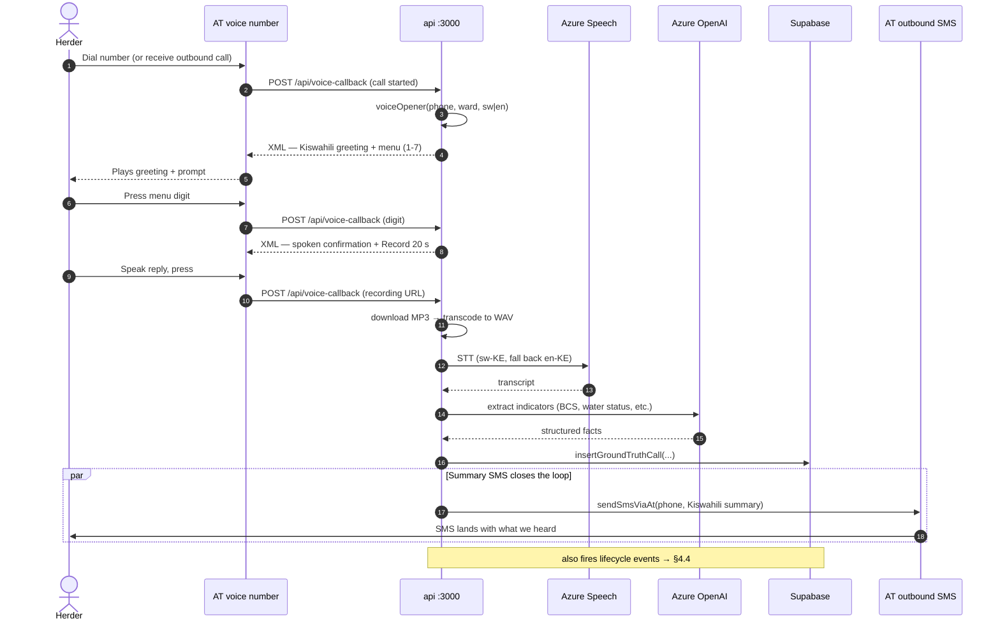

**Read it as:** three round-trips (greeting → menu → recording). At
the end the herder always gets an SMS summary of what we captured —
no black hole.

---

## 3. Scheduled jobs

### 3.1 Forecast job — every 6 hours

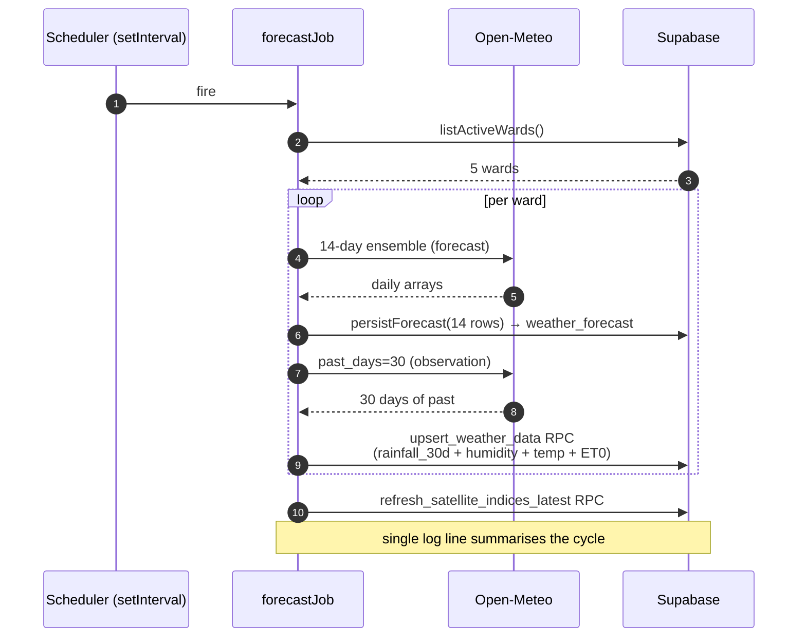

### 3.2 Satellite job — as-needed

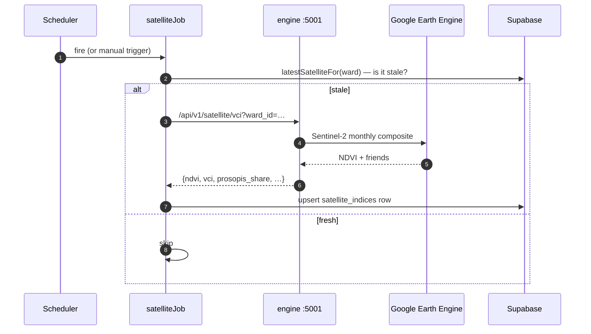

### 3.3 VCI backfill — on demand

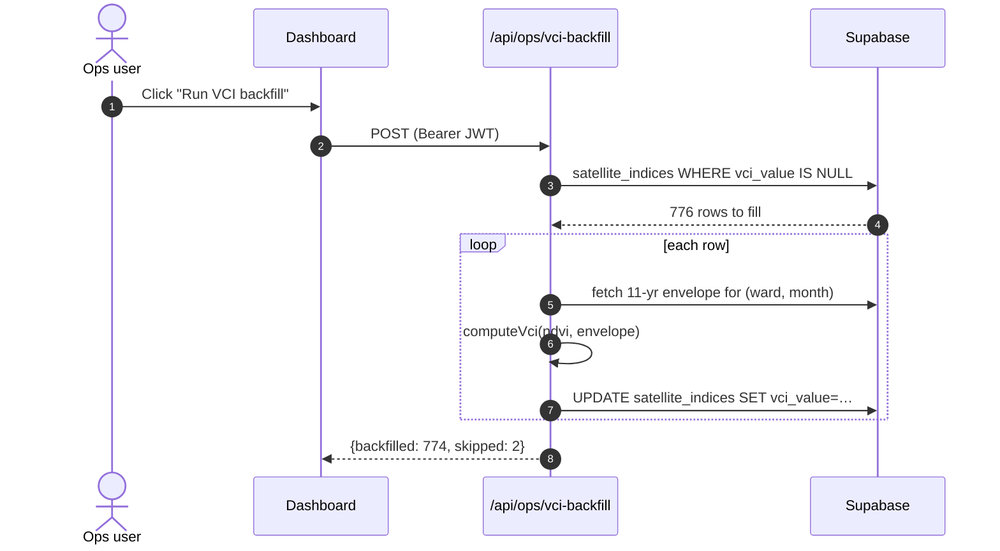

---

## 4. Africa's Talking callbacks

Every event AT sends us has its own handler. All are idempotent —
duplicate deliveries are safe.

### 4.1 SMS delivery report

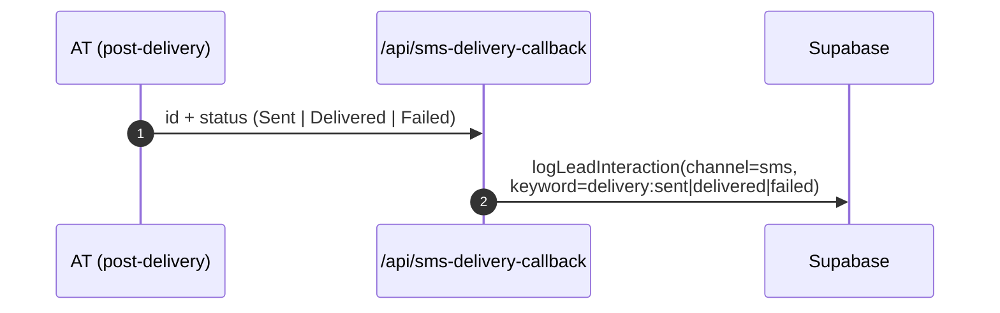

### 4.2 SMS opt-out (bulk)

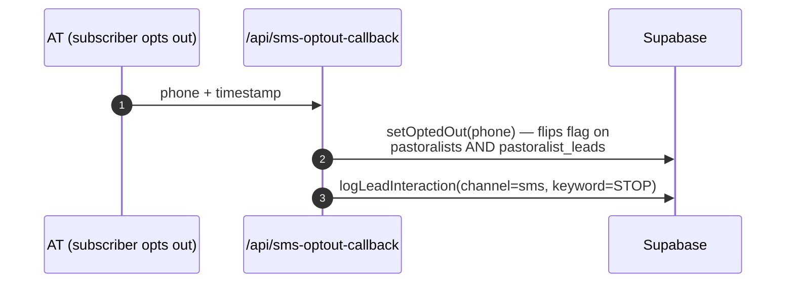

### 4.3 Subscription notification

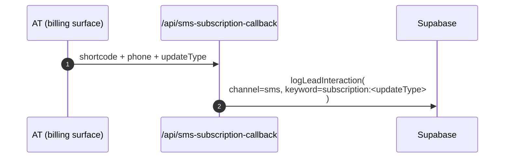

### 4.4 Voice call lifecycle

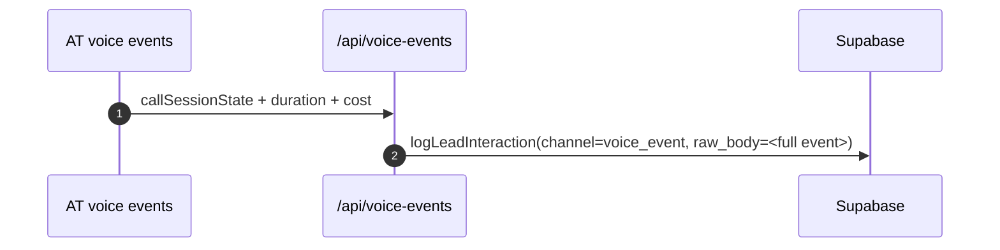

---

## 5. Ops flows

### 5.1 Login + dashboard boot

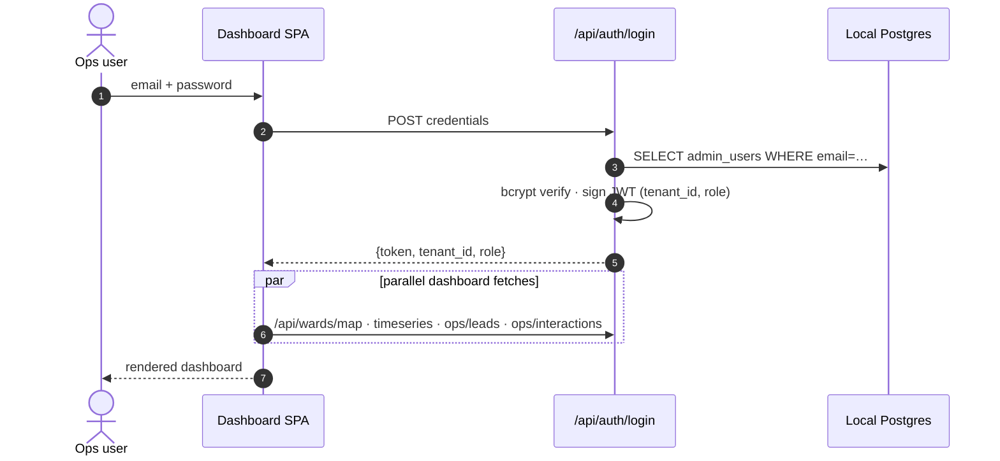

### 5.2 Verify a lead

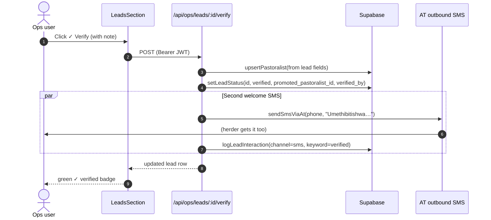

### 5.3 Decline a lead

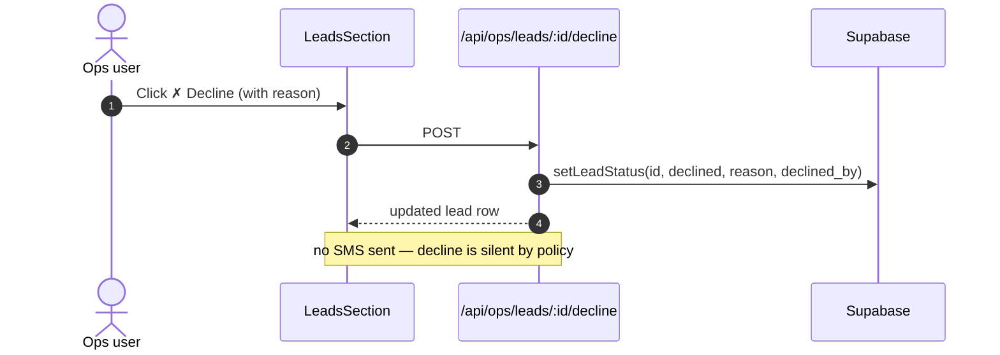

### 5.4 Heatmap toggle (both tabs)

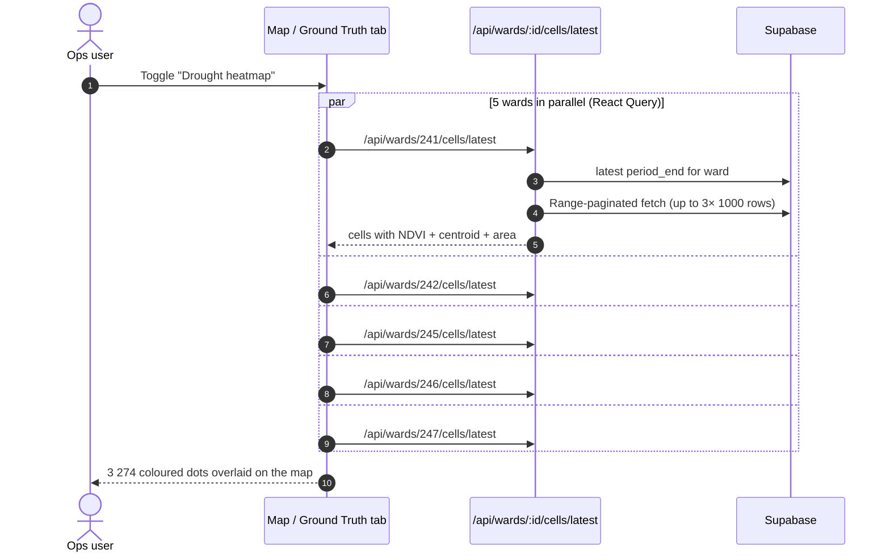

**Read it as:** the payload is capped per-ward and cached 30 min
client-side. Every fetch skips a Supabase view that used to time
out — the api reads the raw table + paginates around PostgREST's
1 000-row default.

---

## 6. The ground-truth flywheel

The single most important loop in the system: what one herder tells
us becomes the next herder's brief.

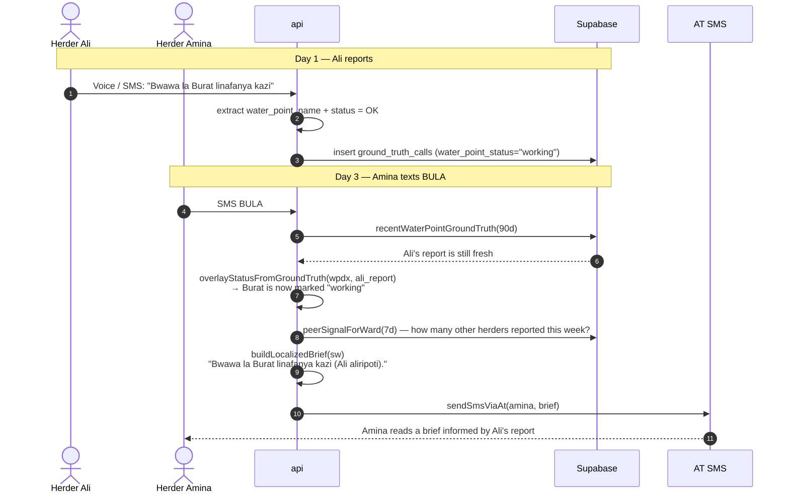

**Two windows in play:**

| Window | Purpose |
|---|---|
| **7 days** | Peer mood + pasture — stale fast |
| **90 days** | Water-point status — changes seasonally |

Both surface only when at least two herders have reported, so no
one herder's echo dominates.

---

## 7. Actors + use cases

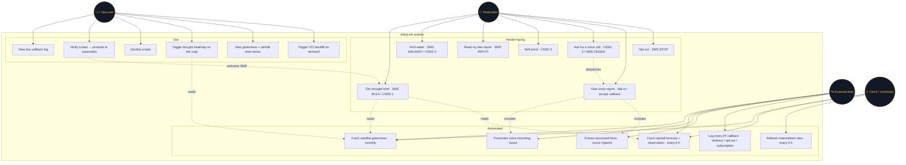

**Read it as:** four actors — herder, ops user, external data
provider, and the clock. Every use case has an owner. Dotted lines
show which capabilities extend or include others (e.g. verifying a
lead automatically triggers a welcome SMS).

---

## Diagram maintenance rules

- **Update whenever:** a new external provider is added, a new
  persistent table lands in Supabase, a new user-facing use case
  ships, or a scheduled job's cadence changes.
- **Do not include:** transient in-process caches, individual DB
  rows, log lines. Kept at the system + capability level.
- **Preview locally:**
  ```bash
  npx @mermaid-js/mermaid-cli -i system-diagrams.md -o diagrams.png
  ```
