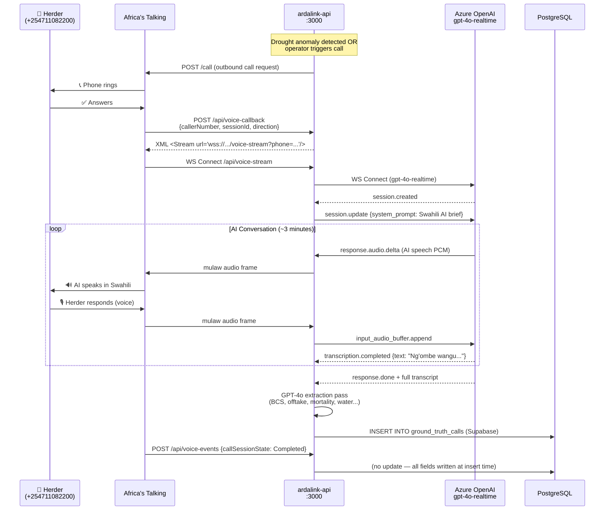
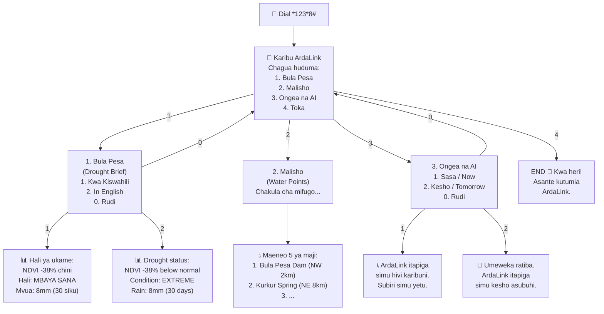
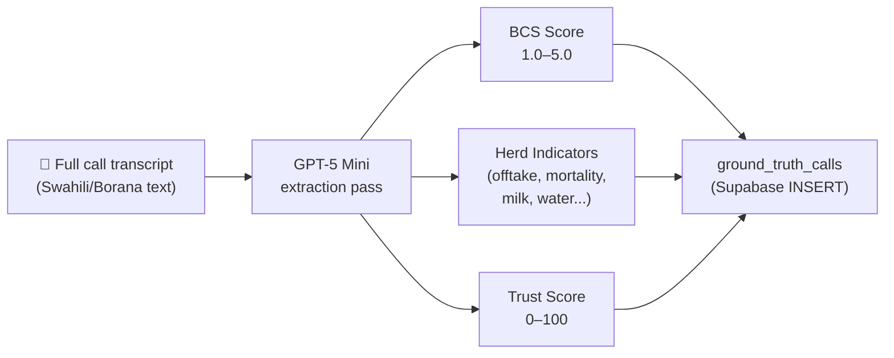

# ArdaLink AI — Voice, USSD & SMS

> ArdaLink communicates with pastoralists through three channels: voice calls (AI-conducted, Swahili/local dialects), USSD menus (structured text on 2G), and SMS keyword responses. All telephony is handled via **Africa's Talking (AT)**.

---

## Table of Contents

1. [Voice Call Sequence](#voice-call-sequence)
2. [USSD Menu Tree](#ussd-menu-tree)
3. [SMS Keyword Handling](#sms-keyword-handling)
4. [Africa's Talking Webhook Contracts](#africas-talking-webhook-contracts)
5. [AI Conversation Design](#ai-conversation-design)
6. [Language Support](#language-support)

---

## Voice Call Sequence

ArdaLink initiates outbound calls to pastoralists. The AI conducts a structured Swahili interview to collect livestock health indicators.



### Call trigger conditions

A call is automatically placed when:

1. The satellite pipeline detects `ndvi_vs_baseline_percent < -30%` for the herder's ward, **and**
2. The herder has `alerts_enabled = TRUE`, **and**
3. The per-phone rate limit has not been hit (3 calls / day)

Calls can also be triggered manually from the operator dashboard via `POST /api/trigger-check`.

---

## USSD Menu Tree

Herders dial `*123*8#` to access the USSD menu. The system supports 2G feature phones — no data connection needed.



### USSD response format

USSD responses are plain text prefixed with either `CON` (continues session) or `END` (terminates session):

```
CON Karibu ArdaLink
Chagua huduma:
1. Bula Pesa
2. Malisho
3. Ongea na AI
4. Toka
```

```
END Asante kutumia ArdaLink.
ArdaLink itapiga simu hivi karibuni.
```

### Menu text principles

- **Max ~160 characters** per screen (2G display limit)
- **Numbered options** (1, 2, 3, 0 for back)
- **Swahili-first**, with English as option 2 where applicable
- Water points shown as quadrant + estimated distance (e.g. `NW 2km`)

---

## SMS Keyword Handling

Herders can send SMS to the ArdaLink number. Responses are immediate and within 160 characters.

| Keyword | Language | Response |
|---------|----------|----------|
| `BULA` | Swahili | Drought brief + call notification |
| `MALISHO` | Swahili | 3 nearest water points |
| `ONGEA` | Swahili | Confirm call will be placed |
| `AI` | English/Swahili | Same as ONGEA |
| `STOP` | Any | Opt-out (no reply sent) |
| `SITAKI` | Swahili | Opt-out (no reply sent) |
| `UNDO` | English | Cancel opt-out (reactivate) |

### Example SMS exchanges

**Herder sends:** `BULA`

**ArdaLink replies:**
```
Hali ya ukame Bula Pesa: NDVI -38% chini ya kawaida.
VCI 22 - Hali mbaya sana. Mvua 8mm/wiki iliyopita.
ArdaLink itapiga simu hivi karibuni.
```

---

**Herder sends:** `MALISHO`

**ArdaLink replies:**
```
Maeneo ya maji karibu nawe:
1. Bula Pesa Dam (NW, ~2km)
2. Kurkur Spring (NE, ~8km)
3. Merti Town Tank (S, ~15km)
Jibu ONGEA kwa msaada zaidi.
```

---

**Herder sends:** `ONGEA`

**ArdaLink replies:**
```
Sawa. ArdaLink itapiga simu yako hivi karibuni.
Tafadhali jibu simu ukipata. Asante.
```

---

## Africa's Talking Webhook Contracts

### POST `/api/voice-callback`

Fired when the herder answers an outbound call.

**Content-Type:** `application/x-www-form-urlencoded`

| Field | Type | Description |
|-------|------|-------------|
| `callerNumber` | string | Herder's E.164 phone number |
| `destinationNumber` | string | ArdaLink's caller ID |
| `sessionId` | string | Unique AT session identifier |
| `direction` | string | `"Outbound"` for ArdaLink-initiated calls |

**Expected response:** XML with `<Stream>` instruction (see [`api.md`](./api.md)).

---

### POST `/api/voice-events`

Fired at call state transitions: `Ringing`, `Active`, `Completed`, `Failed`.

| Field | Type | Description |
|-------|------|-------------|
| `sessionId` | string | Same as voice-callback session |
| `callSessionState` | string | `Ringing` \| `Active` \| `Completed` \| `Failed` |
| `durationInSeconds` | integer | Total call duration (on Completed) |
| `callerNumber` | string | Herder's number |

---

### POST `/api/ussd-callback`

Fired on every USSD interaction.

| Field | Type | Description |
|-------|------|-------------|
| `sessionId` | string | Unique USSD session ID |
| `serviceCode` | string | `*123*8#` |
| `phoneNumber` | string | Herder's E.164 number |
| `text` | string | Accumulated selections, `*`-separated (e.g. `1*2`) |

---

### POST `/api/sms-callback`

Fired when herder sends an SMS to the ArdaLink number.

| Field | Type | Description |
|-------|------|-------------|
| `from` | string | Herder's number |
| `to` | string | ArdaLink's number |
| `text` | string | Raw SMS content |
| `id` | string | AT message ID |
| `date` | string | Receipt timestamp |

---

## AI Conversation Design

### System prompt (summarised)

The AI voice agent is instructed to:

1. Greet the herder warmly in **Swahili** (or switch to Borana/Turkana/Somali if herder uses that language)
2. Introduce itself as **ArdaLink**, a system helping pastoralists with drought information
3. Share the current satellite drought brief for the herder's ward
4. Ask structured questions about:
   - Body Condition Score of cattle/goats/camels (1–5 scale)
   - Whether animals are being sold early
   - Deaths in the past week
   - Milk production changes
   - Distance to nearest water point
   - Water point condition
   - Any supplementary feeding
5. Offer to share water point locations or connect to emergency services
6. Close with a summary and next steps

### Indicator extraction

After the call, GPT-4o processes the full transcript to extract structured data:



**Trust score penalties:**

| Condition | Penalty |
|-----------|---------|
| Call duration < 30 seconds | −25 |
| BCS not collected | −20 |
| Fewer than 4 indicators collected | −15 |
| BCS confidence flagged as low | −10 |
| Satellite-ground truth mismatch (NDVI vs BCS) | −10 |
| Internal contradiction detected | −10 |

A trust score below 50 flags the report for supervisor review.

---

## Language Support

| Language | ISO Code | Channel | Notes |
|----------|----------|---------|-------|
| Swahili | `sw` | Voice, USSD, SMS | Primary — all messages |
| English | `en` | USSD, Dashboard | Secondary USSD option |
| Borana | `gax` | Voice | AI switches if herder uses it |
| Turkana | `tuv` | Voice | AI switches if herder uses it |
| Samburu | `saq` | Voice | AI switches if herder uses it |
| Somali | `so` | Voice | AI switches if herder uses it |

Language switching in voice calls is handled automatically by gpt-4o-realtime, which detects the herder's language from the first response and adapts. The system prompt instructs the AI to prioritise comprehension over strict language matching.

---

## Cross-References

- **API endpoint specs:** [`api.md`](./api.md)
- **Ground truth data stored per call:** [`data.md`](./data.md)
- **Rate limiting for calls:** [`security.md`](./security.md)
- **Azure OpenAI voice bridge architecture:** [`architecture.md`](./architecture.md)
