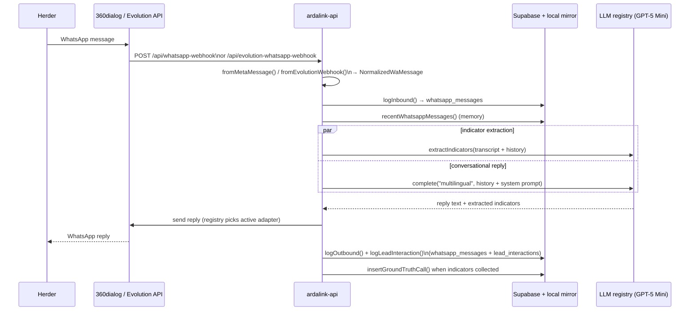
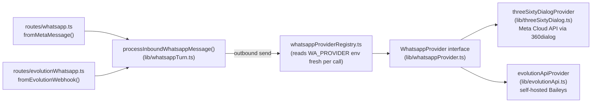
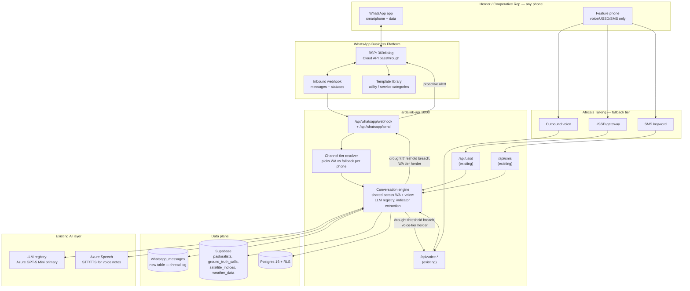
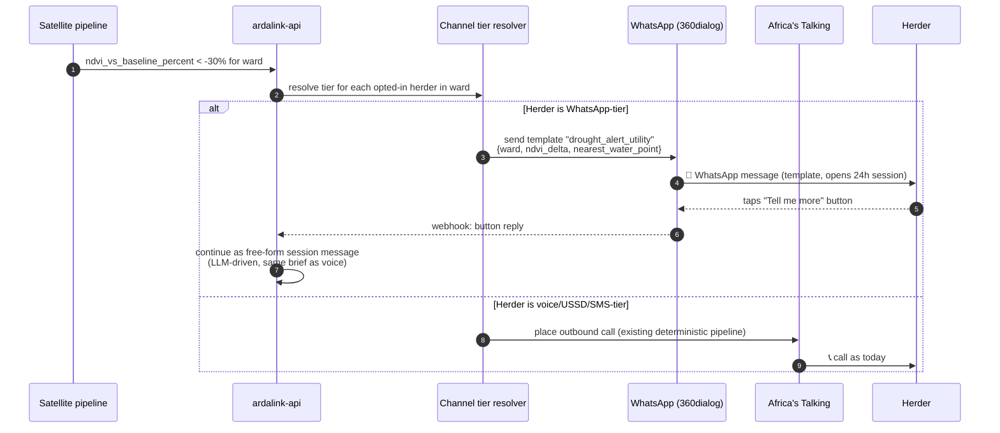
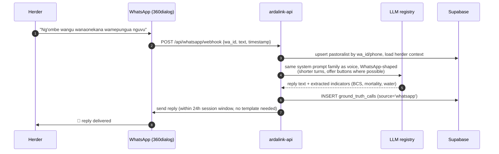
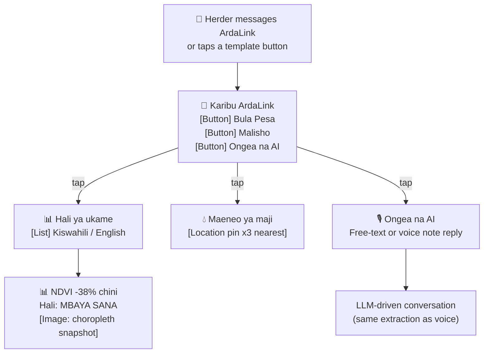

# ArdaLink AI — WhatsApp-First Delivery Architecture

> **Status**: **Phase 0/1 shipped and live-tested** (as of 2026-07-30) —
> WhatsApp is a working channel today, running against a real linked
> WhatsApp account via Evolution API while Meta Business verification
> for the 360dialog path is pending (see
> [As-built status](#as-built-status-202607) below). The rest of this
> document is the original strategic rationale for the WhatsApp-first
> pivot — voice/USSD/SMS retained as a genuine fallback tier — plus the
> phased roadmap for what's still ahead (Phase 2+). Read the as-built
> section first; the strategic sections below it are still accurate,
> just not yet fully executed.
>
> Builds on the vendor research already done in [`whatsapp-delivery.md`](./whatsapp-delivery.md) (Meta Cloud API vs BSP vs self-hosted options, and the Jan 2026 Meta AI-chatbot policy). That doc's conclusion — "don't make WhatsApp primary, scope it for cooperative reps first" — is the position this plan supersedes, on explicit direction from the team.

---

## Table of Contents

1. [As-built status (2026-07)](#as-built-status-202607)
2. [Why the pivot, and the tension we have to own](#why-the-pivot-and-the-tension-we-have-to-own)
3. [Channel tiering strategy](#channel-tiering-strategy)
4. [Target architecture](#target-architecture)
5. [Message flows](#message-flows)
6. [WhatsApp interaction design (replacing the USSD tree)](#whatsapp-interaction-design-replacing-the-ussd-tree)
7. [Data model changes](#data-model-changes)
8. [Delivery approach decision](#delivery-approach-decision)
9. [Compliance, consent, and the 24-hour session window](#compliance-consent-and-the-24-hour-session-window)
10. [Phased rollout roadmap](#phased-rollout-roadmap)
11. [Cost model](#cost-model)
12. [Risks and mitigations](#risks-and-mitigations)
13. [Success metrics](#success-metrics)
14. [Open questions for the team](#open-questions-for-the-team)
15. [Next step](#next-step)

---

## As-built status (2026-07)

Phase 0's *code* and Phase 1 (per the phased roadmap below) have shipped
and been live-tested against a real linked WhatsApp number. Phase 0's
*Meta Business verification* step has not — that's the current blocker,
covered below.

### What's shipped

- **Provider-agnostic channel**: a `WhatsappProvider` interface
  (`ardalink-api/src/lib/whatsappProvider.ts`) with two working adapters
  — `threeSixtyDialogProvider` (`lib/threeSixtyDialog.ts`, Meta Cloud API
  via the 360dialog BSP) and `evolutionApiProvider`
  (`lib/evolutionApi.ts`, self-hosted Baileys/WhatsApp-Web protocol) —
  selected at runtime via `WA_PROVIDER` (`whatsappProviderRegistry.ts`).
  Route paths ended up as `POST /api/whatsapp-webhook` (360dialog) and
  `POST /api/evolution-whatsapp-webhook` (Evolution), not the
  `/api/whatsapp/*` shape sketched in the original Delivery approach
  decision below.
- **Shared conversation pipeline**: both webhooks normalize their own
  wire envelope and hand off to one function,
  `processInboundWhatsappMessage()` (`lib/whatsappTurn.ts`) — welcome
  menu (buttons, not lists — list messages crash on the Evolution/Baileys
  stack, confirmed live), Bula Pesa drought brief, Malisho water-point
  location pins, and free-text conversation.
- **Conversation memory**: `recentWhatsappMessages()` feeds real prior
  turns into both the LLM's message history and the transcript passed to
  `extractIndicators()` — the original stateless-per-turn design was live-
  tested and found to repeat itself every turn; this is the fix.
- **Herder-led system prompt** (`whatsappConversation.ts`): indicator
  questions (BCS, mortality, offtake, water status…) are woven in
  opportunistically rather than as the voice pipeline's rigid mandatory
  FLOW — deliberately does not reuse voice's `indicatorCollectionBlock()`
  or its `end_call` tool, which don't fit a continuing text thread.
  Includes WhatsApp-native formatting guidance (emoji, `*bold*`/`_italic_`,
  leaning on real location pins).
- **Discoverability + accessibility**: `MSAADA`/`HELP`/`MENU`/`START`
  resurfaces the welcome menu mid-conversation; `STOP`/`SITAKI` opts a
  herder out (`markPastoralistOptedOut`, shared with the SMS opt-out
  path).
- **Operator parity**: every WhatsApp turn now logs to `lead_interactions`
  (channel `"whatsapp"`) in addition to the `whatsapp_messages` thread
  log — the same ops CallbackLog / trust-score feature source
  ussd/sms/voice already write on every hit.
- **Data model**: `pastoralists.wa_id`/`channel_tier`/`last_tier_check_at`,
  `whatsapp_messages` table, `ground_truth_calls.channel` — all landed
  (migration `0005_add_whatsapp_support`).

### Known limitation: Meta Business API verification

**360dialog (Meta's own Cloud API, via a Meta Business Solution
Provider) is code-complete but cannot send or receive live production
traffic until Meta approves the underlying business account.** That
verification step — Phase 0 in the roadmap below — is external to
engineering and hasn't happened yet. This is not a code gap; it's a
pending administrative/compliance approval outside this repo's control.

**Evolution API (self-hosted, Baileys/WhatsApp-Web protocol) is the
live-tested substitute in the meantime** — it needs no Meta approval,
and was used to verify the entire conversation pipeline end-to-end
against a real linked WhatsApp account (QR-code device linking, exactly
like WhatsApp Web). It is **not** a long-term production replacement for
360dialog at scale: it has no official Meta support, carries a real
account-ban risk if used at volume against Meta's terms, and this
codebase already documents known gaps (list-message sends crash on this
stack, no `outside_session_window` detection, some inbound shapes —
list/button replies, location, audio — unverified against a live
instance). Once Meta verification clears, 360dialog should become the
one actually receiving production traffic; `WA_PROVIDER` makes that a
config flip, not a code change.

---

## Why the pivot, and the tension we have to own

WhatsApp gives ArdaLink things voice/USSD/SMS structurally cannot:

- **Persistent, revisitable threads** — a herder can scroll back to last week's drought brief; a voice call leaves nothing.
- **Rich content** — the choropleth snapshot, a water-point map pin, a voice note in the herder's own dialect, all in one message.
- **Interactive UI primitives** — list messages and reply buttons replace the `*123*8#` numeric tree with something closer to a real app, without requiring one.
- **Async, herder-paced interaction** — no "call window," no missed-call retry logic; the herder replies when convenient.
- **One thread per herder as the system of record** for that relationship, instead of three disconnected logs (call transcript, USSD session, SMS thread).

**The tension we must not paper over**: STATUS.md's own gap analysis puts **~40% of Isiolo herders on feature phones**, and WhatsApp requires a smartphone, an app install, and a data connection — none guaranteed. A literal "WhatsApp-first" pivot risks re-excluding the population ArdaLink was built for, unless the fallback tier is genuinely first-class rather than an afterthought.

**How this plan resolves it**: WhatsApp is first in *product priority* — it's where new features land first, where the richest experience lives, and where we optimize the herder journey. Voice/USSD/SMS remain **fully maintained**, not deprecated, and every herder is auto-routed to whichever tier their phone supports, detected at first contact (see [Channel tiering strategy](#channel-tiering-strategy)). We are not building a WhatsApp-only product; we're building a WhatsApp-first product with a mandatory offline-capable floor.

---

## Channel tiering strategy

| Tier | Channel | Trigger | Who lands here |
|---|---|---|---|
| **Tier 1 (primary)** | WhatsApp | Default for all outbound; used whenever the herder's number is confirmed WhatsApp-registered | Smartphone herders, cooperative reps, county officers |
| **Tier 2 (fallback)** | Voice call (AI-conducted) | WhatsApp send fails (number not registered) or herder explicitly requests a call | Feature-phone herders, low-literacy herders, first-contact cold outreach |
| **Tier 3 (fallback)** | USSD (`*123*8#`) | Herder-initiated only — no outbound USSD push exists on Africa's Talking | Feature-phone herders who prefer self-serve menus |
| **Tier 4 (fallback)** | SMS keywords | WhatsApp + voice both fail, or herder texts a keyword directly | Any phone, zero data |

**WhatsApp-registration check**: before the first outbound message to any phone number, call the WhatsApp Business Platform's [contacts/on-premise check equivalent] (Cloud API: send a template message and treat a `failed`/`131026` error as "not on WhatsApp") — cache the result against the `pastoralists` row so we don't re-probe every cycle. A herder's tier is **re-evaluated every 30 days** (phones get upgraded; SIMs change hands), not fixed at first contact forever.

---

## Target architecture

**Key design choice**: the conversation engine (LLM calls, indicator extraction, ward context lookup) is **shared** across WhatsApp and voice — we do not fork the AI logic per channel. Only the transport and the interaction shape (buttons/lists vs DTMF vs free speech) differ. This keeps the multilingual prompt library, the extraction pipeline, and the ground-truth write path single-sourced, matching how `voiceDeterministicPipeline.ts` already separates transport from extraction.

---

## Message flows

### Outbound proactive alert (drought threshold breach)

### Inbound herder-initiated conversation

---

## WhatsApp interaction design (replacing the USSD tree)

The existing USSD tree (`voice.md` §USSD Menu Tree) maps directly onto WhatsApp's **interactive list/button messages**, which is most of the UX win — no more `*123*8#` numeric memorization:

Differences worth calling out explicitly:

- **Water points become real map pins** (WhatsApp `location` message type), not a quadrant-and-distance text line — a strict upgrade over the USSD version.
- **The drought brief can carry the actual choropleth image**, not a text summary.
- **"Ongea na AI" no longer needs a scheduled callback** — the herder can just type or send a voice note right there, and get an LLM reply in the same thread, closing the loop faster than "wait for our call tomorrow."
- **Voice notes**: a herder can send a WhatsApp voice note instead of typing; runs through the same Azure Speech STT already wired for calls before hitting the LLM.

---

## Data model changes

| Change | Why |
|---|---|
| `pastoralists.wa_id` (nullable, unique) | WhatsApp's stable user identifier, distinct from phone number (a phone can change WhatsApp accounts) |
| `pastoralists.channel_tier` (`whatsapp` \| `voice` \| `ussd` \| `sms`, + `last_tier_check_at`) | Drives the tier resolver; re-evaluated every 30 days per [Channel tiering strategy](#channel-tiering-strategy) |
| New table `whatsapp_messages` (Supabase) | Full thread log: `wa_id`, `direction`, `message_type` (text/template/button/location/audio), `template_name`, `session_expires_at`, `raw_payload` — needed for the 24h session-window bookkeeping and for QA/audit, mirroring what call recordings do for voice |
| `ground_truth_calls.channel` (new column, not previously present) | B4 dropped the local `ground_truth_reports` table, but never added a channel/source differentiator to `ground_truth_calls` itself — the only existing field is `source_language` (sw/en), which is language, not channel. This column has to be added for real, in both the local mirror migration and directly against the live Supabase project (this repo can't migrate Supabase itself) |
| Template registry (config, not DB) | Meta requires pre-approved templates for any message sent outside the 24h session window — needs a versioned list of approved template names/categories per language, checked into `ardalink-api/src/lib/whatsapp/templates.ts` |

---

## Delivery approach decision

Per [`whatsapp-delivery.md`](./whatsapp-delivery.md)'s comparison, now decided **in favor of Tier-1 primary status**:

- **MVP / submission / pilot: 360dialog (BSP)**. Fastest to a compliant, working primary channel — no owned template-approval plumbing, ~€49/mo + Meta's per-conversation fee, official Cloud API underneath so zero ban risk. Implemented at `POST /api/whatsapp-webhook` (the route ended up flatter than the originally-sketched `/api/whatsapp/*` shape).
- **Self-hosted (Evolution API, Cloud-API mode) is now implemented as a second provider behind the same interface** (`WhatsappProvider` in `ardalink-api/src/lib/whatsappProvider.ts`), selected via `WA_PROVIDER=360dialog|evolution`. **Status as of 2026-07-30** (see [As-built status](#as-built-status-202607)): 360dialog is still the code *default*, but Meta Business verification hasn't cleared yet, so it isn't actually receiving live traffic today — Evolution is what's currently linked to a real WhatsApp account and live-tested. Once verification clears, flipping back to 360dialog as the live default is a config change (`WA_PROVIDER`), not a code change. Evolution's wire protocol is its own simplified JSON shape, not Meta's — see `evolutionApi.ts`'s file header for the specifics, and note that non-text inbound message shapes (list/button replies, location, audio) are unverified against a live instance as of this writing.
- **Do not use Baileys-mode self-hosting or OpenClaw** for this channel — both carry ban risk or are the wrong tool shape, as already established.

---

## Compliance, consent, and the 24-hour session window

- **Meta's Jan 2026 policy**: general-purpose AI chatbots are barred; business-specific advisory bots are permitted. Every template submitted for approval must be framed as livestock/drought advisory (a "service" or "utility" category), never as a general assistant.
- **24-hour session window**: once a herder messages ArdaLink (or replies to a template), we can send free-form messages for 24 hours. Outside that window, only pre-approved templates work. The proactive drought alert is therefore always a **template message** (opens the window); everything after the herder's first reply is free-form.
- **Opt-in**: the first template a new herder receives must be an explicit opt-in ("Reply YES to receive drought alerts on WhatsApp"), mirroring the existing SMS `STOP`/`UNDO` semantics — `alerts_enabled` stays the single source of truth across all four channels.
- **Data minimization / right to delete**: unchanged from STATUS.md §9 — applies equally to `whatsapp_messages` as it does to call transcripts.

---

## Phased rollout roadmap

| Phase | Work | Duration | Exit criteria |
|---|---|---|---|
| **0 — Decision + setup** | Register 360dialog account, Meta Business verification, WhatsApp number (can reuse the AT-provisioned DID or acquire a new one), submit first 3 templates (opt-in, drought alert, water-point) | 1–2 weeks (Meta review is the long pole) | **✅ Account registered. ⚠️ Meta Business verification still pending — see [Known limitation](#known-limitation-meta-business-api-verification).** Templates not yet submitted (blocked on verification). |
| **1 — Cooperative rep pilot** | Build webhook + send client, wire tier resolver defaulting new cooperative-rep contacts to WhatsApp, port the USSD tree to list/button messages | 2–3 weeks | **✅ Shipped and live-tested** (via Evolution API, since 360dialog can't carry live traffic yet) — see [As-built status](#as-built-status-202607). |
| **2 — Herder hybrid rollout** | Add WhatsApp-registration probing for existing `pastoralists` rows, auto-tier every herder, run WhatsApp + voice in parallel for the same population, compare pickup/completion rates | 3–4 weeks | WhatsApp-tier herders show completion rate ≥ voice-tier baseline |
| **3 — WhatsApp-first cutover** | New herder onboarding defaults to WhatsApp-first probing before voice; voice/USSD/SMS formally reclassified as fallback tier in code and ops docs; cost-crossover check for self-hosted Evolution API | 2 weeks | ≥ 60% of active herders reachable on Tier 1 |
| **4 — Scale + optimize** | Voice-note-driven conversations, dialect coverage parity with voice (reuse Phase 3 of STATUS.md's dialect roadmap), location-sharing for live herd tracking | Ongoing | — |

---

## Cost model

| Item | Estimate (1000 conversations/day) |
|---|---|
| 360dialog platform fee | €49/mo flat |
| Meta per-conversation fee (utility/service, Kenya rates) | ~$0.01–0.04/conversation → $300–1,200/mo at volume |
| Existing AT voice/USSD/SMS (fallback tier, reduced volume) | $50–150/mo (down from $200–400 once WhatsApp absorbs the bulk) |
| Template translation/localization review | one-time, folded into existing Swahili copy-review pass (STATUS.md A3) |

Net: comparable to or cheaper than today's telephony-only cost once WhatsApp absorbs conversations that previously required a paid voice minute or SMS.

---

## Risks and mitigations

| Risk | Mitigation |
|---|---|
| Feature-phone herders feel demoted to "second class" | Tier 2–4 remain fully maintained, not frozen; no feature ships WhatsApp-only without a fallback-tier equivalent planned in the same phase |
| Template approval delays block the pilot | Submit templates in Phase 0 before any code depends on them; keep a non-template (session-window) path as the initial test bed |
| Herder never replies, so we're stuck outside the 24h window with no template queued | Always maintain at least one always-approved low-frequency "re-engagement" template per active herder |
| WhatsApp number gets flagged/quality-rated down by Meta | Start conservative on send volume/frequency; monitor quality rating from day 1; keep AT fallback tier ready to absorb load if a number gets throttled |
| Cooperative reps' phones aren't actually WhatsApp-registered either | Phase 1 explicitly validates this assumption before Phase 2 herder rollout begins |

---

## Success metrics

- **Tier-1 reachability**: % of active `pastoralists` rows resolving to WhatsApp tier (target ≥ 60% by end of Phase 3)
- **Response rate**: % of proactive template alerts that get a reply within 24h (target > existing voice pickup rate, currently benchmarked > 70%)
- **Time-to-first-indicator**: minutes from alert sent to a `ground_truth_calls` row landing (target < voice's ~3 minute call, since WhatsApp removes call-answering friction)
- **Fallback-tier health**: voice/USSD/SMS completion rates must not regress once dev attention shifts to WhatsApp — tracked as a guardrail metric, not just WhatsApp adoption

---

## Open questions for the team

1. Does the existing Africa's Talking DID double as the WhatsApp Business number, or do we provision a separate number? (Affects herder recognition — "same number, new channel" vs a second number to communicate.)
2. Cooperative rep pilot group — who specifically, and how many, for Phase 1?
3. Template copy co-design with the Isiolo pastoralist cooperative (same open question as STATUS.md §11.3) — does this block Phase 0's template submission, or can we submit a first draft and iterate?
4. Voice-note transcription cost at WhatsApp scale — same Azure Speech pricing as today's calls, or does volume change the calculus?

---

## Next step

This strategic plan is followed by an **implementation plan** (Plan mode) covering: the `/api/whatsapp/*` route contracts, the 360dialog client, the `whatsapp_messages` migration, the tier-resolver logic, and how the existing voice-conversation LLM prompts get reshaped for WhatsApp's turn-taking model — to be produced once this direction is confirmed.
