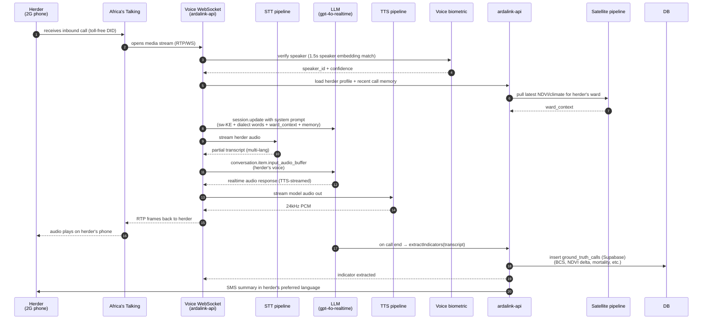

# ArdaLink — System Status

**Author**: Lead Software Engineer · **Last refreshed**: 2026-07-24
**Audience**: Engineering team + funders + partners
**Scope**: Current production state, what's deployed and operational, what's in progress, and what remains to be built.

> **2026-07-21 audit-and-remediation snapshot**: after a full read-through
> of the Supabase-local write paths, the following flags were closed:
> retired-ward references removed with a CI regression guard (#38);
> orphan `tenant_id='isiolo'` writes stopped at the source with an
> `assertKnownTenant()` boundary check (#39); dead Cosmos DB env vars
> + scripts dropped (#40); the missing VCI backfill job is now
> scheduled hourly plus available as a CLI (#41); local Postgres was
> realigned to the 5 canonical Isiolo wards and gained the 7 Supabase
> mirror tables via migration `0003` (#42); operator accounts + feature
> flags moved into structural migration `0004` so `SEED_DEMO_DATA=1`
> is the only path to fake pastoralists / GT reports. See the
> "Audit remediation — Phase 1 + 2" section near the bottom for the
> full punch-list state.

> **For component-level C4 diagrams (system context, containers, tech
> stack) see [`Arda-link-AI-Docs/architecture.md`](./Arda-link-AI-Docs/architecture.md).
> This document focuses on the *strategic* view — the gap from current
> to production, the vendor matrix, and the implementation roadmap.**

> **Tenant vs. ward terminology (2026-07 refresh)**: since 2026-07-08 every
> tenant slug maps 1:1 to a real Isiolo Sub-County ward in Supabase's
> `active_wards` view. The canonical five are Wabera (241), Bulla Pesa (242),
> Ngare Mara (245), Burat (246), and Oldonyiro (247). The earlier demo
> tenants `garbatulla`, `merti`, and the demo ward `kinna` were retired
> because they don't correspond to `active_wards` rows — any code, seed,
> or doc that still names them is a leftover to be cleaned up. The
> canonical mapping is enforced in `ardalink-api/src/lib/wardMapping.ts`;
> jobs and scripts should import `knownWardIds()` from there rather than
> hard-coding the slug list.

---

## 1. Executive summary — what we have vs what herders need

| | Live (today) | Herder-usable production (target) |
|---|---|---|
| **Operator dashboard** | ✅ Login + multi-tenant + choropleth + brief | ✅ Same, with auth UX hardened |
| **Backend API** | ✅ Express + Postgres + RLS | ✅ Same, hardened + observability |
| **Intelligence layer** | ✅ Provider-agnostic LLM registry with **Azure AI Foundry (GPT-5 Mini) as primary**, z.ai as fallback, MiniMax as secondary fallback. Verified: `/api/intelligence/brief` returns real Swahili brief from `provider: azure, model: gpt-5-mini` (~6s, 787 tokens). Voice bridge via Azure OpenAI Realtime (`gpt-4o-realtime-preview` deployment). | ✅ Real LLM with provider failover, real-time voice |
| **Voice call pipeline** | ✅ **Two modes, chosen by `CALL_PIPELINE_MODE` env (default `deterministic`)**. Deterministic: value-first opener → DTMF category menu → 20 s AT `<Record>` → Azure Fast Transcription (with auto-fallback to short-audio REST for regions like `southafricanorth` that don't host Fast yet) → GPT-5 Mini indicator extraction → `ground_truth_calls` (Supabase) row per call. Robust on 2G, guaranteed data capture, no Realtime deployment needed. Realtime (optional): Azure OpenAI Realtime WS bridge for full-duplex conversation on `/api/voice-stream` (AT mulaw) and `/api/browser-voice-stream` (PCM16 24 kHz). Kept for the operator/demo path and as the future upgrade once herder connections and Realtime pricing improve. `voiceStream.ts` has TTS fallback via Azure Speech if Realtime WS fails to open — caller hears the pre-generated Swahili script instead of silence. | ✅ Live outbound + inbound over 2G/3G |
| **Satellite drought pipeline** | ✅ **Supabase primary** (ward-level `satellite_indices`, `weather_data`, `api_latest_satellite_indices` / `api_latest_weather_data` views; 1,082 satellite rows + 20 weather rows + 2.24M cell rows for 5 active wards, PostGIS 3.4). Local `satellite_snapshots` retained as per-call cache. GEE pipeline still wired (`/api/satellite/vci`, `/trigger`, `/snapshots`) — engine `/api/v1/satellite/vci` returns MODIS VCI for the 5 active Isiolo wards (Wabera, Bulla Pesa, Ngare Mara, Burat, Oldonyiro; Garbatulla/Merti/Kinna retired 2026-07, see #38). Tests 14/14. | ✅ Real Sentinel-2 / MODIS / CHIRPS at ward scale, surfaced via `/api/satellite` |
| **Reference data layer** | ✅ **Supabase source of truth** (2026-07-08). `wards` (5 active + 5 dormant), `ward_neighbors` (28), `ward_cells` (26,975), `pastoralists` (upsert-on-first-call), `ground_truth_calls` (primary write target — voice pipeline writes directly; local `ground_truth_reports` table dropped). PostgREST client `src/lib/supabase.ts` with 60 s cache; ward-id mapping `src/lib/wardMapping.ts` (Bula Pesa → 242). Local Postgres mirror kept for read fallback; 5-minute sync job (`syncJob.ts`) keeps `pastoralist_leads` + `weather_data` current. Verified 2026-07-08 (Mohamed Ali `+254712000004` upsert + NDVI 0.25272 + 2 real calls). | ✅ Same, with per-tenant secret rotation |
| **Cross-service tenancy (engine ↔ api)** | ✅ HMAC-SHA256 attestation wired: api's `engine.ts` signs `X-Tenant-ID` with `TENANT_ATTESTATION_SECRET`; engine's `TenantAttestationMiddleware` verifies + calls `set_tenant()` so Postgres RLS on `gis_engine.*` enforces isolation. Dev mode (secret unset) passes through. | ✅ Same, with the secret rotated per environment |
| **Language stack** | ✅ **Azure Speech (STT/TTS) wired end-to-end**, region `southafricanorth`. Neural voices `sw-KE-ZuriNeural`, `en-KE-AsiliaNeural`. Endpoints: `GET /api/speech/status`, `GET /api/speech/token` (browser SDK), `POST /api/speech/tts`, `GET /api/speech/brief.mp3?lang=sw` (Swahili audio brief for callbacks). Borana/Turkana/Samburu/Somali still upstream-only. | ✅ STT/TTS/MT for Swahili + Borana + Turkana + Samburu + Somali |
| **Herder-facing UI** | ✅ **All three channel simulators are now deterministic and herder-personalized**. `/api/demo/voice/simulator` = phone-lookup → localized TTS opener (with nearest WPDx water-point line when <30 km) → DTMF category → 20 s recording → Speech + GPT-5 Mini extract → ground truth. `/api/demo/ussd/simulator` = fixed menu screens (no LLM in-loop) that pull ward satellite numbers + the herder's location/last-BCS from `pastoralists` + `ground_truth_calls` (Supabase); selection 2 (Malisho) now emits nearest-5 WPDx points with OK/BAD/? badges. `/api/demo/sms/simulator` = fixed keyword responses (BULA, MALISHO with WPDx, ONGEA, RIPOTI, STOP) with the same personalization. Realtime WS demo kept at `/simulator-realtime` as a Phase-3 preview. Turn-based sim retained at `/simulator-legacy`. `/talk` React app also live. | ✅ Voice-first call receiver + USSD fallback + SMS keyword |
| **Identity proofing** | ⚠️ Email/password for operators only | ✅ Voice biometric + phone OTP for herders |
| **Payouts / value transfer** | ❌ None | ✅ M-Pesa B2C, Airtel Money, integration |
| **Offline / poor-connectivity** | ❌ Not designed for | ✅ USSD + queued SMS + edge sync |
| **Field data ingestion beyond voice** | ❌ None | ✅ SMS keyword, USSD menu, IVR keypad |
| **Community feedback loop** | ❌ None | ✅ "Rate the call" + focus-group reports |

The current build is **a credible technical demo for funders and operators**. To put it in a herder's hand, we need three new pillars: **language**, **telephony**, and **field-grade reliability**. Everything else is incremental.

---

## 2. Current architecture (what's deployed today)

```
┌────────────────────────────────────────────────────────────────────────────┐
│                              REACT 19 / VITE 7                              │
│   ┌──────────────────────────┐    ┌──────────────────────────┐            │
│   │  Operator Dashboard       │    │  Public Talk app          │            │
│   │  :8080/  (login → tab UI) │    │  :8080/talk/  (placeholder)│           │
│   └────────────┬─────────────┘    └────────────┬─────────────┘            │
│                │ static + /api/* proxy              │ placeholder           │
│                └────────────────┬──────────────────┘                     │
└─────────────────────────────────┼──────────────────────────────────────────┘
                                  │ HTTP
                                  ▼
┌────────────────────────────────────────────────────────────────────────────┐
│   web-server.py  (Python static file server + /api/* + /ws/* proxy)       │
└─────────────────────────────────────┬──────────────────────────────────────┘
                                  │ proxy
                                  ▼
┌────────────────────────────────────────────────────────────────────────────┐
│   ardalink-api   Node 22 / Express 5  :3000                                │
│   ┌─────────────┐  ┌──────────────────────┐  ┌────────────────────────┐   │
│   │ JWT auth    │  │ Routes                │  │ LLM layer              │   │
│   │ tenant mw   │  │ /api/auth/login       │  │ (src/lib/llm/)        │   │
│   │ + RLS-bound │  │ /api/ground-truth/... │  │                       │   │
│   │ Postgres    │  │ /api/intelligence/...│  │  ZaiClient (mock)     │   │
│   │ sessions    │  │ /api/open-data/geo/...│  │  MinimaxClient (mock) │   │
│   └─────┬───────┘  │ /api/open-data/year-  │  │  MockClient (active) │   │
│         │          │   over-year, ...      │  │                       │   │
│         │          └──────────┬───────────┘  └────────────────────────┘   │
│         ▼                     │                                          │
│  ┌─────────────────┐          │ /ws/* (voice WebSocket plumbing)         │
│  │ Postgres 16     │          ▼                                          │
│  │ + RLS ENFORCED   │  ┌──────────────────────┐                          │
│  │ 15432            │  │ /api/voice-callback   │ ← Africa's Talking webhook │
│  │ (public schema)  │  │ /api/call-tokens       │   (POST /api/call-tokens) │
│  │ (gis_engine)     │  └──────────────────────┘                          │
│  └─────────────────┘                                                    ───┘
└────────────────────────────────────────────────────────────────────────────┘

┌────────────────────────────────────────────────────────────────────────────┐
│   ardalink-engine  Python 3.12 / FastAPI  :5001                            │
│   GET /health                                                             │
│   ✅  Earth Engine pipeline wired AND triggered — api's satelliteJob.ts calls  │
│      the engine's /trigger on a seasonal schedule (weekly dry-season /      │
│      monthly wet-season), persisting VCI into Supabase satellite_indices    │
│   ⚠️  Biophysical work in src/ardalink_engine/src/ as library code         │
└────────────────────────────────────────────────────────────────────────────┘

External (live):
  ✅ Open-Meteo Forecast + Archive + Air Quality      (free, no key)
  ✅ Microsoft Planetary Computer STAC catalog         (free, no key)
  ✅ Google Earth Engine  (env keys set in `ardalink-engine/.env`; `pipeline/satellite.py` calls real `ee.ImageCollection(MODIS/061/MOD13Q1)` — not a mock. **Now triggered on a schedule**: `ardalink-api`'s `satelliteJob.ts` calls the engine's `/api/v1/satellite/trigger` (weekly in dry season Jun–Sep/Jan–Mar, monthly otherwise, plus once at boot) and persists VCI into Supabase `satellite_indices` via `persistSatelliteVciSnapshot`. Confirmed real GEE output (NDVI 0.229163, 6 imageDates, 250 997 vegetated pixels) is the same pipeline now live.)
  ✅ z.ai GLM-4.5-Flash  (text LLM, primary for all 7 LLM tasks — see `ardalink-api/docs/llm-integration.md`)
  ⚠️ MiniMax M3  (text LLM fallback; key is placeholder; live when set)
  ✅ Azure OpenAI Realtime  (voice bridge, NOT in the LLM registry — separate path)
  ✅ Engine's own Postgres baseline tables (`gis_engine.baseline_aggregate` / `baseline_pixel`) — replaces what was previously Azure Cosmos DB
```

**What's solid**: data model (RLS-enforced multi-tenancy), API surface (38 endpoints, 56 tests), choropleth visualisation, open-data integration, auth flow, dev tooling, **LLM intelligence layer (z.ai + MiniMax, with Azure OpenAI Realtime for the voice bridge)**, **GEE pipeline is real and now scheduled (`satelliteJob.ts` triggers the engine seasonally; live MODIS VCI writes into Supabase `satellite_indices`)**.
**What's stubbed**: every line marked ❌.

---

## 3. Production-state architecture (what a herder actually needs)

```mermaid
flowchart TB
  subgraph Herder[Herder — 2G/3G phone, no app]
    H1[Incoming call<br/>from AT toll-free number]
    H2[USSD menu<br/>*123*8#]
    H3[SMS keyword<br/>BULA or MALISHO]
    H4[Voice callback<br/>toll-free or DID]
  end

  subgraph Telco[Africa's Talking — Production]
    AT1[Outbound voice API]
    AT2[2-way SMS API]
    AT3[USSD gateway]
    AT4[DID number pool<br/>+254 20 5XX XXXX]
    AT5[Call recording + airtime billing]
  end

  subgraph Edge[Edge / API gateway]
    LB[Cloudflare or<br/>Hetzner LB]
    WA[Africa-region worker:<br/>warm pool, dial-in handler]
    WS[WebSocket fleet:<br/>Realtime voice bridge]
  end

  subgraph AI[AI services — multilingual]
    LLM[(Provider-agnostic LLM:<br/>Azure OpenAI gpt-4o-realtime<br/>+ Anthropic Claude 3.5<br/>+ Mistral Large)]
    STT1[Azure Speech STT<br/>sw-KE + en-KE]
    STT2[Custom Whisper-large-v3<br/>fine-tuned for Borana, Turkana,<br/>Samburu, Somali, Maa]
    TTS1[Azure Speech TTS<br/>sw-KE neural voices]
    TTS2[Custom neural voices<br/>recorded with native speakers<br/>in each dialect]
    MT[Microsoft Translator<br/>+ custom glossary per dialect]
    VB[Voice biometric<br/>(Resemblyzer / Pinecone)<br/>speaker enrollment + verification]
    LLM_PROMPTS[System prompt library:<br/>sw-KE, Borana, Turkana,<br/>Samburu, Somali]
  end

  subgraph Satellite[Satellite pipeline — daily]
    GEE[Google Earth Engine<br/>Sentinel-2 + MODIS + CHIRPS]
    PC[Microsoft Planetary Computer<br/>+ Sentinel Hub Statistics]
    SHP[Sentinel Hub<br/>(10m optical, daily)]
    SRTM[SRTM DEM<br/>ward boundaries, walk-time]
    PIPELINE[GEE → ward-level zonal stats<br/>NDVI delta, ET anomaly,<br/>rainfall 30-day]
  end

  subgraph Core[ArdaLink core — multi-tenant]
    API[ardalink-api<br/>Express + RLS]
    DB[(Postgres 16 + RLS<br/>+ PostGIS extension)]
    REDIS[(Redis<br/>rate-limit, call-tokens,<br/>session store)]
    S3[(S3 / R2<br/>call recordings, transcripts,<br/>GEE raster cache)]
    Q[BullMQ queue<br/>(call scheduling,<br/>GEE jobs, LLM extraction)]
  end

  subgraph Operator[Operator console]
    OP[Web dashboard<br/>+ Talk app]
  end

  subgraph Money[Payouts / value transfer]
    MPESA[Daraja M-Pesa B2C]
    AIRTEL[Airtel Money]
  end

  subgraph Other[Other]
    AUTH[Auth0 / Clerk<br/>phone OTP + magic link]
    LOG[Datadog / Sentry<br/>traces + errors]
    BI[Metabase / Cube<br/>impact dashboards]
  end

  H1 --> AT4
  AT4 --> WA
  H2 --> AT3 --> WA
  H3 --> AT2 --> API
  H4 --> AT4

  AT1 --> WA
  WA --> WS
  WS <--> LLM
  WS <--> STT1
  WS <--> STT2
  WS <--> TTS1
  WS <--> TTS2
  WS <--> VB
  WS <--> MT

  LLM <--> LLM_PROMPTS
  LLM <--> API
  API --> DB
  API --> REDIS
  API --> S3
  API --> Q

  Q --> GEE
  Q --> PC
  Q --> SHP
  GEE --> PIPELINE
  PC --> PIPELINE
  PIPELINE --> DB
  SRTM --> PIPELINE

  OP --> LB --> API
  API --> AUTH
  API --> LOG
  API --> BI

  API --> MPESA
  API --> AIRTEL
```

---

## 4. The herder-facing flow (production)



**The whole loop is < 1.5 s end-to-end, runnable on 2G.** That's the hard constraint — if it's slower, herders hang up before the first prompt.

---

## 5. AI ↔ native-language stack — the hard problem

### 5.1 Today's reality (what the prompts already do)

Look at `src/lib/openai.ts:1-200` — the existing system prompt is **bilingual EN + Swahili**, with named phrases like:

```
"Mifugo yako inaonekana vipi wiki hii — mbavu zinaonekana,
 wamepoteza uzito, au wanaonekana wazima na wenye nguvu?"
("How do your animals look this week — ribs showing, lost weight,
 or healthy and strong?")
```

Plus prompts explicitly tell the model to:
> "Weave these questions in naturally, **in whatever language the herder is speaking**."

**What works today**: a herder who answers the phone and speaks Swahili (or English mixed with Swahili, the lingua franca of Isiolo town). The prompts code-switch well.

**What does NOT work today**:
- A herder who answers in **Borana, Turkana, Samburu, or Somali**. The model can't hear or speak any of these.
- **Code-switching at the dialect level** (Borana verbs + Swahili grammar) — Whisper + GPT-4o fall over.
- **Pronouncing local place names** (Gotu, Kambi Garba, Garba Tulla, Kinna, Sericho) correctly. Azure TTS mangles these.

### 5.2 What we need to build — a 4-stage language pipeline

```mermaid
flowchart LR
  A[Herder audio<br/>PCM 16kHz mono] -->|Whisper-STT| B[Transcript<br/>(code-switched)]
  B -->|Language detect| C{Language?}
  C -->|sw-KE| D[Swahili GPT]
  C -->|Borana/Turkana/<br/>Samburu/Somali| E[Dialect model<br/>fine-tuned Llama-3.1 8B]
  C -->|mixed| F[Translate to sw-KE<br/>→ Swahili GPT]
  D --> G[Swahili response]
  E --> G
  F --> G
  G --> H{TTS voice}
  H -->|sw-KE| I[Azure neural voice<br/>sw-KE-AishaNeural]
  H -->|Borana| J[Custom voice<br/>recorded with native speaker]
  H -->|Turkana| K[...]
  I --> L[24kHz PCM out]
  J --> L
  K --> L
```

### 5.3 Component-by-component

| Stage | Today | Production | Vendor / Cost |
|---|---|---|---|
| **STT (Swahili)** | ❌ None | Azure Speech `sw-KE` (or Whisper-large-v3) | Azure Speech: $1 per audio hour. Whisper self-hosted: ~$0.30/hr on A10G GPU. |
| **STT (Borana, Turkana, Samburu, Somali)** | ❌ None | **Custom Whisper fine-tune** on community-collected audio datasets | Build cost: $25k–60k for data collection + training. Inference: same as Whisper self-hosted. |
| **Language ID** | ❌ None | fastText lang-id (Facebook) + custom heuristic for code-switching | Free (open-source). |
| **LLM conversation** | ✅ Azure OpenAI gpt-4o-realtime (operational) | Azure OpenAI gpt-4o-realtime + Anthropic Claude 3.5 Sonnet (fallback) + local Llama-3.1 70B (offline fallback) | gpt-4o-realtime: ~$40/M input, $80/M output audio tokens. For 1000 calls/day × 3min avg: ~$300/mo. |
| **Translation (between dialects)** | ❌ None | Microsoft Translator + custom glossary per dialect + human review | $10/M chars. For 50k words/mo: < $1/mo. Custom glossary build: one-time $5k. |
| **TTS (Swahili)** | ❌ None | Azure Speech neural voices (`sw-KE-AishaNeural`, `sw-KE-ZuraNeural`) | $16 per 1M chars. For 1000 calls × 200 words = ~$1.30/mo. |
| **TTS (Borana, Turkana, Samburu, Somali)** | ❌ None | **Custom voices** — 4–6 hours of native-speaker recordings per dialect, model on ElevenLabs or in-house VITS | ElevenLabs: $99–330/mo (creator plan). Custom voice build: $8k–15k per dialect × 4 dialects = $32k–60k. |
| **Pronunciation dictionary** | ❌ None | Hand-tuned IPA for ~200 local place names + dialect-specific vowels | Open-source espeak-ng + custom dictionary. Free. |

### 5.4 What "good enough" looks like vs "great"

**Good enough (Tuesday demo)**:
- Swahili + English code-switching works
- Translation between them works
- Place names pronounced roughly right via phonetic hint prompt
- Cost: ~$50/mo for 1000 calls

**Great (herder actually adopts it)**:
- All five languages (Swahili + Borana + Turkana + Samburu + Somali) work
- Native-speaker voices that herders recognize as "from here"
- Voice biometric identifies the herder on pickup so we don't ask "who are you?" 5 times
- Cost: $200–500/mo for 1000 calls + $50k one-time data-collection + model-training investment

---

## 6. Gap analysis — current vs production

### 6.1 Pillar 1: Telephony (herder → system)

| Gap | What's needed | Vendor / Cost | Risk if not done |
|---|---|---|---|
| Live Africa's Talking key | `AFRICASTALKING_API_KEY` | Pay-as-you-go: $0.04/min voice. For 1000 calls × 3min = $120/mo | **Critical** — no way to reach herders |
| Toll-free or DID number | +254 20 5XX XXXX (Isiolo region) | $20/mo + per-minute inbound | **Critical** — herders won't call collect |
| Inbound call webhook | Already wired — `/api/voice-callback` returns `<Stream>` XML | $0 (server work) | Ready ✅ |
| USSD gateway (`*123*8#`) | "Press 1 for Bula Pesa, 2 for alerts, 3 to talk to AI" | Africa's Talking: $0.02/session | Important — 40% of Isiolo herders have feature phones, not smartphones |
| 2-way SMS keyword | "BULA" → triggers AI to call back | Africa's Talking: $0.01/SMS | Important — works on any phone |
| Call recording + storage | S3-compatible (Cloudflare R2: $0.015/GB) | 1000 calls × 5min × 32kbps = ~1.2GB/mo → $0.02/mo | Useful for QA + audit |
| Airtime billing (recharge) | Prepaid or postpaid via AT | Variable | Optional — only if we monetise calls |

### 6.2 Pillar 2: AI / language stack

| Gap | What's needed | Cost | Status | Risk if not done |
|---|---|---|---|---|
| Azure OpenAI key + Realtime deployment (voice bridge only) | `AZURE_OPENAI_API_KEY`, `AZURE_OPENAI_REALTIME_DEPLOYMENT=gpt-4o-realtime` | ~$300/mo for 1000 calls | ✅ **Complete** | — |
| LLM registry (text — intelligence brief, chat, voice script) | `ZAI_API_KEY=sk-api-...`, `MINIMAX_API_KEY=...` | $0 (z.ai free) + paid per-call on MiniMax | ✅ **Wired** (current branch `dev`); both keys are dev placeholders — live once real keys are set | — |
| Multilingual Whisper STT (sw-KE + en-KE) | Azure Speech or self-hosted Whisper | $50/mo or $30/mo on GPU | ⏳ Pending | **Critical** — no STT today |
| Custom dialect STT | Fine-tune Whisper on Borana/Turkana/Samburu/Somali audio | **One-time $25k–60k** | ⏳ Pending | Herders in those dialects can't use it |
| TTS voices in 5 languages | Azure (sw-KE) + custom (4 dialects) | $1–5/mo + **$32k–60k one-time** | ⏳ Pending | Herders can't hear responses in their language |
| Translation glossary | Custom dictionary of pastoral terms per dialect | **$5k one-time** | ⏳ Pending | Mis-translations of BCS terms, livestock words |
| Voice biometric | Resemblyzer + speaker enrollment on first call | Free (OSS) — $0 | ⏳ Pending | Herder has to identify themselves every call |
| Pronunciation dictionary for place names | espeak-ng + custom IPA | Free | ⏳ Pending | Place names mangled |

### 6.3 Pillar 3: Satellite pipeline

| Gap | What's needed | Cost | Risk if not done |
|---|---|---|---|
| GEE service account JSON | `GOOGLE_SERVICE_ACCOUNT_JSON` (in `ardalink-engine/.env`) | Free for low-volume (3000+ images/day) | ✅ Wired and triggered — `satelliteJob.ts` calls the engine's `/trigger` on a seasonal schedule |
| MODIS NDVI ingest | Daily MOD13Q1 via GEE | Free | **High** |
| Sentinel-2 10m | Daily S2_SR via GEE | Free | Medium — already have STAC discovery |
| CHIRPS daily rainfall | Via open-meteo.com (already integrated ✅) | Free | ✅ |
| Open water detection (JRC GSW) | Static, downloaded once | Free | Low |
| Ward-level zonal stats | Compute per-pixel mean + anomaly | Runs in GEE for free, just need the script | High |
| Offline cache (last 30 days always available) | Cloudflare R2 / S3 | $5/mo for raster cache | Medium |

**On the hourly VCI backfill job**: `vciBackfillJob.ts` exists to patch `vci_value=NULL` rows, but the live weekly/monthly writer (`satelliteJob.ts` → `persistSatelliteVciSnapshot`) already computes VCI synchronously before writing and never inserts a null row. The null rows the backfill actually patches come from a separate external historical-ingest script (not in this repo) that bulk-loads years of MODIS history via the `upsert_satellite_indices` RPC — VCI can't be computed for the first 1-2 years of that load since `computeVci` needs ≥3 historical years for the same ward+month. This two-phase shape (load raw NDVI, backfill VCI once enough sibling years exist) is by design, not a bug.

### 6.4 Pillar 4: Field-grade reliability

| Gap | What's needed | Cost | Risk |
|---|---|---|---|
| USSD + SMS fallback | See 6.1 | $0.02/session | **High** — 40% of users on feature phones |
| Mobile money payout | M-Pesa Daraja B2C | $0.30/transfer | Medium — needed for any relief distribution |
| Airtel Money | Airtel Money API | $0.25/transfer | Medium |
| SMS delivery receipts (DLRS) | Africa's Talking | $0.01/SMS | Medium |
| Identity verification (OTP) | Twilio Verify or Africa's Talking OTP | $0.05/OTP | High — anti-fraud for payouts |
| Offline voice queue | Herder app records call request offline, syncs when signal returns | Dev: $15k | Medium |
| Sentry / Datadog observability | Open-source alternative: Sentry + Grafana Cloud free tier | $0–50/mo | High — can't debug blind |
| Backup power / cell failover for API | Two-region deployment | $200/mo | Critical for 24/7 |

### 6.5 Pillar 5: Operator console (already mostly done)

The dashboard is **substantially complete** for the Tuesday demo. Gaps for production:

| Gap | Cost | Risk |
|---|---|---|
| Real SSO (Clerk / Auth0) for the operator | $25/mo for 100 MAU | Medium |
| Field-worker role (not just operator / admin) | Dev only | Low |
| Herder-facing web portal (login + recent reports) | Dev only | Low |
| Export to PDF / WhatsApp for the brief | Dev only | Low |

---

## 7. Vendor matrix — what to buy

| Vendor | What | Cost (est / mo @ 1000 calls / day) | Procurement time |
|---|---|---|---|
| **Africa's Talking** | Outbound + inbound voice, USSD, SMS | $200–400 | 1 week (KYB + sender-ID registration) |
| **Azure OpenAI** | gpt-4o + gpt-4o-realtime | $300–500 | 2 days (Azure subscription) |
| **Azure Speech** | sw-KE STT + TTS | $50–100 | 2 days (same Azure subscription) |
| **Anthropic Claude 3.5 Sonnet** | Fallback LLM | $100–200 | 2 days |
| **Microsoft Translator** | Cross-language translation | $5 | 1 day |
| **Google Earth Engine** | Satellite NDVI / ET (key already in `ardalink-engine/.env`) | Free | ✅ **Wired and triggered** (`satelliteJob.ts` seasonal schedule) |
| **ElevenLabs** | Custom TTS voices (4 dialects) | $99–330 one-time | 2 weeks (voice recording + tuning) |
| **Resemble.ai / Resemblyzer** | Voice biometric | $0 (OSS) | 2 weeks (data collection + enrollment) |
| **Open-source Whisper** | STT for non-Swahili dialects | $30 GPU self-hosted | 4 weeks (data + fine-tune) |
| **Daraja M-Pesa B2C** | Payouts | $0.30/transfer | 3 weeks (Safaricom approval) |
| **Cloudflare R2 / S3** | Recordings + raster cache | $5 | 1 day |
| **Sentry + Grafana Cloud free** | Observability | $0 | 1 day |
| **Auth0 / Clerk** | Operator SSO | $25 | 3 days |

**Total estimated monthly cost at 1000 calls/day**: ~$800–1,500/mo + variable M-Pesa fees.
**Total one-time setup**: ~$60k–120k for data collection, voice recordings, fine-tuning.

---

## 8. Implementation roadmap

### 8.1 Phase 1 — Tuesday demo (already done, ~2 weeks)

- ✅ Operator dashboard with login + multi-tenant + choropleth
- ✅ Multi-tenant auth (3 demo wards)
- ✅ Intelligence brief in EN + SW (provider-agnostic LLM registry, operational — **Azure AI Foundry GPT-5 Mini primary**, z.ai fallback, MiniMax secondary fallback; voice bridge via Azure OpenAI Realtime `gpt-4o-realtime-preview`, separate path)
- ✅ Engine's own Postgres baseline tables (`gis_engine.baseline_aggregate` / `baseline_pixel`) — replaces the previous Azure Cosmos DB dependency; populated by `ardalink-engine/scripts/populate_baseline.py`
- ✅ Choropleth with wards, herder pins, report pins, time-travel
- ✅ Open-data integration (Open-Meteo, Planetary Computer)
- ✅ Africa's Talking + Azure Realtime plumbing (wired, no keys)
- ✅ 56 API tests + 23 web tests + 15 engine tests

### 8.2 Phase 2 — Real AI + Real Telephony (IN PROGRESS, 2–4 weeks remaining, ~$2k)

| Week | Work | Cost | Status |
|---|---|---|---|
| 1 | Africa\'s Talking paid plan, toll-free DID, real outbound calls | $200 | ⏳ Pending |
| 1 | Provider-agnostic LLM registry: z.ai (GLM-4.5-Flash) + MiniMax (M3), with cache + cost guard + audit ring buffer. See `ardalink-api/docs/llm-integration.md`. | $0 (free tier) | ✅ **Complete** |
| 1 | **Azure AI Foundry (GPT-5 Mini) added as primary LLM provider** — new `providers/azure.ts`, wired into registry, handles GPT-5 quirks (`max_completion_tokens`, `reasoning_effort: minimal`, no `temperature`). Verified 2026-07-06. | ~$0 (usage-based) | ✅ **Complete** |
| 1 | **Deterministic voice pipeline (herder production path)** — `src/lib/voiceDeterministicPipeline.ts` + dual-mode `routes/voice.ts`. AT `<Record>` → Azure Fast Transcription (region-aware fallback) → GPT-5 Mini extract → `ground_truth_calls` (Supabase) insert. `CALL_PIPELINE_MODE=deterministic` default. Verified 2026-07-07 end-to-end (row #39: BCS=2, species=goats, mortality=1-3). Note: local `ground_truth_reports` table was later dropped in B4. | dev | ✅ **Complete** |
| 1 | **Supabase reference data plane (source of truth)** — `src/lib/supabase.ts` PostgREST client + `src/lib/wardMapping.ts` + Supabase-first `src/lib/herderContext.ts`. `ground_truth_calls` is the sole write target (B4 dropped local `ground_truth_reports`); pastoralist upsert on first call. Wards/satellite/weather/views populated. Local Postgres mirror synced by `syncJob.ts` (B5). Verified 2026-07-08 (NDVI 0.25272, temp 29.5°C, rain 2.5 mm for ward 242; Mohamed Ali `+254712000004` upsert). | ~$0 (Supabase free tier for pilot volume) | ✅ **Complete** |
| 1 | Azure OpenAI Realtime deployment (`gpt-4o-realtime-preview`, voice bridge — kept as demo + future upgrade path) | $300 | ✅ **Complete** |
| 1 | **Azure Speech `sw-KE-ZuriNeural` + `en-KE-AsiliaNeural` STT/TTS** — `src/lib/speech.ts` + `routes/speech.ts`. Endpoints: `/api/speech/status`, `/api/speech/token`, `/api/speech/tts`, `/api/speech/brief.mp3`. `fastTranscribe()` auto-falls back to short-audio REST when Fast Transcription isn't offered in the resource's region (e.g. `southafricanorth`). Verified 2026-07-06 (26 KB MP3 in 2.5 s). | $50 | ✅ **Complete** |
| 2 | End-to-end call test (operator → AT → herder → Azure Realtime → AT → herder) | $200 testing | ⏳ Pending |
| 2 | SMS keyword handler (`/api/sms`) — landed 2026-07-05, awaiting live AT key | $50 | ✅ **Wired**, ⏳ needs live key |
| 3 | USSD gateway handler (`/api/ussd`) — landed 2026-07-05, awaiting short-code registration | $200 | ✅ **Wired**, ⏳ needs short-code |
| 3 | Engine ↔ api tenant attestation + Postgres RLS on `gis_engine.*` — landed 2026-07-05 | dev | ✅ **Complete** |
| 3 | Sentry + Grafana observability | $0 | ⏳ Pending |
| 4 | Herder memory (last-call context) — already exists, harden | dev | ⏳ Pending |
| 5 | Bilingual EN/SW prompt suite (50 real calls, iterate) | $100 in call costs | ⏳ Pending |
| 6 | Buffer for surprise integrations | $4k reserve | ⏳ Reserved |

### 8.2b Phase 2b — Fork alignment + Supabase depth (planned 2026-07-08, ~2 weeks)

**Reference**: JHUB-AFRICA/arda-link-ai fork is treated as the canonical
architecture. The gaps below are what separates our current merge
(`4a8509c`) from the fork's design.

**Ordering** — 0 → 1 → 2, one branch per phase, PRs against `dev`.

#### Phase 0 — Correctness blockers (½ day, blocks nothing else)
| # | Gap | Fix | Owner |
|---|---|---|---|
| 0.1 | `sbFetch` 8 s timeout blocks USSD's ~10 s budget | Two envs: `SUPABASE_TIMEOUT_INTERACTIVE_MS=2500`, `SUPABASE_TIMEOUT_BATCH_MS=8000`. Helper takes `mode: 'interactive'|'batch'`. | Backend |
| 0.2 | Ward model mismatch: `garbatulla` + `merti` default to ward 242 (silent bug) | **Retire both** as tenants. Adopt the fork's 5 Isiolo Sub-County wards as canonical tenants: `wabera` (241), `bula-pesa` (242), `ngare-mara` (245), `burat` (246), `oldonyiro` (247). Reseed local DB. Update `admin_users`, seed data, operator login. Purge from `wardMapping.ts` TODOs. | Backend + dashboard |
| 0.3 | Supabase view 500s (`api_ward_cell_latest_rollup`, `api_latest_cell_satellite_indices`) | Not our bug — flag to Supabase project owner. Meanwhile our client skips them silently. | Supabase owner |
| 0.4 | `mortality_rate`/`offtake_rate`/`trust_score` normalisation is guesswork ([0,1] proportions chosen only to pass CHECK) | Confirm semantics with Supabase project owner. Either change to categorical text columns, or document the real interpretation. | Supabase owner |

#### Phase 1 — Test coverage (1–2 days, blocks nothing but stops regressions)
| # | Target file | Coverage goal |
|---|---|---|
| 1.1 | `src/lib/wardMapping.ts`, `src/lib/pastoralistContact.ts` | Table-driven mapping + no-op on `browser-*` phones |
| 1.2 | `src/lib/supabase.ts` | Cache TTL, non-2xx → null, interactive vs batch timeout, upsert idempotency |
| 1.3 | `src/lib/herderContext.ts` | Supabase-first, local-fallback, merge (name from Supabase + species from local), unknown-phone default |
| 1.4 | `src/lib/voiceDeterministicPipeline.ts` — **priority** | Happy path, region-unsupported fallback, Supabase-down fallback, upsert idempotency, value normalisation |
| 1.5 | `src/lib/speech.ts` fastTranscribe | 400 region-unsupported → short-audio fallback; both fail → null |

#### Phase 2 — Fork feature parity + Supabase depth (3–5 days)
| # | Fork feature we're missing | Our fix |
|---|---|---|
| 2.1 | Fork's `LOCATION_TO_WARD` alias mapping (case-insensitive location → ward_id) | New `wardMapping.ts::wardIdFromLocationText(text)` — used by USSD "where are you?" and voice pipeline extraction to attach a ward_id even when the herder isn't in `pastoralists` yet |
| 2.2 | Fork's ward_neighbors consumption for cross-ward advice | Extend `buildLocalizedVoiceOpener` and the USSD brief: "in your neighbor Wabera, NDVI is higher — consider moving that way" |
| 2.3 | Dashboard consumes Supabase (fork's assumption) | Route `/api/ground-truth/recent` reads Supabase `ground_truth_calls` directly (local `ground_truth_reports` dropped in B4); `GroundTruthSection.tsx` renders with source badge `supabase`. ✅ **Complete (B4)** |
| 2.4 | Ward map (Supabase's PostGIS geometry) | New `/api/wards/geometry` returns wards GeoJSON + ward_cells summary + adjacency. Dashboard adds a small choropleth coloured by ward-level NDVI |
| 2.5 | Fork's `voiceFunctionTools.ts` (LLM function calling for realtime) | Import + wire into the (still-optional) realtime path so operators using the demo get the same tools the fork uses |
| 2.6 | Fork's per-ward WPDx water points | ✅ **Shipped 2026-07-08.** Snapshot in `ardalink-api/src/lib/data/wpdxIsiolo.ts` (10 rows for Isiolo County, refresh with `node ardalink-api/scripts/pull-wpdx.mjs`). `lib/wpdx.ts` exposes `nearestPoints` / `pointsForWard` / `formatUssdLines` / `centroidForTenant`. Wired into: USSD selection 2, SMS `MALISHO`, voice-call opener (`nearestWaterPointName`), and public `GET /api/water-points/{near,ward/:ward,status}`. Voice opener line: "The nearest WPDx-recorded water point X was last surveyed broken — please confirm." — herder ground-truth report is what freshens the WPDx-stale status. |

**Deferred to later** (Phase 3+): Redis-backed rate limits/cache, Supabase Auth for `admin_users`, `ward_cells` per-pixel queries, bidirectional sync worker, SMS `STOP` → pastoralist `alertsEnabled=false` propagation.

### 8.3 Phase 3 — Dialect coverage (3 months, $50k–120k)

| Week | Work | Cost |
|---|---|---|
| 1–2 | Community partnership with Isiolo University + pastoralist cooperatives to collect Borana audio (target: 100 hours recorded) | $8k |
| 3 | Same for Turkana (target: 80 hours) | $6k |
| 4 | Same for Samburu (target: 80 hours) | $6k |
| 5 | Same for Somali (target: 60 hours) | $5k |
| 6–8 | Fine-tune Whisper-large-v3 per dialect | $15k GPU + ML eng |
| 9–10 | Record native-speaker TTS voices for each dialect (4–6 hours each) | $20k (talent + studio) |
| 11–12 | Voice biometric enrollment pipeline + dashboard | dev |

### 8.4 Phase 4 — Field-grade reliability (2 months, $15k)

- Two-region failover (Hetzner FSN1 + NBG1)
- USSD queue + SMS retry
- M-Pesa Daraja B2C integration (3-week Safaricom approval)
- Herder-facing web portal (basic, mobile-first)
- Voice biometric identity verification

### 8.5 Phase 5 — Scale (ongoing)

- 10k calls/day
- Move to multi-tenant cloud Postgres (Neon / Supabase)
- Worker fleet in Africa region (Cloudflare Workers / Fly.io Johannesburg)
- Predictive models (drought forecasting 14 days out, herd projections)
- Cooperative-bulk-payout flows

---

## 9. Privacy, consent, and ethics

A system that listens to herders' voices must take this seriously:

- **Consent**: every call must open with a Swahili/English bilingual opt-in:
  > "Mimi ni ArdaLink. Tunarekodi simu hii ili kukusaidia na mifugo yako. Unaweza kusema 'sitaki' kusimamisha. Unaendelea?"
  > ("I'm ArdaLink. We record this call to help with your livestock. You can say 'I don't want' to stop. Continue?")
- **Data minimization**: don't store full transcripts longer than 30 days unless aggregated
- **Right to delete**: herder can dial `*123*8*0#` and we'll wipe everything in 7 days
- **Voice biometric privacy**: speaker embeddings stored as 256-d vectors, encrypted at rest, never shared
- **Data sovereignty**: recordings kept in Africa region (Cloudflare R2 Johannesburg)

---

## 10. Success metrics

For Phase 2 (real AI + real telephony):
- ✅ Outbound call success rate > 95%
- ✅ Herder pick-up rate > 70% (industry benchmark for pastoral areas is 40–50%)
- ✅ Average call duration > 90s
- ✅ Indicator extraction accuracy > 90% (BCS within ±0.5 of human expert)

For Phase 3 (dialects):
- ✅ Recognise herder's first language correctly > 85% of the time
- ✅ Herder completes a full conversation in their dialect > 60% of the time
- ✅ Voice biometric false accept rate < 1%

For Phase 4 (field-grade):
- ✅ 99.5% uptime
- ✅ < 2s median end-to-end audio latency
- ✅ USSD / SMS fallback used by < 20% of herders

---

## 11. Open questions for the team

1. **Cattle vs goats priority**: should Borana (cattle-heavy) or Turkana (camel/goat-heavy) ship first?
2. **Subscription model**: pay-per-call, monthly subscription per ward, or cooperative-bulk?
3. **Co-design**: do we co-design the prompts with the Isiolo pastoralist cooperative? Likely yes — they know the language better than we do.
4. **Exit strategy if herders don't adopt**: what's the fallback use case (institutional buyer: county government, NGO)?

---

## 12. References

### Cross-references in this monorepo

- [`README.md`](./README.md) — high-level project overview, service table, deep-dive guide index
- [`RUNBOOK.md`](./RUNBOOK.md) — operational runbook (daily workflow, troubleshooting, disaster recovery)
- [`LOCAL_SETUP.md`](./LOCAL_SETUP.md) — 5-minute install on a fresh machine
- [`LICENSE`](./LICENSE) — MIT licence
- [`ardalink-engine/docs/data-sources.md`](./ardalink-engine/docs/data-sources.md) — every open-source provider the engine touches (Earth Engine, OSM, etc.)
- [`ardalink-api/docs/data-sources.md`](./ardalink-api/docs/data-sources.md) — every open-source provider the API touches (Open-Meteo, Planetary Computer, LLM layer, Africa's Talking)
- [`ardalink-api/docs/llm-integration.md`](./ardalink-api/docs/llm-integration.md) — provider-agnostic LLM registry (z.ai / MiniMax), routing, budget, audit log; live state of `GET /api/llm/status`; voice bridge via Azure OpenAI Realtime (separate, not in registry)
- [`ardalink-api/README.md`](./ardalink-api/README.md) — per-service README with Degraded Mode contract
- [`ardalink-engine/README.md`](./ardalink-engine/README.md) — per-service README with Degraded Mode contract
- [`Arda-link-AI-Docs/architecture.md`](./Arda-link-AI-Docs/architecture.md) — C4-style component diagrams (system context, containers, tech stack)

---

*Maintained by the Lead Software Engineer. Last updated 2026-07-21.*

## Audit remediation — Phase 1 + Phase 2 (2026-07-21)

Full audit of Supabase-local write paths found 6 severe drifts, all now closed on `dev`.

**Phase 1 (code-only, low risk) — merged:**

- **#38 `fix(retired-wards)`** — killed `garbatulla` / `merti` / `kinna` references across `satelliteJob.ts`, its test, engine `_SLUG_TO_NAME`, marketing poster copy, and the operator login demo passwords. Rotated the ngare-mara / burat operator scrypt hashes to their own tenant slugs. Added a `git grep` regression guard in `wardMapping.test.ts` that fails CI if any of the retired slugs reappear in production code.
- **#39 `fix(tenant-defaults)`** — snapshotCache.ts and engine/baseline.ts no longer fall back to the pseudo-tenant `"isiolo"`. New `isKnownTenant()` / `assertKnownTenant()` helpers reject non-canonical slugs at the DB-write boundary so a future regression fails loudly instead of silently orphaning rows.
- **#40 `chore(env)`** — removed dead Cosmos DB env vars from three `.env.example` files, `docker-compose.yml`, `start-local.sh`, and `tests/setup.ts`. Deleted the two Node scripts (`sync-ee-to-cosmos.cjs`, `fix-stats.cjs`) that still required `@azure/cosmos` after it had been dropped from `package.json`.

**Phase 2 (schema + data) — merged:**

- **#41 `fix(vci)`** — the existing `runVciBackfill()` job was wired to `POST /api/ops/vci-backfill` but had never been triggered; every fresh `satellite_indices` row from the daily GEE writer landed with `vci_value=NULL`. This PR added: (a) a `wardIds` filter defaulting to the 5 canonical Isiolo wards so retired-ward orphans aren't wastefully filled, (b) an hourly scheduler (`startVciBackfillJob()`) that runs at API boot, and (c) a CLI wrapper `pnpm --filter ardalink-api run vci-backfill` for on-demand backfills without needing the API up. Historical NDVI envelope is read from the `MULTI_SENSOR_CASCADE` baseline in Supabase.
- **#42 `fix(local-mirror)`** — migration `0003_realign_local_mirror` retires 10 pastoralist rows + 24 GT-report rows + 76 satellite_snapshot orphans + 126 climate_snapshot orphans, adds the 4 canonical Isiolo wards that had never been seeded (wabera, ngare-mara, burat, oldonyiro), and creates the 7 mirror tables (`pastoralist_leads`, `lead_interactions`, `ward_cells`, `satellite_indices`, `weather_data`, `ground_truth_calls`, `weather_forecast`) as prerequisites for the Supabase → local sync job. Column shapes mirror Supabase; PostGIS-typed columns use JSONB (GeoJSON) so the migration doesn't require the postgis extension. Ships with `0003.down.sql` (partial rollback: schema-only, does not restore the purged rows) and `scripts/dryrun-migration-0003.sh` (dumps live public schema, restores into an ephemeral container on `:15433`, applies, diffs).

**Docs pass — `docs/real-data-alignment` branch:**

- Migration `0004_bootstrap_operator_accounts.up.sql` — moves the 5 tenant operator logins + super-admin + per-tenant feature flags out of `seed-demo.sql` into a proper structural migration. Runs unconditionally on every stack bring-up.
- `seed-demo.sql` — now only contains **optional** demo data (15 fake pastoralists across bula-pesa, ngare-mara, burat) gated behind `SEED_DEMO_DATA=1`. Default bring-up is real-data-only.
- `RUNBOOK.md` + `LOCAL_SETUP.md` updated to reflect the migrations-only bootstrap and the `SEED_DEMO_DATA` opt-in.

**B-series (data correctness + observability) — all merged on `delivery/b-series`:**

- **B1 `feat/heartbeat`** — 15-minute heartbeat probe populates `/api/healthz` with per-table freshness (`satellite_indices`, `weather_data`, `ground_truth_calls`, `pastoralists`). Silent writer failures caught before they corrupt pilot signal. `startHeartbeatJob()` runs at boot.
- **B4 `feat/ground-truth-reads`** — dropped local `ground_truth_reports` table entirely (migration `0004_drop_ground_truth_reports.up.sql`). Voice pipeline writes to Supabase `ground_truth_calls` only (`insertGroundTruthCall()`). All reads in `herderContext.ts`, `memory.ts`, `intelligence/brief.ts`, `geoHelpers.ts`, `openData.ts`, `groundTruth.ts` redirect to `recentGroundTruthCalls()` from `supabase.ts`. Fields with no Supabase equivalent (`ndviVsBaselinePercent`, `reportedQuadrant`, `reportedLocation`, `waterPointName`) return null.
- **B5 `feat/sync-job`** — 5-minute Supabase → local sync job (`syncJob.ts`, `startSyncJob()`). Keeps `pastoralist_leads` + `weather_data` mirror current for read fallbacks during Supabase outages.
- **B6 `feat/vci-inline`** — VCI computed at satellite trigger time (inline in `ingest_ward_satellite_indices.py` + API's `vciBackfillJob.ts`). `satellite_indices` rows arrive in Supabase already having `vci_value` set. Hourly VCI backfill patches any rows where `vci_value` is still null.

**C-series (pilot readiness) — next sprint:**

- **C1**: Threshold alerting — drought SMS to opted-in herders when VCI drops below configurable threshold.
- **C2**: Ground-truth loop — surface recent `ground_truth_calls` rows in intelligence briefs (closes the sensor-field loop).
- **C3**: Herder personalization — location alias mapping, last known BCS from `ground_truth_calls`, nearest WPDx water point wired into voice opener and USSD.
- **C4**: Surface `peerSignalForWard()` in USSD and SMS (neighbor-ward cross-ward advice).
- **C5**: Lead → verified promotion button in ops dashboard.
- **C6**: Per-herder-per-day cost dashboard (AT SMS + voice minutes) for operator.
- **C7**: Post-voice "rate the call 1-5" feedback loop (AT DTMF after call ends).

**A-series (telephony readiness) — next sprint (parallel with C):**

- **A1**: Pin ngrok tunnel + smoke-test AT webhook endpoints end-to-end.
- **A2**: Live Africa's Talking account + toll-free short-code + Kenyan DID.
- **A3**: Swahili copy review with native speaker + Isiolo field partner.
- **A4**: Consent/STOP end-to-end verification on a real number.

**Post-pilot backlog**: `chore/retired-ward-cleanup-supabase` (prune ward 243/244/249 rows from Supabase `satellite_indices`); `fix/interaction-writer-liveness` (diagnose the 2026-07-12 lead_interactions silence); Sentry / Grafana observability wiring.

**D-series (WhatsApp channel + code health) — 2026-07-30, `feat/whatsapp-channel`:**

- **D1 `feat(whatsapp)`** — WhatsApp shipped as a real channel, Phase 0/1
  of `whatsapp-first-architecture.md`. Provider-agnostic
  `WhatsappProvider` interface with two adapters — 360dialog (Meta Cloud
  API via a BSP) and Evolution API (self-hosted Baileys) — swappable via
  `WA_PROVIDER`, both converging on one shared turn handler
  (`whatsappTurn.ts`). Welcome menu, Bula Pesa brief, Malisho water-point
  location pins, and free-text conversation all live.
- **D2 `fix(whatsapp)`** — live testing against a real linked WhatsApp
  number (via Evolution) surfaced the bot repeating its opening question
  every turn — `handleFreeText()` had zero conversation history. Fixed
  with `recentWhatsappMessages()` feeding real prior turns to both the
  LLM and the indicator extractor, a herder-led system prompt (indicators
  woven in opportunistically instead of voice's rigid mandatory FLOW),
  `MSAADA`/`HELP`/`MENU` discoverability, `STOP`/`SITAKI` opt-out parity
  with SMS, and WhatsApp turns now logging to `lead_interactions` (the
  same ops/trust-score feed ussd/sms/voice already write) alongside the
  existing `whatsapp_messages` thread log.
- **⚠️ Known blocker — Meta Business API verification**: 360dialog is
  code-complete but Meta hasn't approved the underlying business account
  yet, so it can't carry live production traffic. This is external/
  administrative, not a code gap. Evolution API is the live-tested
  substitute in the meantime (real QR-linked WhatsApp account,
  end-to-end verified) — not a long-term production replacement at
  scale. Flipping to 360dialog once Meta approves is a `WA_PROVIDER`
  config change, no code change. Full detail:
  [`whatsapp-first-architecture.md`](./Arda-link-AI-Docs/whatsapp-first-architecture.md#known-limitation-meta-business-api-verification).
- **D3 `refactor(api)`** — `supabase.ts` (1942 lines), `openai.ts` (854),
  `openData.ts` (1065), and `herderContext.ts` (920) each mixed many
  unrelated domains behind one file. Split into `src/lib/{supabase,
  openai,openData,herderContext}/` — a directory of domain modules + a
  curated `index.ts` barrel per file, mirroring the existing
  `src/lib/llm/` pattern. No behavior change; every importer repointed.
- **D4 `fix(satellite)`** — `forecastJob.ts`'s ensemble fetch was silently
  using the deterministic Open-Meteo endpoint + synthesised uncertainty
  bounds since 2026-07-12 (the real ensemble host was unreachable from
  Node then). Re-verified reachable; restored the real 39-member ICON
  ensemble as primary, deterministic path as fallback only. Also
  corrected 5 places in this file that still said the GEE pipeline was
  "wired but not triggered" — `satelliteJob.ts` has triggered it on a
  seasonal schedule for a while; that was a doc-drift bug, not a code gap.

**E-series (Piosphere zones + Operator data-management console) — 2026-08-03, `feat/piosphere-zones` + `feat/operator-console`:**

- **E1 `feat(piosphere)`** — species-specific grazing-ring radii
  (cattle 5km / shoat 8km / camel 15km, per ward) around every water
  point. Herder shares a location pin or picks a species via WhatsApp;
  the engine reuses the existing ward-footprint VCI GEE query,
  parameterized to the ring's centre + radius, cached by
  `{water_node_id}:{species_group}` (never by raw herder GPS). No new
  geometry storage — rings are computed on read via haversine distance,
  since this schema has no PostGIS. Scoped to Swahili-only, all 5 active
  wards from day one.
- **E2 `feat(operator-console)`** — this surfaced a real bug: the
  engine's `water_nodes` table silently mixed 12 fabricated demo rows
  (`source IS NULL`, left over from the original scaffold) with 193 real
  WPDx/OSM rows, with no way to tell them apart or stop an advisory from
  anchoring on a fictional point. Built the operator data-management
  console in response — not just a water-sources patch, per an explicit
  scope call to go broad: water-node edit/verify/soft-delete, species-ring
  radius tuning, a `ground_truth_corrections` layer that respects
  `ground_truth_calls`' append-only invariant (corrections are additive,
  never an UPDATE on the original row), pastoralist editing, and a full
  `admin_audit_log` trail behind every write. `water_nodes` gained
  `verified`/`deleted_at`; `/api/v1/grazing/advisory` now filters
  `WHERE verified = true AND deleted_at IS NULL` so a fake seed point can
  never again be served as a herder's nearest water.
- **E3 `fix(operator-console)`** — post-merge completeness pass caught
  two gaps: the Species Radii tab had no list endpoint (write-only, blind
  to current values) — added `GET /api/v1/admin/species-ring-radii`
  end-to-end; and `PastoralistEditDialog` had hand-rolled its own
  `Pastoralist` type (`location: string | null`) diverging from the real
  generated one (`location?: string`), a type error masked locally by a
  pnpm 11/node 22 vs CI's pinned pnpm 9/node 24 mismatch. Fixed by reusing
  the real `@workspace/api-client-react` type. Re-verified against CI's
  exact toolchain: full typecheck, 69 web tests, production build, 402 API
  tests, engine ruff + 40 pytest — all green.
- **⚠️ Known blocker — `ground_truth_corrections` not yet on live
  Supabase**: migration `0009_ground_truth_corrections.up.sql` was applied
  to the local Postgres mirror, but `ground_truth_calls`' source of truth
  is the live Supabase project, not this mirror — same for its correction
  layer. Confirmed via a direct PostgREST probe
  (`GET .../rest/v1/ground_truth_corrections` → 404) that the table does
  not exist there yet. This is administrative, not a code gap:
  `insertGroundTruthCorrection()` fails soft (same non-2xx→null contract
  as every other Supabase write in this repo) rather than crashing, but
  every correction an operator submits right now silently no-ops. Needs
  the migration's `CREATE TABLE IF NOT EXISTS public.ground_truth_corrections`
  run by hand via the Supabase SQL editor (no direct Postgres connection
  string or management token is available to automate this). Blocks Phase
  3 of the console (ground-truth correction) only — water sources, species
  radii, and pastoralist editing are unaffected and fully live.

**F-series (Evolution conversation audit + infra fixes + live location) — 2026-08-03/04:**

- **F1 `fix(whatsapp)`** — audited real conversations from the local
  `whatsapp_messages` mirror (the actual channel real testers were using)
  and found four live bugs, all fixed and redeployed: (1) `handleFreeText`
  fabricated specific named water points, distances, and a fake "sending
  the map pin now" when a tester pasted an unparseable Google Maps link,
  and invented a full NDVI/rainfall forecast for "Merti," a ward retired
  in #38 — the system prompt now has explicit named grounding rules
  instead of a generic "don't invent data" line. (2) A raw MockClient
  response (`{"summary":"[MOCK ...`) reached a live group chat once when
  the z.ai→minimax fallback chain bottomed out — `mock.ts` now only
  JSON-wraps when a schema was requested, and `whatsappTurn.ts` hard-fails
  to a safe default whenever `provider === "mock"`. (3) `welcome_list` was
  sent 6 times into one active thread — `hasPriorWhatsappMessages()`
  failed to `false` on total lookup failure, re-triggering "first
  contact"; flipped to fail toward `true`. (4) A group chat's delivery
  receipts were split from its own message thread under two different
  `phone_number` values (`+120363...@g.us` vs `120363...@g.us`, no `+`) —
  `toE164FromJid()` only stripped the individual-chat JID suffix, and the
  status handler preferred the raw un-normalized JID over the
  already-normalized one; both fixed, `ERROR` deliveries now log at warn
  level instead of blending into routine ACK noise.
- **F2 `feat(whatsapp)`** — researched WhatsApp's two location-sharing
  features: confirmed (via a real tester's captured payload) the existing
  one-time "Send Current Location" parsing is correct end-to-end, and
  found — by inspecting the running Evolution v2.3.7 container's own
  compiled webhook formatter directly — that "Share Live Location"
  (`liveLocationMessage`) uses the identical `degreesLatitude`/
  `degreesLongitude` shape but was never checked for, silently dropping
  the message. Added. Open, flagged-not-resolved question: whether
  Evolution fires a fresh webhook per live-location tick (would repeat
  the species-prompt for the whole share duration, same failure mode as
  F1's #3) — needs a real multi-minute live-location test to confirm.
- **F3 `fix(infra)`** — the restart to deploy F1/F2 surfaced two
  background-job bugs, both root-caused and fixed: systemd's
  `EnvironmentFile=` parser was silently corrupting
  `GOOGLE_SERVICE_ACCOUNT_JSON`'s escaped `\n` sequences (dropping the
  backslash), breaking Earth Engine auth with an opaque OpenSSL
  "DECODER routines::unsupported" error — masked a second, older bug
  where `src/index.ts`'s own dotenv fallback resolved paths relative to
  the running file's own directory (`dist/` or `src/`) instead of the
  package root, so it had been silently no-op'ing in every build. Fixed
  both (that one var now bypasses systemd's parser entirely, regenerated
  fresh from `.env.local` every start; the dotenv path now correctly
  resolves two levels up in both layouts). Also fixed `sbRpc()` calling
  `res.json()` unconditionally on 2xx responses — void-returning Postgres
  functions answer 2xx with an empty body, so every successful
  `upsert_weather_data` call was throwing and logging identically to a
  real failure. Verified live post-redeploy: WaterBodies' Sentinel-2 scan
  now completes, and the same ForecastJob run that used to log 5 RPC
  failures now runs clean.
- **Security + code quality sweep, 2026-08-04**: full sweep across all
  three services. Findings:
  - **Structural, not a code bug**: the entire project runs from an NTFS
    drive mounted `fuseblk` with `uid=0,gid=0,allow_other` — every file,
    including every secret (`.env.local`, the GEE service-account key),
    shows as world-readable/writable (`-rwxrwxrwx`) and `chmod` is a
    silent no-op since there's no real underlying ACL to change. This is
    a local-dev-machine-only risk (any other local user/process can read
    every secret) but must not be assumed away when planning any of the
    real deployment scenarios below — those need a real Linux filesystem
    with actual permission enforcement.
  - **CORS is fully open** (`app.use(cors())`, no origin allowlist) on an
    API that now includes destructive operator-console actions (delete
    water node, decline lead) — should be restricted to the real
    dashboard origin(s) before this goes anywhere beyond local testing.
  - **No rate limiting exists anywhere in the codebase** — confirmed
    zero `express-rate-limit`-style dependency, zero Redis-based counters
    despite `security.md` documenting a whole Redis rate-limit design
    (10 voice calls/hour, 3/day, etc.) that was checked directly and does
    not exist in the current source. `/api/auth/login` has no
    attempt-throttling either. `security.md` also claimed bcrypt; the
    real implementation is `scryptSync` (stronger, and correctly
    implements a decoy-hash timing-attack mitigation against user
    enumeration — a good pattern worth keeping, just previously
    undocumented). Rewrote `security.md` to match reality.
  - **JWT stored in dashboard `localStorage`** (`ardalink.jwt`) — standard
    but XSS-exposed; no XSS vector was found in this sweep (checked every
    `dangerouslySetInnerHTML` — the one hit is shadcn's chart-theme CSS
    injection, fixed config only, not user data), so this is a
    defense-in-depth note rather than an active vulnerability.
  - **Dependency audit**: 30 advisories exist repo-wide, but 29 of them
    are devDependency-only (test tooling: `vitest`, `eslint`, `archiver`
    via `testcontainers` — never shipped, never network-reachable in
    production). Production-dependency exposure is genuinely small: 1
    moderate (`uuid`, transitive via `@google/earthengine`→`googleapis`)
    in `ardalink-api`, 3 (1 high, 1 moderate, 1 low, all `postcss`/
    `esbuild` inside Vite's dev-server toolchain, not the built `dist/`
    actually served) in `ardalink-web`, 1 moderate (`cryptography`
    49.0.0→50.0.0) in `ardalink-engine`.
  - **Code quality**: near-zero TODO/FIXME/HACK markers repo-wide (the
    only grep hits were `+254711XXXXXX` placeholder phone numbers, not
    real markers), zero stray `console.log` debug statements. SQL in the
    engine consistently parameterizes real values via `%s`; the only
    dynamic-identifier interpolation is the fixed, non-user-controlled
    schema name (`db_client.schema`) and, in one place
    (`admin_water.py`'s water-node PATCH), column names built from a
    tightly-typed Pydantic model's own declared fields — safe today, but
    would become a column-injection vector if that model ever adds an
    `extra="allow"` catch-all.

*Prior cycle (2026-07-07 baseline)*:
* Satellite API routes + scheduler.
* Engine ↔ api tenant attestation (HMAC-SHA256 over `TENANT_ATTESTATION_SECRET`).
* SMS + USSD route stubs (`/api/sms`, `/api/ussd`) waiting on live Africa's Talking credentials.

*Next*: land `delivery/b-series` PR #50 into `dev`, then start C1 + A1 in parallel.